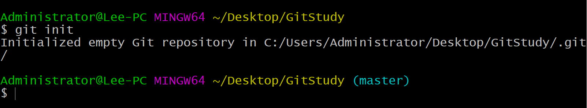

# day01_Git使用

### 目标

* 安装git版本控制软件, 为今天学习做准备


### 讲解

1. 先去官网下载这个软件, 准备安装到本电脑中

   > https://git-scm.com/


2. 根据自己电脑系统下载此软件到本机

   


3. 安装的位置, ==不要在中文路径下==

4. 查看安装是否成功:  在任意文件夹右键, 查看是否有Git Base Here 选项, 有就成功了

   


### 小结

1. git软件安装后有什么表现?

   <details>
   <summary>答案</summary>
   <ul>
   <li>在任意位置右键可以看到 Git Bash Here</li>
   </ul>
   </details>


## 学习目标

* 掌握git相关流程思路
* 掌握git相关语法

## Git介绍

### 目标

* 了解什么是git
* 了解git的作用


### 讲解

1. 玩游戏一条命通关难度大吗?  很大

2. 所以我们是不是要适当存档? 是的

3. 那从0开始一次性就能把代码都写完? 中间肯定不能出错?  不能

4. 所以我们需要写一段代码, 就存档保存一下!

5. 我们在写项目的时候, 每天想要保存一个版本, 如果手动管理	

   > 可能你会复制工程文件夹, 进行**版本管理**

   


2. 这样做其实不太好, 会有如下问题
   * 操作麻烦: 每次需要复制, 粘贴, 重命名, 占磁盘空间
   * 命名麻烦: 起不好名字, 都不知道这个文件夹和上个文件夹比修改了什么
   * 存储麻烦: 如果电脑/磁盘损坏, 项目文件容易丢失
   * 合并麻烦: 如果自己写项目还好, 但是很多人合作一个项目, 往同一个文件夹合代码是一件费时费力的事情


3. 解决方案: 使用git这个**版本控制工具**软件

   * 概念: git是一款免费、开源的版本控制系统 ，用于敏捷高效地处理任何或小或大的项目。

   * 作用：

     * 文件存档备份
     * 文件版本管理
     * 多人协同合作(自动合并)

     


### 小结

1. 什么是git?

   <details>
   <summary>答案</summary>
   <ul>
   <li>版本控制工具</li>
   </ul>
   </details>


2. git有什么作用?

   <details>
   <summary>答案</summary>
   <ul>
   <li>文件存档备份, 文件版本管理, 多人协同合作(自动合并)</li>
   </ul>
   </details>
   
   

## Git的三个区域

### 目标

* 掌握git管理的项目


### 讲解

1. git的三个区域
   * **工作区**: 处理工作的区域 
   * **暂存区**: 临时存放的区域
   * **本地git仓库**: 最终的存放区域


2. 在生活区的体现

   


3. 在文件夹的体现如下
   * 工作区: 在你电脑里看到的目录
   * 暂存区: 在.git文件夹内的index中 (二进制记录)
   * 版本库: 指的整个.git文件夹 (也认为是本地仓库) 


4. 在代码中的体现

   


### 小结

1. git中有哪三个区域?

   <details>
   <summary>答案</summary>
   <ul>
   <li>工作区, 暂存区, 仓库区</li>
   </ul>
   </details>


## Git配置

### 目标

* 安装git软件后, 了解配置全局**用户名**和**邮箱**

* 以后提交时, 知道是谁提交的

  

### 讲解

1. 我们在预习必须自己安装了git软件, 但是还不能直接使用

2. 需要再用命令, 配置下, 你本机提交任何仓库时, 你的提交信息

3. 无论哪个项目/哪个仓库, 你都要表明你的身份名字和邮箱

4. 命令格式如下: ==中文自己看情况换==

   > git config 固定命令, 设置git相关配置
   >
   > --global 全局配置: 一次配置, 整机在使用git时都生效

   ```bash
   git config --global user.name 你的用户名
   git config --global user.email 你的邮箱地址
   ```


5. 配置后, 可以运行如下命令查看是否成功

   ```bash
   git config --list
   ```

   

6. 将来想要修改, 可以重新执行一次配置命令覆盖即可


### 小结

1. 配置全局的用户名和邮箱的作用是?

   <details>
   <summary>答案</summary>
   <ul>
   <li>可以在以后的提交中, 查看本次提交的记录是谁交的</li>
   </ul>
   </details>


## Git基础命令

### 目标

* 掌握git的基础命令使用


### 讲解

1. 我们新建一个文件夹 / 现有的文件夹 是git仓库吗?  不是!!!

   > 因为没有 .git 文件夹, 所以没有被git管理

2. 新文件夹 / 现有文件夹, 可以运行如下命令, 得到.git文件夹, 即可让git开始准备管理

   ```bash
   # 初始化 git 仓库, 产物: .git 文件夹 (所在文件夹"内"被管理)
   git init
   ```

3. 在今日代码文件夹下, 输入git init命令

   > 初始化空的git版本库

   

4. 在今日代码文件夹下, 得到.git文件夹

   

   

5. 新建如下文件, 并适当随意写入一些内容

   * css/index.css
   * js/index.js
   * index.html

   


6.  接下来, 要把工作区变化, 放到暂存区中, 如下命令, 后续有更好的, 这里不用记

   ```bash
   # (了解) 将index.html 添加到暂存区
   git add index.html
   
   # 将css目录下一切添加到暂存区
   git add css
   ```

   

7. 每次一个个加, 要累死了!! 如下命令, 可以一次性把所有变化文件, 放入暂存区

   > 注意: add 后面有个空格, 此.的意思 , 当前目录下所有变化都暂存

   ```bash
   git add .
   ```

   

8. 把暂存区内容, 提交到版本库, 命令如下

   ```bash
   git commit -m '提交的内容说明'
   ```


9. 图示:

   > 相当于存档了一次, 在版本库中产生一次提交记录(并生成版本号)
   >
   > 本次存档, 不耽误我们在工作区(项目文件夹)下 继续编写项目

   


### 小结

1. 如何得到一个git仓库(.git文件夹)?

   <details>
   <summary>答案</summary>
   <ul>
   <li>git init</li>
   </ul>
   </details>


2. 非空白文件夹, 可以用git管理吗?

   <details>
   <summary>答案</summary>
   <ul>
   <li>可以的, 直接git init初始化一个空的git仓库即可</li>
   </ul>
   </details>


3. 工作区有变化如何存入版本库?

   <details>
   <summary>答案</summary>
   <ul>
   <li>git add . 先暂存所有变化目录, 然后git commit -m '提交说明'把变化存入到版本库, 产生一次记录</li>
   </ul>
   </details>


## Git查看日志及状态

### 目标

* 了解一些git其他的命令


### 讲解

1. 查看所有提交的日志记录, 命令如下

   ```bash
   git log
   ```

3. 运行命令效果如下

   

4. 当我们的日志越来越多, 可能想要简化查看, 可以输入如下命令

   > --oneline  在一行显示简略信息

   ```bash
   git log --oneline
   ```

5. 运行命令效果如下

   

6. 我们再新增一个login.html, 并修改index.css里代码

7. 如果刚才改的代码过多, 忘记改过哪些了, 可以运行如下命令, 查看git仓库变化

   ```bash
   git status
   ```

8. 执行后, 查看命令如下

   

   

9. 暂存, 并再次提交产生一次版本记录

   ```bash
   git add .
   git commit -m '新建登录页面_和样式'
   ```


10. 刚才的流程图示

    


### 小结

1. 如果代码又有变化了, 我现在想存档下, 如何做?

   <details>
   <summary>答案</summary>
   <ul>
   <li>git add . 然后 git commit -m '再次提交'</li>
   </ul>
   </details>


## Git版本回退

### 目标

* 了解git回退命令和流程


### 讲解

> 注意: 因为现在是学习阶段, 我们还不会更多的命令, 也不懂更多流程, 所以回到历史我们就先看看, 不要改变历史

1. 我们玩游戏, 突然感觉没玩好, 想要回到上次存档的记录重新来?  可以!!

2. 代码写到后面发现, 最近这2天的需求写错了, 回到2天前?  可以!!

3. 但是以上的**回退前提,** 你前面确实commit存档过 (而且存到的.git文件夹要存在)

4. 回退命令语法如下, 中文看情况写

   ```bash
   git reset --hard 版本号
   ```

5. 可以运行如下命令查看版本号

   > 每次的版本号随机生成, 我们的肯定不一样

   ```bash
   git log --oneline
   ```

   


6. 尝试回退到 `a3bcab2` 这次记录上

   ```bash
   git reset --hard a3bcab2
   ```

   

7. 观察自己工作区的代码, 确实进行的回退!!

8. 如果想要在回到最近一次提交的记录, 发现git log看不到未来的记录了, T.T 完犊子了. 回不去了!!

   > 但是, git 总是有后悔药吃!!!

9. 输入git reflog命令, 可以查看 git 所有的操作记录, 包括你的reset记录

   ```bash
   git reflog
   ```


10. 好了, 根据版本号, 再次穿越

    > 我老李! 又回来了!!

    ```bash
    git reset --hard cbde6f0
    ```

    

11. 可以打印git log --oneline, 查看Head标记在哪里?

    > HEAD 是头指针, 可以指向标记现在工作区所在的记录

    


12. 整个使用图示

    


### 小结

1. 回退的命令是什么?

   <details>
   <summary>答案</summary>
   <ul>
   <li>git reset --hard 版本号</li>
   </ul>
   </details>

2. 查看操作日志的命令?

   <details>
   <summary>答案</summary>
   <ul>
   <li>git reflog</li>
   </ul>
   </details>


## Git忽略文件

### 目标

* 了解git忽略文件的作用和配置


### 讲解

1. 有的时候, 我们某些文件/文件夹, 不想让git进行跟踪管理

2. 这种场景下, 我们需要在.git文件夹隔壁, 来个叫做 .gitignore (固定名字)的忽略文件, 并写入忽略规则

3. 可以编写如下这些规则

   ```gitignore
   # 忽略某个指定文件
   password.txt
   
   # 忽略文件夹
   css
   
   # 忽略文件夹下的某个文件
   css/index.js
   
   # 忽略文件夹下某类文件
   css/*.js
   ```

   

4. 然后根目录新建password.txt, 查看 git追踪到了哪些变化

   ```bash
   git status
   ```

5. 发现只新增了.gitignore, 符合规则的都备忽略掉了

   


### 小结

1. 如何设置git忽略文件?

   <details>
   <summary>答案</summary>
   <ul>
   <li>在.git文件夹隔壁建立一个.gitignore文件, 写入相关语法配置即可忽略此仓库文件夹下符合规则的文件夹/文件</li>
   </ul>
   </details>


## 分支基本概念

### 目标

* 掌握分支的概念和流程使用


### 讲解

1. 如果一个git仓库, 一个master分支上, 提交的记录很多, 什么功能都有, 不方便管理啊, 比如这样

   


2. 会显得master (默认主分支) 显得很乱, 不方便管理/回退查找等, 功能越多, 项目越大, 越复杂

3. 所以这个时候, 我们要在版本库里, 创建不同的分支, 来分别管理他们 (不同的分支之间, 是互相独立的)

   


4. 以后编写相关业务, 先切换到版本库下的对应不同分支, 去写业务, 然后暂存, 提交, 都会在对应分支下, 产生提交记录, 不会影响到别的分支


5. 等某个模块开发完毕后, 可以把某个子分支的代码, 合并回到master主分支中, 项目开发完毕, 主分支里最有一次提交的记录就是我的完整项目


### 小结

1. 分支的作用是什么?

   <details>
   <summary>答案</summary>
   <ul>
   <li>可以独立开发和维护提交版本记录, 和别的分支互不影响, 尤其多人开发同一个项目, 可以分别控制自己的代码</li>
   </ul>
   </details>


2. 分支内功能开发完毕后, 需要最后一步做什么?

   <details>
   <summary>答案</summary>
   <ul>
   <li>合并回到主分支, 保证最后主分支有所有模块的代码, 最后统一交付</li>
   </ul>
   </details>
   
   

## 分支的本质

### 目标

* 了解分支的本质


### 讲解

> HEAD 指针指向哪个版本，当前指向的版本代码就会覆盖到当前的工作区和暂存区。

1. 分支其实就是一个叫**HEAD**的指针标记

2. 每次代码提交, 此HEAD指针都会往后移动一次, 保证指向的(并且工作区里的)都是最后一次提交

3. 比如刚才我们第二次提交后, HEAD指针指向这里, 也是工作区最后一次提交的版本

   


4. 当我们敲击命令

   ```bash
   git reset --hard a3bcab2
   ```

5. 那么HEAD指针会移动

   


6. 而且HEAD移动后, 会影响工作区里的代码

   


### 小结

1. 分支的本质是什么?

   <details>
   <summary>答案</summary>
   <ul>
   <li>就是一个叫做HEAD的标记, 可以影响工作区的代码</li>
   </ul>
   </details>


## 创建分支

### 目标

* 掌握分支创建的命令和特点


### 讲解

1. 现在已经有了"登录"和"主页"了, 我们来创建一个"注册"分支reg

2. 创建分支命令如下, 语法↓

   ```bash
   # 创建分支
   git branch 分支名
   ```
   
3. 注意: 创建后不会自动切换分支, 我们可以运行命令查看现在这个.git版本库里所有分支

   ```bash
   # 查看当前版本库所有分支
   git branch
   
   # 绿色带*代表, 你现在所处的分支
   ```

   


4. 手动切换到分支上, 命令语法↓

   > ==注意: 第一次创建并切换到此分支==, 这里你会发现master分支上的所有代码(和当前节点所有提交记录) 都被复制了过来, 在这个基础上, 接着往后开发就行, 不是你的页面不同碰!!

   ```bash
   # 切换分支命令
   git checkout 分支名
   ```

   

​	


5. 刚才操作后的结果图示:

   


### 小结

1. 创建分支的命令是?

   <details>
   <summary>答案</summary>
   <ul>
   <li>git branch 分支名</li>
   </ul>
   </details>


2. 如何查看所有分支?

   <details>
   <summary>答案</summary>
   <ul>
   <li>git branch</li>
   </ul>
   </details>


3. 如何切换分支?

   <details>
   <summary>答案</summary>
   <ul>
   <li>git checkout 分支名</li>
   </ul>
   </details>


4. 切换分支的本质和效果是?

   <details>
   <summary>答案</summary>
   <ul>
   <li>把HEAD指向你切换的分支的最后一次提交记录的节点, 然后让工作区和暂存区都为当前分支的最后一次提交的记录</li>
   </ul>
   </details>


## 分支下开发流程

### 目标

* 理解在当前分支开发下的流程


### 讲解

1. 那我们现在就可以在当前reg分支下来编写, 注册页面的逻辑代码, 例如新建reg.html文件, 并随便写点内容

2. 然后暂存, 提交一次, 这次提交的记录会出现在这里, 如图

   


3. 所以, 以后在当前reg分支下开发, 就会在reg范围内, 每次提交产生一次版本记录, 但是不会影响到别的分支里

4. 其实, 我们如果用的是git专用终端, 还可以在这里看到所在分支的名字

   


### 小结

1. 在某个分支下, 如何继续开发业务如何使用git?

   <details>
   <summary>答案</summary>
   <ul>
   <li>在当前分支下, 在工作区编写业务代码, 然后提交产生多次提交记录, 每次提交在当前所在分支下产生提交记录, 不会影响别的分支</li>
   </ul>
   </details>


## 分支合并

### 目标

* 掌握分支合并命令


### 讲解

1. 当我们某个分支的业务开发完毕以后呢, 我们可以把分支里写好的代码, 合并到主分支/其他分支上

2. 首先, 切换到你要合并到的目标分支上, 这里以master主分支为例

   ```bash
   # 切换分支
   git checkout master
   ```

3. 图示如下

   


4. 合并命令语法

   ```bash
   # 把目标分支名下的所有记录, 合并到当前分支下
   
   git merge 目标分支名
   ```

5. 这里我们执行命令

   ```bash
   git merge reg
   ```

   

6. 执行后效果图示

   


## 分支解决冲突

### 目标

* 掌握冲突产生原因
* 掌握查看冲突文件能力
* 掌握手动解决冲突办法


### 讲解

1. 在2个分支, 修改了同1个文件并==提交过==

2. 在==合并==的时候, 就会产生冲突

3. 先模拟一次冲突的制造

   * 在master分支下, 修改login.html的某行代码, 并完成一次暂存提交
   * 切换到reg分支下, 也修改login.html的对应行代码, 并完成一次暂存提交

4. 再切换回到master分支下, 用合并命令, 把reg分支下代码和变化合并过来

   > 不出意外, 就会出现冲突了

   


5. vscode中冲突的代码会长这样

   


6. 这个时候, 要积极寻找对方是哪个人, 然后商量, 留下谁的? 手动删除掉<<<<<<和=和>>>>>>>>后, 重新暂存提交, 完成冲突解决

   > 这里暂时都留下

   


7. 接着我们, 暂存提交一次

   


### 小结

1. 如何合并遇到冲突了怎么办?

   <details>
   <summary>答案</summary>
   <ul>
   <li>手动解决, 然后暂存, 提交一次即可</li>
   </ul>
   </details>


## 删除分支

### 目标

* 掌握删除分支的命令


### 讲解

1. 假如注册功能开发完毕, 代码已经合并到master分支上, 我们无需reg分支

2. 命令如下

   ```bash
   git branch -d 分支名
   ```

3. 如果你当前分支代码 还有没合并到别的分支的, 则会报错


### 小结

1. 删除分支命令是?

   <details>
   <summary>答案</summary>
   <ul>
   <li>git branch -d 目标分支名</li>
   </ul>
   </details>


## 今日重点(必须会)

1. 掌握git的作用和流程
2. 掌握git的常用命令(也知道敲击命令后带来什么效果)


## 今日作业(必完成)

### 作业1-整理笔记

1. 把今天知识点梳理一遍, 记好笔记

### 作业2-案例

1. 课上案例至少再写一遍

### 作业3-作业

> 要求1: 新建文件夹+git版本库, 新建html/js随意
>
> 要求2: 新建1子分支, 共5道题, 每做完1道题, 提交一次产生一个版本 (最后做完git log --oneline打印检查提交记录)
>
> 要求3:  切换回默认主分支master, 把子分支合并过来, 然后删除掉子分支
>
> 要去4: 绘制图, 表示出你现在git的三个区域 (还有版本库里的分支和记录有哪些)

### 作业4-答题+每日反馈

1. 10道选择题(祝你得100分): 
2. 关注微信群里的, 每日反馈: 


## 参考文档

1. [git教程](https://www.runoob.com/git/git-tutorial.html)


## 更多扩展

### git全局配置-删除

1. git全局配置删除命令

   > user.name 可以视情况删除哪个自己选

   ```bash
   git config --unset --global user.name
   ```


### vscode中文件右侧标记

> 一般打开一个包含git仓库的文件夹时, 会有这些标记


```js
右侧没有标记的时候为“未修改” 或 此文件/文件夹, 被git忽略不跟踪变化
M为“已修改”
A为“已添加”
D为“已删除”
R为“已重命名”
C为“已复制”
U为“已更新但为融合”
```

### 额外命令

| 命令                 | 作用                                                         | 危险程度 |
| -------------------- | ------------------------------------------------------------ | -------- |
| git restore 目标文件 | git还原 (会把"工作区"恢复到上次提交的时候), 并删除刚写的所有代码(无法找回) | 非常危险 |
|                      |                                                              |          |
|                      |                                                              |          |


### git版本回退更多

1. 如下命令

   ```bash
   # 除了找到对应版本号之外, 我们还可以用内置的代号
   # 回退到  "最近一次提交"   (但是要注意如果你已经回退了, 是回不到未来的, 回到未来需要指定版本号数字字母)
   git reset --hard head~0
   # 回退到  "上一次提交"
   git reset --hard head~1
   # 回退到  "上上次提交"
   git reset --hard head~2
   
   # 想退多少次, 先用git log --oneline 打印后根据注释信息, 自己数下回退几次 head~后面写几
   ```

2. 以上命令还有个写法

   ```bash
   
   # 回退到  "上一次提交"
   git reset --hard head^
   # 回退到  "上上次提交"
   git reset --hard head^^
   
   # 如果回退的太远, 一百个往前, 你不能写一百个^吧,  还是写head~个数吧
   ```

### git版本回退-更优解

reset其实会把未来的丢失掉, 如果推到远程仓库可能会有问题 (看下面情况做吧), 但是其实保证大家维护的同一个项目工程都是最新代码即可

比reset更好用的revert

```js
如果已经有A -> B -> C，想回到B：

方法一：reset到B，丢失C：

A -> B

方法二：再提交一个revert反向修改，变成B：

A -> B -> C -> B

C还在，但是两个B是重复的

看你的需求，也许C就是瞎提交错了（比如把密码提交上去了），必须reset

如果C就是修改，现在又要改回来，将来可能再改成C，那你就revert
```


### git常用忽略配置

```bash
.DS_Store
node_modules/
dist/

npm-debug.log*
yarn-debug.log*
yarn-error.log*
package-lock.json
yarn.lock
mock

# Editor directories and files
.idea
.vscode
*.suo
*.ntvs*
*.njsproj
*.sln

```


