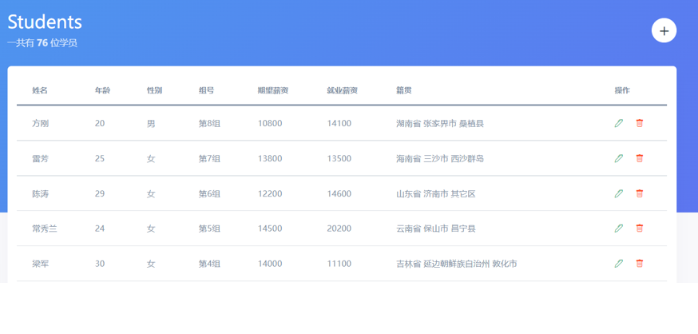

# day04-学生信息管理

## 学习目标

* 学生信息管理 (增删改查)


## 01-项目-学生信息页权限控制

### 目标

- 复制静态页面
- 完成页面权限控制


### 讲解

1. 从素材中复制静态页面 student.html 到项目中

2. 直接打开不允许进入页面, 必须有 token 才能进入

   逻辑同首页

   注意: 用户名 span 标签需要设置类名 username

   ```js
   // 校验是否有 token
   if (!localStorage.getItem('token')) {
     // 直接去登录页
     // return 只能在函数中使用
     location.href = './login.html'
   }
   
   // 渲染用户名
   document.querySelector('.username').innerHTML = localStorage.getItem('username') || ''
   
   // 退出登录
   document.querySelector('#logout').addEventListener('click', () => {
     // 1. 清空 token 和用户名
     // localStorage.removeItem('token')
     // localStorage.removeItem('username')
     // 清除所有 localStorage 中的数据
     localStorage.clear()
     // 2. 跳回登录页
     location.href = './login.html'
   })
   ```

3. 由于逻辑完全相同, 可以将代码封装到单独的 js 文件中

   新建一个 permission.js

   放入代码

   index.html 和 student.html 分别引入该文件即可

### 小结

1. 当遇到多个页面的逻辑相同时应该怎么办?

   <details>
   <summary>答案</summary>
   <ul>
   <li>封装单独的 js</li>
   </ul>
   </details>


## 02-项目-渲染学生信息

### 目标

* 把学生数据渲染到页面
  


### 思路

目标1: 渲染学生信息

- 1.1 发请求获取数据

- 1.2 渲染总数

- 1.3 渲染学生表格数据

```js
// 目标1: 渲染学生信息
async function getStudents() {
  // 1.1 发请求获取数据
  const res = await axios({ url: '/students' })
  // 1.2 渲染总数
  document.querySelector('.total').innerHTML = res.data.length
  // 1.3 渲染学生表格数据
  document.querySelector('.list').innerHTML = res.data.map(item => `<tr>
              <td>${item.name}</td>
              <td>${item.age}</td>
              <td>${item.gender === 0 ? '男' : '女'}</td>
              <td>第${item.group}组</td>
              <td>${item.hope_salary}</td>
              <td>${item.salary}</td>
              <td>${item.province}${item.city}${item.area}</td>
              <td>
                <a href="javascript:;" class="text-success mr-3"><i class="bi bi-pen"></i></a>
                <a href="javascript:;" class="text-danger"><i class="bi bi-trash"></i></a>
              </td>
            </tr>`).join('')
}
getStudents()
```


### 小结

1. 为什么没有写 headers 请求头也把数据拿回来了?

   <details>
   <summary>答案</summary>
   <ul>
   <li>因为在 common.js 里而请求拦截器统一携带了</li>
   </ul>
   </details>


## 03-项目-删除学生信息

### 目标

* 完成点击删除功能


### 思路

目标2: 删除学生信息

- 2.1 给即将要被点击的 i 标签添加自定义属性 data-id

- 2.2 使用事件委托绑定事件

- 2.3 点击删除按钮时获取到当前点击标签的 id

- 2.4 发请求调用删除接口删除数据

- 2.5 重新渲染


### 讲解

1. 先给所有删除按钮绑定点击事件

2. 因为要区分点击的是哪个, 所以先给每个按钮绑定数据的id

   ```html
   <!-- 2.1 给即将要被点击的 i 标签添加自定义属性 data-id -->
   <a href="javascript:;" class="text-danger" ><i class="bi bi-trash" data-id="${item.id}"></i></a>
   ```

   

3. 事件委托, 绑定点击事件, 因为后续要做新增, 所以得委托, 点击获取到id属性的值

   ```js
   // 2.2 使用事件委托绑定事件
   document.querySelector('.list').addEventListener('click', e => {
     // 必须是删除按钮, 才能走以下逻辑
     if (e.target.classList.contains('bi-trash')) {
       // 2.3 点击删除按钮时获取到当前点击标签的 id
       const id = e.target.dataset.id
     }
   })
   ```
   
   

4. 调用删除的接口后, 再调用请求列表方法刷新即可

   ```js
   // 2.2 使用事件委托绑定事件
   document.querySelector('.list').addEventListener('click', async e => {
     // 必须是删除按钮, 才能走以下逻辑
     if (e.target.classList.contains('bi-trash')) {
       // 2.3 点击删除按钮时获取到当前点击标签的 id
       const id = e.target.dataset.id
       // 2.4 发请求调用删除接口删除数据
       await axios({
         url: `/students/${id}`,
         method: 'DELETE'
       })
       // 2.5 重新渲染
       getStudents()
     }
   })
   ```
   


### 小结

1. 删除的思路是什么?

   <details>
   <summary>答案</summary>
   <ul>
   <li>给i标签绑定id值, 然后事件委托绑定点击事件, 把要删除的数据id传递给后台, 再重新请求列表刷新页面</li>
   </ul>
   </details>


## 04-项目-添加学生信息

### 目标

* 实现学生信息添加功能


### 思路

目标3: 添加学生信息

> 过往的经验:
>
> - 添加 -> 一个模态框
> - 编辑 -> 一个模态框
>
> 现在的尝试: 复用同一个模态框
>
> - 添加 -> 模态框 <- 编辑


- 3.1 通过官网学习, 实现以下功能

  - 按 esc 不关闭模态框

  - 点击遮罩层不关闭模态框

- 3.2 创建模态框对象, 点击显示

- 3.3 初始化模态框

  - 标题设置为添加学员
  - 清空表单

- 3.4 渲染省市区三联动 (需要处理选择为空的情况)

  - 获取并渲染省份数据

  - 监听省份改变事件, 根据用户选择的内容继续获取并渲染城市数据

  - 监听城市改变事件, 根据用户选择的内容继续获取并渲染区县数据

  - 注意事项:

    - 选择省份

      ​	获取城市并渲染

      ​	清空地区

    - 没选择省份

      ​	清空城市

      ​	清空地区

    - 选择城市

      ​	获取地区并渲染

    - 没选择城市

      ​	清空地区

- 3.5 点击确认收集表单数据并发请求

- 3.6 隐藏模态框

- 3.7 重新渲染


### 讲解

1. 先找到相关的标签, 使用bootstrap5自带的弹窗和js功能, [文档](https://v5.bootcss.com/docs/components/modal/#methods)

   ```js
   const modal = new bootstrap.Modal('#modal', {
     keyboard: false, // 按下 esc 不关闭
     backdrop: 'static' // 点击遮罩层不关闭
   })
   
   modal.show() // 显示
   modal.hide() // 隐藏
   modal.toggle() // 切换
   ```

   

2. 点击右上角+号, 打开弹窗, 并让表单清空, 并设置标题为添加学员

   ```js
   // 3.2 创建模态框对象, 点击显示
   const modal = new bootstrap.Modal('#modal', {
     keyboard: false, // 按下 esc 不关闭
     backdrop: 'static' // 点击遮罩层不关闭
   })
   document.querySelector('#openModal').addEventListener('click', e => {
       modal.show()
       // 标题设置为添加学员
       document.querySelector('.modal-title').innerHTML = '添加学员'
       // 清空表单
       document.querySelector('form').reset()
   })
   ```
   
   

3. 准备省市区联动

   ```js
   const form = document.querySelector('#form')
   const ps = document.querySelector('[name=province]')
   const cs = document.querySelector('[name=city]')
   const as = document.querySelector('[name=area]')
   // 3.2 创建模态框对象, 点击显示
   document.querySelector('#openModal').addEventListener('click', async () => {
     // 弹出模态框
     modal.show()
     // 3.3 初始化模态框
     // 标题设置为添加学员
     document.querySelector('.modal-title').innerHTML = '添加学员'
     // 清空表单
     form.reset()
     // 3.4 渲染省市区三联动 (需要处理选择为空的情况)
     // 获取并渲染省份数据
     const res = await axios({ url: 'http://ajax-api.itheima.net/api/province' })
     // console.log(res)
     ps.innerHTML = '<option value="">--省份--</option>' + res.data.map(item => `<option value="${item}">${item}</option>`).join('')
     
   })
       
   ps.addEventListener('change', async () => {
     // if (选择省份了) {
     //   清空地区
     // } else {
     //   清空地区
     // }
     // 清空地区 - 写一行即可
     as.innerHTML = '<option value="">--地区--</option>'
   
     // 监听省份改变事件, 根据用户选择的内容继续获取并渲染城市数据
     // console.log(ps.value)
     // select 标签的特点:
     // 用户选择了指定的 option, 就会把选择的 option 的 value 值赋给 select 的 value
     // 可以理解为, select 元素的 value 值就是当前用户选择的 option.value
     const res = await axios({
       url: 'http://ajax-api.itheima.net/api/city',
       params: {
         pname: ps.value
       }
     })
     // console.log(res)
     cs.innerHTML = '<option value="">--城市--</option>' + res.data.map(item => `<option value="${item}">${item}</option>`).join('')
   })
       
   cs.addEventListener('change', async () => {
     // 监听城市改变事件, 根据用户选择的内容继续获取并渲染区县数据
     // console.log(cs.value)
     // select 标签的特点:
     // 用户选择了指定的 option, 就会把选择的 option 的 value 值赋给 select 的 value
     // 可以理解为, select 元素的 value 值就是当前用户选择的 option.value
     const res = await axios({
       url: 'http://ajax-api.itheima.net/api/area',
       params: {
         pname: ps.value,
         cname: cs.value
       }
     })
     // console.log(res)
     as.innerHTML = '<option value="">--地区--</option>' + res.data.map(item => `<option value="${item}">${item}</option>`).join('')
   })
   ```

   

4. 检测表单的确定事件, 然后收集所有标签的值, 并调用接口, 刷新页面

   > 表单值校验和注册与登录同理, 可以自行扩展

   ```js
   document.querySelector('#submit').addEventListener('click', async () => {
     // 3.5 点击确认收集表单数据并发请求
     const data = serialize(form, { hash: true, empty: true })
     // 数据类型转换
     data.age = +data.age
     data.gender = +data.gender
     data.hope_salary = +data.hope_salary
     data.salary = +data.salary
     data.group = +data.group
     // console.log(data)
     await axios({
       url: '/students',
       method: 'post',
       data
     })
     // 3.6 隐藏模态框
     modal.hide()
     // 3.7 重新渲染
     getStudents()
   })
   ```
   
   

## 05-项目-编辑学生信息-数据回显

### 目标

* 完成学生信息编辑时回显表单


### 思路

- 3.1 给即将要被点击的 i 标签添加自定义属性 data-id
- 3.2 使用事件委托绑定事件
- 3.3 点击编辑按钮时获取到当前点击标签的 id
- 3.4 显示并初始化模态框
  - 标题设置为编辑学员
  - 清空表单
- 3.5 发请求获取当前学生信息
- 3.6 数据回显
  - 获取所有的省份并渲染
  - 获取所有的城市并渲染
  - 获取所有的地区并渲染
  - 使用循环来一一对应渲染
  - 对 gender 单独处理
  


### 讲解

1. 先给编辑按钮, 绑定对应的数据id

   ```html
   <a href="javascript:;" class="text-success mr-3"><i class="bi bi-pen" data-id="${item.id}"></i></a>
   ```

   

2. 使用事件委托绑定事件, if 判断, 然后获取到要编辑的项学生 id 的值, 并请求详情数据回显到表单里

   ```js
   // 3.2 使用事件委托绑定事件
   document.querySelector('.list').addEventListener('click', async e => {
     // 3.3 点击编辑按钮时获取到当前点击标签的 id
     if (e.target.classList.contains('bi-pen')) {
       const id = e.target.dataset.id
       // console.log('我要编辑', id)
       // 3.4 显示并初始化模态框
       modal.show()
       // 标题设置为编辑学员
       document.querySelector('.modal-title').innerHTML = '编辑学员'
       // 清空表单
       form.reset()
       
       // 3.5 发请求获取当前学生信息
       const res = await axios({ url: `/students/${id}` })
       console.log(res.data)
   
       // 获取所有的省份并渲染
       const pRes = await axios({ url: 'http://ajax-api.itheima.net/api/province' })
       ps.innerHTML = '<option value="">--省份--</option>' + pRes.data.map(item => `<option value="${item}">${item}</option>`).join('')
   
       // 获取所有的城市并渲染
       const cRes = await axios({ url: 'http://ajax-api.itheima.net/api/city', params: { pname: res.data.province } })
       cs.innerHTML = '<option value="">--城市--</option>' + cRes.data.map(item => `<option value="${item}">${item}</option>`).join('')
   
       // 获取所有的地区并渲染
       const aRes = await axios({ url: 'http://ajax-api.itheima.net/api/area', params: { pname: res.data.province, cname: res.data.city } })
       as.innerHTML = '<option value="">--地区--</option>' + aRes.data.map(item => `<option value="${item}">${item}</option>`).join('')
   
       // 上面三个请求发完, 页面上只是显示:
       // --省份--   --城市--   --地区--
   
       // 3.6 数据回显
       // 使用循环一一对应渲染
       Object.keys(res.data).forEach(k => {
         console.log(k, res.data[k])
         // 单独对 gender 进行判断处理
         if (k === 'gender') {
           // 获取两个单选框
           const genders = document.querySelectorAll('[name=gender]')
           // 拿到性别代码当做索引
           const index = res.data[k]
           // console.log(genders)
           genders[index].checked = true
         }
         // 将数据回显到表单项的 value 中
         const el = document.querySelector(`[name=${k}]`)
         if (el) {
           // select 标签 value 值的作用:
           // 获取 ps.value 等于获取当前用户选择的 option 对应的 value
           // 设置 ps.value 等于用户选择指定的 option
           el.value = res.data[k]
         }
       })
     }
   })
   ```


## 06-项目-编辑学生信息-数据提交

### 目标

* 完成学生信息编辑完成功能


### 思路

- 3.7 点击时记录 id 放到全局 (用作判断添加 or 编辑)
- 3.8 打开确认框需要将 id 清空
- 3.9 点击确定按钮时用 id 来判断是添加还是编辑
- 3.10 添加逻辑不变, 如果是编辑就发送编辑请求
- 3.11 最终都是关闭模态框并重新渲染


### 讲解

1. 编辑和新增用同一套表单, 可以先定义全局变量 id 来保存正在编辑的 id 值, 也可以用它来判断是否处于编辑状态
   * 新增按钮把此值置空
   * 编辑按钮把正在编辑的 id 赋值给它
   * 然后点击确定的时候可以用这个值做判断

   ```js
   let id
   // 3.2 使用事件委托绑定事件
   document.querySelector('.list').addEventListener('click', async e => {
     if (e.target.classList.contains('bi-pen')) {
       // 3.3 点击编辑按钮时获取到当前点击标签的 id
       // 3.7 点击时记录 id 放到全局 (用作判断添加 or 编辑)
       id = e.target.dataset.id
     }
     // ...
   })
   ```
   
   
   
2. 在表单确定点击事件中做出判断, 调用不同的接口即可

   ```js
   // 3.5 点击确认收集表单数据并发请求
   document.querySelector('#submit').addEventListener('click', async e => {
     const data = serialize(document.querySelector('form'), { hash: true, empty: true })
     data.age = +data.age
     data.hope_salary = +data.hope_salary
     data.salary = +data.salary
     data.gender = +data.gender
     data.group = +data.group
     try {
       // 3.8 点击确定按钮时用 id 来判断是添加还是编辑
       if (id) {
         // 3.9 添加逻辑不变, 如果是编辑就发送编辑请求
         // 有 id 就是编辑
         await axios({
           url: `/students/${id}`,
           method: 'PUT',
           data
         })
       } else {
         // 没有 id 就是添加
         await axios({
           url: '/students',
           method: 'POST',
           data
         })
       }
     } catch (err) {
       alert('请检查相关选项是否输入正确')
     }
     // 3.10 最终都是关闭模态框并重新渲染
     // 3.6 隐藏模态框
     modal.hide()
     // 3.7 重新渲染
     getStudents()
   })
   ```
   
   

## 今日重点须会

1. 掌握学生信息的增删改查的思路
2. 掌握用同一个表单如何区分2种状态


## 今日作业(必完成)

### 作业1-整理笔记

1. 把今天知识点梳理一遍, 记好笔记

### 作业2-案例

1. 课上案例至少再写一遍

### 作业3-答题+每日反馈

1. 关注微信群里的, 每日反馈

