# vue基础

接口汇总:https://apifox.com/apidoc/shared-fa9274ac-362e-4905-806b-6135df6aa90e/doc-842135


## Day01

### 点击说笑话

> 目标: 点击按钮随机显示一条笑话, 笑话从数组中取

代码模板:

> 直接复制这个, 接着写即可

1. 准备1个变量, 给初始值, 显示到页面上
2. 在准备一组笑话
3. 点击按钮, 随机提取一个笑话字符串, 赋予给word变量

```vue
<!DOCTYPE html>
<html lang="en">
<head>
  <meta charset="UTF-8">
  <meta http-equiv="X-UA-Compatible" content="IE=edge">
  <meta name="viewport" content="width=device-width, initial-scale=1.0">
  <title>Document</title>
  <script src="https://cdn.jsdelivr.net/npm/vue@2.7.14/dist/vue.js"></script>
</head>
<body>
  <div id="app">
    <div>
      <p>{{ word }}</p>
      <button>点击说笑话</button>
    </div>
  </div>
  <script>
    const app = new Vue({
      el: '#app',
      data: {
        word: '这里是一条笑话',
        jokeArr: ['我去相亲网站去了, 那你找到对象了吗? 不! 我找到了他们网站的一个Bug', '讲述一下车怎么翻沟里了。我坐在副驾说沟！沟!沟! 朋友说：欧嘞，欧嘞。欧嘞 结果车就翻里了。', '几位大哥开车去钓鱼，车陷草里了，然后几个大神说把草烧了就出来了，然后就放火烧了，结果就烧没了。']
      }
    })
  </script>
</body>
</html>
```

正确代码:

```vue
<!DOCTYPE html>
<html lang="en">
<head>
  <meta charset="UTF-8">
  <meta http-equiv="X-UA-Compatible" content="IE=edge">
  <meta name="viewport" content="width=device-width, initial-scale=1.0">
  <title>Document</title>
  <script src="https://cdn.jsdelivr.net/npm/vue@2.7.14/dist/vue.js"></script>
</head>
<body>
  <div id="app">
    <div>
      <p>{{ word }}</p>
      <button @click="sayJoke">点击说笑话</button>
    </div>
  </div>
  <script>
    const app = new Vue({
      el: '#app',
      data: {
        word: '这里是一条笑话',
        jokeArr: ['我去相亲网站去了, 那你找到对象了吗? 不! 我找到了他们网站的一个Bug', '讲述一下车怎么翻沟里了。我坐在副驾说沟！沟!沟! 朋友说：欧嘞，欧嘞。欧嘞 结果车就翻里了。', '几位大哥开车去钓鱼，车陷草里了，然后几个大神说把草烧了就出来了，然后就放火烧了，结果就烧没了。']
      },
      methods: {
        sayJoke() {
          const i = Math.floor(Math.random() * this.jokeArr.length)
          this.word = this.jokeArr[i]
        }
      }
    })
  </script>
</body>
</html>
```

### 翻转世界

> 目标: 点击按钮 - 把文字取反显示 - 再点击取反显示(回来了)

> 提示: 把字符串取反赋予回去

效果演示:


正确代码:

```html
<!DOCTYPE html>
<html lang="en">
<head>
  <meta charset="UTF-8">
  <meta http-equiv="X-UA-Compatible" content="IE=edge">
  <meta name="viewport" content="width=device-width, initial-scale=1.0">
  <title>Document</title>
  <script src="https://cdn.jsdelivr.net/npm/vue@2.7.14/dist/vue.js"></script>
</head>
<body>
  <div id="app">
    <div>
      <h1>{{ message }}</h1>
      <button @click="rev">逆转世界</button>
    </div>
  </div>
  <script>
    const app = new Vue({
      el: '#app',
      data: {
        message: "HELLO, WORLD"
      },
      methods: {
        rev() {
          this.message = this.message.split("").reverse().join("")
        }
      }
    })
  </script>
</body>
</html>
```

> 总结: 记住方法特点, 多做需求, vue是数据变化视图自动更新, 减少操作DOM时间, 提高开发效率

### 折叠面板

> 目标: 点击展开或收起时，把内容区域显示或者隐藏


模板代码(只有标签和样式)

```vue
<!DOCTYPE html>
<html lang="en">
<head>
  <meta charset="UTF-8">
  <meta http-equiv="X-UA-Compatible" content="IE=edge">
  <meta name="viewport" content="width=device-width, initial-scale=1.0">
  <title>Document</title>
  <script src="https://cdn.jsdelivr.net/npm/vue@2.7.14/dist/vue.js"></script>
  <style>
    body {
      background-color: #ccc;
    }
    #app {
      width: 400px;
      margin: 20px auto;
      background-color: #fff;
      border: 4px solid blueviolet;
      border-radius: 1em;
      box-shadow: 3px 3px 3px rgba(0, 0, 0, 0.5);
      padding: 1em 2em 2em;
    }
    h3 {
        text-align: center;
      }
    .title {
      display: flex;
      justify-content: space-between;
      align-items: center;
      border: 1px solid #ccc;
      padding: 0 1em;
    }
    .title h4 {
      line-height: 2;
      margin: 0;
    }
    .container {
      border: 1px solid #ccc;
      padding: 0 1em;
    }
    .btn {
      /* 鼠标改成手的形状 */
      cursor: pointer;
    }
  </style>
</head>
<body>
  <div id="app">
    <h3>案例：折叠面板</h3>
    <div>
      <div class="title">
        <h4>芙蓉楼送辛渐</h4>
        <span class="btn" >
          收起
        </span>
      </div>
      <div class="container">
        <p>寒雨连江夜入吴,</p>
        <p>平明送客楚山孤。</p>
        <p>洛阳亲友如相问，</p>
        <p>一片冰心在玉壶。</p>
      </div>
    </div>
  </div>
  <script>
    const app = new Vue({
      el: '#app',
      data: {
      }
    })
  </script>
</body>
</html>
```

正确答案:

```vue
<!DOCTYPE html>
<html lang="en">
<head>
  <meta charset="UTF-8">
  <meta http-equiv="X-UA-Compatible" content="IE=edge">
  <meta name="viewport" content="width=device-width, initial-scale=1.0">
  <title>Document</title>
  <script src="https://cdn.jsdelivr.net/npm/vue@2.7.14/dist/vue.js"></script>
  <style>
    body {
      background-color: #ccc;
    }
    #app {
      width: 400px;
      margin: 20px auto;
      background-color: #fff;
      border: 4px solid blueviolet;
      border-radius: 1em;
      box-shadow: 3px 3px 3px rgba(0, 0, 0, 0.5);
      padding: 1em 2em 2em;
    }
    h3 {
        text-align: center;
      }
    .title {
      display: flex;
      justify-content: space-between;
      align-items: center;
      border: 1px solid #ccc;
      padding: 0 1em;
    }
    .title h4 {
      line-height: 2;
      margin: 0;
    }
    .container {
      border: 1px solid #ccc;
      padding: 0 1em;
    }
    .btn {
      /* 鼠标改成手的形状 */
      cursor: pointer;
    }
  </style>
</head>
<body>
  <div id="app">
    <h3>案例：折叠面板</h3>
    <div>
      <div class="title">
        <h4>芙蓉楼送辛渐</h4>
        <span class="btn" @click="isShow = !isShow">
          {{ isShow ? '收起' : '展开' }}
        </span>
      </div>
      <div class="container" v-show="isShow">
        <p>寒雨连江夜入吴,</p>
        <p>平明送客楚山孤。</p>
        <p>洛阳亲友如相问，</p>
        <p>一片冰心在玉壶。</p>
      </div>
    </div>
  </div>
  <script>
    const app = new Vue({
      el: '#app',
      data: {
        isShow: false
      }
    })
  </script>
</body>
</html>
```

### 帅哥美女走一走

> 目标: 点击按钮, 改变3个li的顺序, 在头上的就到末尾.

> 提示: 操作数组里的顺序, v-for就会重新渲染li


正确代码(先不要看)

```html
<!DOCTYPE html>
<html lang="en">
<head>
  <meta charset="UTF-8">
  <meta http-equiv="X-UA-Compatible" content="IE=edge">
  <meta name="viewport" content="width=device-width, initial-scale=1.0">
  <title>Document</title>
  <script src="https://cdn.jsdelivr.net/npm/vue@2.7.14/dist/vue.js"></script>
</head>
<body>
  <div id="app">
    <ul>
      <li v-for="item in arr" :key="item">{{ item }}</li>
    </ul>
    <button @click="go">走一走</button>
  </div>
  <script>
    const app = new Vue({
      el: '#app',
      data: {
        arr: ["帅哥", "美女", "程序猿"]
      },
      methods: {
        go() {
          // 头部数据加入到末尾
          this.arr.push(this.arr[0])
          // 再把头部的数据删除掉
          this.arr.shift()
        }
      },
    })
  </script>
</body>
</html>
```

### 加加减减

> 目标: 点击生成按钮, 新增一个li(随机数字)和删除按钮, 点击删除按钮, 删除对应的li和值

> 提示: 数组渲染列表, 生成和删除都围绕数组操作


正确代码:

```html
<!DOCTYPE html>
<html lang="en">
<head>
  <meta charset="UTF-8">
  <meta http-equiv="X-UA-Compatible" content="IE=edge">
  <meta name="viewport" content="width=device-width, initial-scale=1.0">
  <title>Document</title>
  <script src="https://cdn.jsdelivr.net/npm/vue@2.7.14/dist/vue.js"></script>
</head>
<body>
  <div id="app">
    <ul>
      <li v-for="(item, i) in arr" :key="item">
        <span>{{ item }}</span>
        <button @click="del(i)">删除</button>
      </li>
    </ul>
    <button @click="add">生成</button>
  </div>
  <script>
    const app = new Vue({
      el: '#app',
      data: {
        arr: [1, 5, 3]
      },
      methods: {
        add() {
          this.arr.push(Math.floor(Math.random() * 20));
        },
        del(index) {
          this.arr.splice(index, 1);
        }
      },
    })
  </script>
</body>
</html>
```

### 购物车

> 目标: 完成商品浏览和删除功能, 当无数据给用户提示

* 需求1: 根据给的初始数据, 把购物车页面渲染出来
* 需求2: 点击对应删除按钮, 删除对应数据
* 需求3: 当数据没有了, 显示一条提示消息


html+css和数据代码结构(可复制接着写)

```vue
<!DOCTYPE html>
<html lang="en">
<head>
  <meta charset="UTF-8">
  <meta http-equiv="X-UA-Compatible" content="IE=edge">
  <meta name="viewport" content="width=device-width, initial-scale=1.0">
  <title>Document</title>
  <script src="https://cdn.jsdelivr.net/npm/vue@2.7.14/dist/vue.js"></script>
  <style>
    #app {
      width: 600px;
      margin: 10px auto;
    }
    
    .tb {
      border-collapse: collapse;
      width: 100%;
    }
    
    .tb th {
      background-color: #0094ff;
      color: white;
    }
    
    .tb td,
    .tb th {
      padding: 5px;
      border: 1px solid black;
      text-align: center;
    }
    
    .add {
      padding: 5px;
      border: 1px solid black;
      margin-bottom: 10px;
    }
  </style>
</head>
<body>
  <div id="app">
    <table class="tb">
      <tr>
        <th>编号</th>
        <th>品牌名称</th>
        <th>创立时间</th>
        <th>操作</th>
      </tr>
      <!-- 循环渲染的元素tr -->
      <tr>
        <td>1</td>
        <td>车名</td>
        <td>2020-08-09</td>
        <td>
          <button>删除</button>
        </td>
      </tr>
      <tr>
        <td colspan="4">没有数据咯~</td>
      </tr>
    </table>
  </div>
  <script>
    const app = new Vue({
      el: '#app',
      data: {
        list: [
          { id: 1, name: "奔驰", time: "2020-08-01" },
          { id: 2, name: "宝马", time: "2020-08-02" },
          { id: 3, name: "奥迪", time: "2020-08-03" },
        ]
      }
    })
  </script>
</body>
</html>
```

正确代码

```vue
<!DOCTYPE html>
<html lang="en">
<head>
  <meta charset="UTF-8">
  <meta http-equiv="X-UA-Compatible" content="IE=edge">
  <meta name="viewport" content="width=device-width, initial-scale=1.0">
  <title>Document</title>
  <script src="https://cdn.jsdelivr.net/npm/vue@2.7.14/dist/vue.js"></script>
  <style>
    #app {
      width: 600px;
      margin: 10px auto;
    }
    
    .tb {
      border-collapse: collapse;
      width: 100%;
    }
    
    .tb th {
      background-color: #0094ff;
      color: white;
    }
    
    .tb td,
    .tb th {
      padding: 5px;
      border: 1px solid black;
      text-align: center;
    }
    
    .add {
      padding: 5px;
      border: 1px solid black;
      margin-bottom: 10px;
    }
  </style>
</head>
<body>
  <div id="app">
    <table class="tb">
      <tr>
        <th>编号</th>
        <th>品牌名称</th>
        <th>创立时间</th>
        <th>操作</th>
      </tr>
      <!-- 循环渲染的元素tr -->
      <tr v-for="(item,index) in list" :key="item.id">
        <td>{{item.id}}</td>
        <td>{{item.name}}</td>
        <td>{{item.time}}</td>
        <td>
            <button @click="del(index)">删除</button>
        </td>
      </tr>
      <tr v-if="list.length === 0">
        <td colspan="4">没有数据咯~</td>
      </tr>
    </table>
  </div>
  <script>
    const app = new Vue({
      el: '#app',
      data: {
        list: [
          { id: 1, name: "奔驰", time: "2020-08-01" },
          { id: 2, name: "宝马", time: "2020-08-02" },
          { id: 3, name: "奥迪", time: "2020-08-03" },
        ]
      },
      methods: {
        del(index) {
          // 删除按钮 - 得到索引, 删除数组里元素
          this.list.splice(index, 1);
        },
      }
    })
  </script>
</body>
</html>
```

### 逛水果店

本店收银系统采用vue开发, 冲这点, 你不来买点试试?

先看效果 - 无css(你想美化下, 你就写点哈哈)

> 提示: v-model="变量" 输入框的值会绑定给vue的这个变量(别忘了在data里先声明哦)

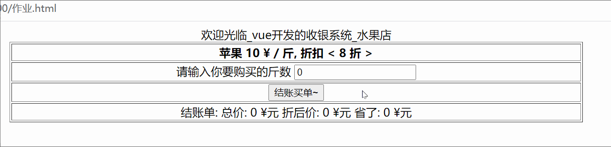

只要你实现了功能 你就是对的 (只不过每个程序员的想法都不太一样)

正确代码:

```vue
<!DOCTYPE html>
<html lang="en">
<head>
  <meta charset="UTF-8">
  <meta http-equiv="X-UA-Compatible" content="IE=edge">
  <meta name="viewport" content="width=device-width, initial-scale=1.0">
  <title>Document</title>
  <script src="https://cdn.jsdelivr.net/npm/vue@2.7.14/dist/vue.js"></script>

</head>
<body>
  <div id="app">
    <table width=800 style="text-align: center; margin: 0 auto;" border=1>
      <caption>欢迎光临_vue开发的收银系统_水果店</caption>
      <tr>
        <th>苹果 {{ price }} ¥ / 斤, 折扣 &lt; {{ dis * 10 }} 折 &gt;</th>
      </tr>
      <tr>
        <td>
          请输入你要购买的斤数 <input type="number" v-model="count"  placeholder="斤数">
        </td>
      </tr>
      <tr>
        <td>
          <!-- 静态页面6个变量使用后, 绑定点击事件 -->
          <button @click="buy">结账买单~</button>
        </td>
      </tr>
      <tr>
        <td>
          结账单:
          <span>总价: {{ allPrice }} ¥元</span>
          <span>折后价: {{ disPrice }} ¥元</span>
          <span>省了: {{ savePrice }} ¥元</span>
        </td>
      </tr>
    </table>
  </div>
  <script>
    const app = new Vue({
      el: '#app',
      data: {
        price: 10, // 苹果单价
        dis: 0.8, // 折扣
        count: 0, // 购买的斤数
        allPrice: 0, // 总价
        disPrice: 0, // 折后价格
        savePrice: 0, // 省了多少钱
      },
      methods: {
        buy(){
          // 把 count 保存的数量和单价和折扣等计算
          this.allPrice = this.price * this.count
          this.disPrice = this.allPrice * this.dis
          this.savePrice = this.allPrice - this.disPrice
        }
      }
    })
  </script>
</body>
</html>
```


## Day02

### 选择喜欢的

目标: 用户选择栏目, 把用户选中的栏目信息在下面列表显示出来

> 提示: vue变量是数组类型, 绑定在checkbox标签上

```js
// 数据在这里
["科幻", "喜剧", "动漫", "冒险", "科技", "军事", "娱乐", "奇闻"]
```


正确代码:

```vue
<!DOCTYPE html>
<html lang="en">
<head>
  <meta charset="UTF-8">
  <meta http-equiv="X-UA-Compatible" content="IE=edge">
  <meta name="viewport" content="width=device-width, initial-scale=1.0">
  <title>Document</title>
  <script src="https://cdn.jsdelivr.net/npm/vue@2.7.14/dist/vue.js"></script>

</head>
<body>
  <div id="app">
    <div>
      <div v-for="item in arr" :key="item" style="display: inline-block;">
        <!-- 1. 每个复选框都得用 value 保存对应的频道名字, 一会被选中可以自动把 value 值装到 v-model 变量中 -->
        <input type="checkbox" v-model="checkArr" :value="item"/>
        <span>{{ item }}</span>
      </div>
      <ul>
        <!-- 2. 把收集到的数组渲染到li上显示 -->
        <li v-for="item in checkArr" :key="item">{{ item }}</li>
      </ul>
    </div>
  </div>
  <script>
    const app = new Vue({
      el: '#app',
      data: {
        arr: ["科幻", "喜剧", "动漫", "冒险", "科技", "军事", "娱乐", "奇闻"],
        checkArr: [] // 收集选中的复选框的value值
      }
    })
  </script>
</body>
</html>
```


### 品牌管理案例-渲染-增-删

> 目标: 数据渲染, 数据新增, 数据删除

* 需求1: 把默认数据显示到表格上 
* 需求2: 注意资产超过100的, 都用红色字体标记出来
* 需求3: 点击删除的a标签, 删除数据
* 需求4: 实现底部添加资产的功能

细节:

* 注意a标签有默认行为-跳转刷新页面(如果有href属性)
* 添加资产时, 提示用户数据不能为空
* form表单里的button的点击事件, 会触发默认表单提交的行为

图示:

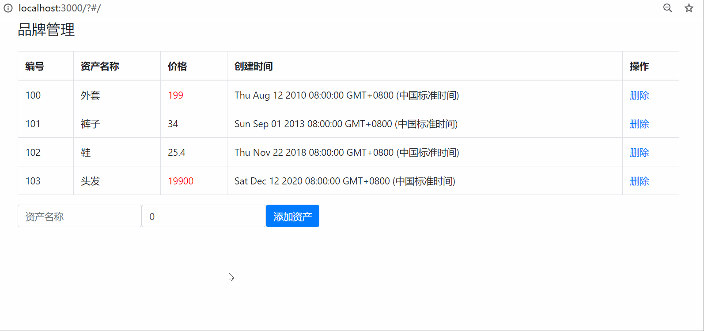

模板代码(在这个基础上写)

```vue
<!DOCTYPE html>
<html lang="en">
<head>
  <meta charset="UTF-8">
  <meta http-equiv="X-UA-Compatible" content="IE=edge">
  <meta name="viewport" content="width=device-width, initial-scale=1.0">
  <title>Document</title>
  <script src="https://cdn.jsdelivr.net/npm/vue@2.7.14/dist/vue.js"></script>
  <link rel="stylesheet" href="https://cdn.jsdelivr.net/npm/bootstrap@4.6.2/dist/css/bootstrap.min.css" integrity="sha384-xOolHFLEh07PJGoPkLv1IbcEPTNtaed2xpHsD9ESMhqIYd0nLMwNLD69Npy4HI+N" crossorigin="anonymous">
  <style>
    .red{
      color: red;
    }
  </style>
</head>
<body>
  <div id="app">
    <div class="container">
      <!-- 顶部搜索框模块 -->
      <div class="form-group">
        <div class="input-group">
          <h4>品牌管理</h4>
        </div>
      </div>

      <!-- 数据表格 -->
      <table class="table table-bordered table-hover mt-2">
        <thead>
          <tr>
            <th>编号</th>
            <th>资产名称</th>
            <th>价格</th>
            <th>创建时间</th>
            <th>操作</th>
          </tr>
        </thead>
        <tbody>
          <tr >
            <td></td>
            <td></td>

            <!-- 如果价格超过100，就有red这个类 -->
            <td class="red"></td>
            <td></td>
            <td><a href="#" >删除</a></td>
          </tr>
        </tbody>
        <tfoot >
          <tr>
            <td colspan="5" style="text-align: center">暂无数据</td>
          </tr>
        </tfoot>
      </table>

      <!-- 添加资产 -->
      <form class="form-inline">
        <div class="form-group">
          <div class="input-group">
            <input
              type="text"
              class="form-control"
              placeholder="资产名称"
            />
          </div>
        </div>
        &nbsp;&nbsp;&nbsp;&nbsp;
        <div class="form-group">
          <div class="input-group">
            <input
              type="text"
              class="form-control"
              placeholder="价格"
            />
          </div>
        </div>
        &nbsp;&nbsp;&nbsp;&nbsp;
        <!-- 阻止表单提交 -->
        <button class="btn btn-primary">添加资产</button>
      </form>
    </div>
  </div>
  <script>
    const app = new Vue({
      el: '#app',
      data: {
        name: "", // 名称
        price: 0, // 价格
        list: [
          { id: 100, name: "外套", price: 199, time: new Date('2010-08-12')},
          { id: 101, name: "裤子", price: 34, time: new Date('2013-09-01') },
          { id: 102, name: "鞋", price: 25.4, time: new Date('2018-11-22') },
          { id: 103, name: "头发", price: 19900, time: new Date('2020-12-12') }
        ]
      }
    })
  </script>
</body>
</html>
```

完整正确的代码

```vue
<!DOCTYPE html>
<html lang="en">
<head>
  <meta charset="UTF-8">
  <meta http-equiv="X-UA-Compatible" content="IE=edge">
  <meta name="viewport" content="width=device-width, initial-scale=1.0">
  <title>Document</title>
  <script src="https://cdn.jsdelivr.net/npm/vue@2.7.14/dist/vue.js"></script>
  <link rel="stylesheet" href="https://cdn.jsdelivr.net/npm/bootstrap@4.6.2/dist/css/bootstrap.min.css" integrity="sha384-xOolHFLEh07PJGoPkLv1IbcEPTNtaed2xpHsD9ESMhqIYd0nLMwNLD69Npy4HI+N" crossorigin="anonymous">
  <style>
    .red{
      color: red;
    }
  </style>
</head>
<body>
  <div id="app">
    <div class="container">
      <!-- 顶部框模块 -->
      <div class="form-group">
        <div class="input-group">
          <h4>品牌管理</h4>
        </div>
      </div>

      <!-- 数据表格 -->
      <table class="table table-bordered table-hover mt-2">
        <thead>
          <tr>
            <th>编号</th>
            <th>资产名称</th>
            <th>价格</th>
            <th>创建时间</th>
            <th>操作</th>
          </tr>
        </thead>
        <tbody>
          <tr v-for="item in list" :key="item.id">
            <td>{{ item.id }}</td>
            <td>{{ item.name }}</td>
            <!-- 如果价格超过100，就有red这个类 -->
            <td :class="{red: item.price > 100}">{{ item.price }}</td>
            <td>{{ item.time }}</td>
            <td><a href="#" @click="del(item.id)">删除</a></td>
          </tr>
        </tbody>
        <tfoot v-show="list.length === 0">
          <tr>
            <td colspan="5" style="text-align: center">暂无数据</td>
          </tr>
        </tfoot>
      </table>

      <!-- 添加资产 -->
      <form class="form-inline">
        <div class="form-group">
          <div class="input-group">
            <input
              type="text"
              class="form-control"
              placeholder="资产名称"
              v-model="name"
            />
          </div>
        </div>
        &nbsp;&nbsp;&nbsp;&nbsp;
        <div class="form-group">
          <div class="input-group">
            <input
              type="text"
              class="form-control"
              placeholder="价格"
              v-model.number="price"
            />
          </div>
        </div>
        &nbsp;&nbsp;&nbsp;&nbsp;
        <button class="btn btn-primary" @click.prevent="add">添加资产</button>
      </form>
    </div>
  </div>
  <script>
    const app = new Vue({
      el: '#app',
      data: {
        name: "", // 名称
        price: 0, // 价格
        list: [
          { id: 100, name: "外套", price: 199, time: new Date('2010-08-12')},
          { id: 101, name: "裤子", price: 34, time: new Date('2013-09-01') },
          { id: 102, name: "鞋", price: 25.4, time: new Date('2018-11-22') },
          { id: 103, name: "头发", price: 19900, time: new Date('2020-12-12') }
        ]
      },
      methods: {
        add(){
          if (this.name.trim().length === 0 || this.price === 0) return alert("不能为空")

          // 解决bug: 无数组新增-list没有数据, id需要给一个固定值(以后id都是后台生成, 现在是模拟给一个id)
          let id = this.list.length > 0 ? this.list[this.list.length - 1].id + 1 : 100

          this.list.push({
            // 当前数组最后一个对象的id+1作为新对象id值
            id: id,
            name: this.name,
            price: this.price,
            time: new Date()
          })
        },
        del(id){
          // 通过id找到这条数据在数组中下标
          let index = this.list.findIndex(obj => obj.id === id)
          this.list.splice(index, 1)
        }
      }
    })
  </script>
</body>
</html>
```

### 品牌管理案例-时间格式化

> 目标: 复制上个案例, 在此基础上, 把表格里的时间用过滤器+moment模块, 格式化成YYYY-MM-DD 格式

图示: 


1. 引入 dayjs 处理日期的第三方工具模块

   dayjs 官网文档: https://www.npmjs.com/package/dayjs

   cdn 网址如下(直接引入到网页):

   ```bash
   <script src="https://cdn.bootcdn.net/ajax/libs/dayjs/1.11.7/dayjs.min.js"></script>
   ```

2. 定义函数, 把时间用 dayjs 模块格式化, 返回我们想要的格式

   ```js
   <td>{{ dateFormate(item.time) }}</td>
   
   methods: {
     ...
     dateFormate(val){ 
       return dayjs(val).format("YYYY-MM-DD")
     }
   }
   ```

### 品牌管理案例-总价和均价

> 目标: 基于之前的案例, 完成总价和均价的计算效果

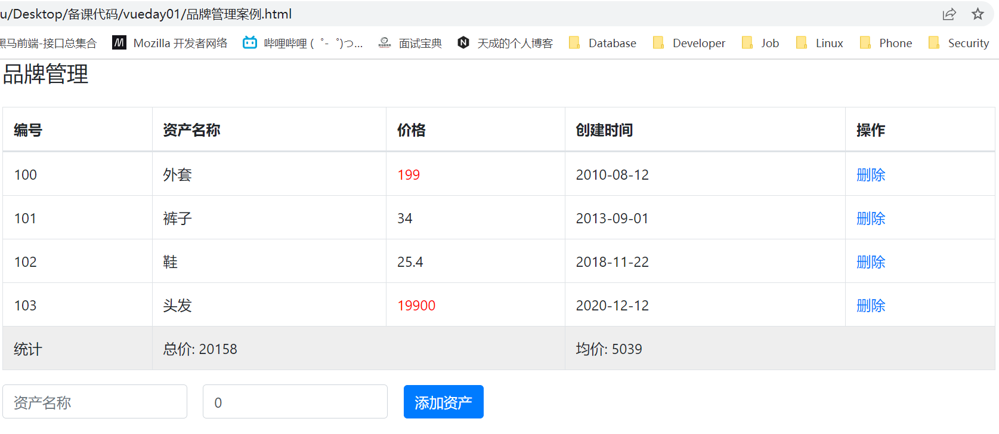

此处只修改了变化的代码

```vue
<tbody>
  <tr v-for="item in list" :key="item.id">
    <td>{{ item.id }}</td>
    <td>{{ item.name }}</td>
    <!-- 如果价格超过100，就有red这个类 -->
    <td :class="{red: item.price > 100}">{{ item.price }}</td>
    <td>{{ dateFormate(item.time) }}</td>
    <td><a href="#" @click="del(item.id)">删除</a></td>
  </tr>
  <tr style="background-color: #EEE">
    <td>统计</td>
    <td colspan="2">总价: {{ allPrice }}</td>
    <td colspan="2">均价: {{ avgPrice }}</td>
  </tr>
</tbody>
<tfoot v-show="list.length === 0">
  <tr>
    <td colspan="5" style="text-align: center">暂无数据</td>
  </tr>
</tfoot>

...

<script>
  // ...源代码省略
  computed: {
    allPrice(){
      return parseInt(this.list.reduce((sum, item) => sum + item.price, 0))
    },
    avgPrice(){
      return parseInt(this.allPrice / this.list.length)
    }
  }
</script>
```

> 总结: 总价来源于所有数据计算而来的结果, 故采用计算属性


### 品牌管理案例-数据缓存

> 目标: 侦听list变化, 同步到浏览器本地

```vue
<!DOCTYPE html>
<html lang="en">
<head>
  <meta charset="UTF-8">
  <meta http-equiv="X-UA-Compatible" content="IE=edge">
  <meta name="viewport" content="width=device-width, initial-scale=1.0">
  <title>Document</title>
  <script src="https://cdn.jsdelivr.net/npm/vue@2.7.14/dist/vue.js"></script>
  <link rel="stylesheet" href="https://cdn.jsdelivr.net/npm/bootstrap@4.6.2/dist/css/bootstrap.min.css" integrity="sha384-xOolHFLEh07PJGoPkLv1IbcEPTNtaed2xpHsD9ESMhqIYd0nLMwNLD69Npy4HI+N" crossorigin="anonymous">
  <script src="https://cdn.bootcdn.net/ajax/libs/dayjs/1.11.7/dayjs.min.js"></script>
  <style>
    .red{
      color: red;
    }
  </style>
</head>
<body>
  <div id="app">
    <div class="container">
      <!-- 顶部框模块 -->
      <div class="form-group">
        <div class="input-group">
          <h4>品牌管理</h4>
        </div>
      </div>

      <!-- 数据表格 -->
      <table class="table table-bordered table-hover mt-2">
        <thead>
          <tr>
            <th>编号</th>
            <th>资产名称</th>
            <th>价格</th>
            <th>创建时间</th>
            <th>操作</th>
          </tr>
        </thead>
        <tbody v-if="list.length > 0">
          <tr v-for="item in list" :key="item.id">
            <td>{{ item.id }}</td>
            <td>{{ item.name }}</td>
            <!-- 如果价格超过100，就有red这个类 -->
            <td :class="{red: item.price > 100}">{{ item.price }}</td>
            <td>{{ dateFormate(item.time) }}</td>
            <td><a href="#" @click="del(item.id)">删除</a></td>
          </tr>
          <tr style="background-color: #EEE">
            <td>统计</td>
            <td colspan="2">总价: {{ allPrice }}</td>
            <td colspan="2">均价: {{ avgPrice }}</td>
          </tr>
        </tbody>
        <tfoot v-show="list.length === 0">
          <tr>
            <td colspan="5" style="text-align: center">暂无数据</td>
          </tr>
        </tfoot>
      </table>

      <!-- 添加资产 -->
      <form class="form-inline">
        <div class="form-group">
          <div class="input-group">
            <input
              type="text"
              class="form-control"
              placeholder="资产名称"
              v-model="name"
            />
          </div>
        </div>
        &nbsp;&nbsp;&nbsp;&nbsp;
        <div class="form-group">
          <div class="input-group">
            <input
              type="text"
              class="form-control"
              placeholder="价格"
              v-model.number="price"
            />
          </div>
        </div>
        &nbsp;&nbsp;&nbsp;&nbsp;
        <button class="btn btn-primary" @click.prevent="add">添加资产</button>
      </form>
    </div>
  </div>
  <script>
    const app = new Vue({
      el: '#app',
      data: {
        name: "", // 名称
        price: 0, // 价格
        list: JSON.parse(localStorage.getItem('data')) || []
      },
      methods: {
        add(){
          if (this.name.trim().length === 0 || this.price === 0) return alert("不能为空")

          // 解决bug: 无数组新增-list没有数据, id需要给一个固定值(以后id都是后台生成, 现在是模拟给一个id)
          let id = this.list.length > 0 ? this.list[this.list.length - 1].id + 1 : 100

          this.list.push({
            // 当前数组最后一个对象的id+1作为新对象id值
            id: id,
            name: this.name,
            price: this.price,
            time: new Date()
          })
        },
        del(id){
          // 通过id找到这条数据在数组中下标
          let index = this.list.findIndex(obj => obj.id === id)
          this.list.splice(index, 1)
        },
        dateFormate(val){ 
          return dayjs(val).format("YYYY-MM-DD")
        }
      },
      computed: {
        allPrice(){
          return parseInt(this.list.reduce((sum, item) => sum + item.price, 0))
        },
        avgPrice(){
          return parseInt(this.allPrice / this.list.length)
        }
      },
      watch: {
        list: {
          handler(newArr){
            localStorage.setItem('data', JSON.stringify(newArr))
          },
          deep: true,
          immediate: true
        }
      }
    })
  </script>
</body>
</html>
```

### 全选反选案例

> 目标: 完成全选和反选的功能

注意: 小选框都选中(手选/点反选), 全选自动选中

图示:


标签和数据准备(可复制):

```vue
<!DOCTYPE html>
<html lang="en">
<head>
  <meta charset="UTF-8">
  <meta http-equiv="X-UA-Compatible" content="IE=edge">
  <meta name="viewport" content="width=device-width, initial-scale=1.0">
  <title>Document</title>
  <script src="https://cdn.jsdelivr.net/npm/vue@2.7.14/dist/vue.js"></script>
</head>
<body>
  <div id="app">
    <span>全选:</span>
    <input type="checkbox" />
    <button >反选</button>
    <ul>
      <li >
        <input type="checkbox" />
        <span>名字</span>
      </li>
    </ul>
  </div>
  <script>
    const app = new Vue({
      el: '#app',
      data: {
        arr: [
          {
            name: "猪八戒",
            checked: false
          },
          {
            name: "孙悟空",
            checked: false
          },
          {
            name: "唐僧",
            checked: false
          },
          {
            name: "白龙马",
            checked: false
          }
        ]
      }
    })
  </script>
</body>
</html>
```

正确答案(不可复制):

```html
<!DOCTYPE html>
<html lang="en">
<head>
  <meta charset="UTF-8">
  <meta http-equiv="X-UA-Compatible" content="IE=edge">
  <meta name="viewport" content="width=device-width, initial-scale=1.0">
  <title>Document</title>
  <script src="https://cdn.jsdelivr.net/npm/vue@2.7.14/dist/vue.js"></script>
</head>
<body>
  <div id="app">
    <span>全选:</span>
    <input type="checkbox" v-model="isAll" />
    <button @click="fan">反选</button>
    <ul>
      <li v-for="item in arr" :key="item.name">
        <input type="checkbox" v-model="item.checked" />
        <span>{{ item.name }}</span>
      </li>
    </ul>
  </div>
  <script>
    const app = new Vue({
      el: '#app',
      data: {
        arr: [
          {
            name: "猪八戒",
            checked: false
          },
          {
            name: "孙悟空",
            checked: false
          },
          {
            name: "唐僧",
            checked: false
          },
          {
            name: "白龙马",
            checked: false
          }
        ]
      },
      methods: {
        fan() {
          this.arr.map(item => item.checked = !item.checked)
        }
      },
      computed: {
        isAll: {
          set(val) {
            // 设置isAll的值的时候触发此方法, 传入要设置的值
            // val 是全选框的 true/false 的值
            this.arr.forEach(item => item.checked = val)
          },
          get() {
            return this.arr.every(item => item.checked)
          }
        }
      }
    })
  </script>
</body>
</html>
```


### 买点书

> 目标: 把数据渲染到页面上, 当用户点击买书按钮, 书籍数量增加1, 并且要计算累计的和

演示:


标签结构和数据(复制接着写): 

```vue
<!DOCTYPE html>
<html lang="en">
<head>
  <meta charset="UTF-8">
  <meta http-equiv="X-UA-Compatible" content="IE=edge">
  <meta name="viewport" content="width=device-width, initial-scale=1.0">
  <title>Document</title>
  <script src="https://cdn.jsdelivr.net/npm/vue@2.7.14/dist/vue.js"></script>
</head>
<body>
  <div id="app">
    <p>请选择你要购买的书籍</p>
    <ul>
    </ul>
    <table border="1" width="500" cellspacing="0">
      <tr>
        <th>序号</th>
        <th>书名</th>
        <th>单价</th>
        <th>数量</th>
        <th>合计</th>
      </tr>
    </table>
    <p>总价格为: </p>
  </div>
  <script>
    const app = new Vue({
      el: '#app',
      data: {
        arr: [
          {
            name: "水浒传",
            price: 107,
            count: 0,
          },
          {
            name: "西游记",
            price: 192,
            count: 0,
          },
          {
            name: "三国演义",
            price: 219,
            count: 0,
          },
          {
            name: "红楼梦",
            price: 178,
            count: 0,
          },
        ]
      },
    })
  </script>
</body>
</html>
```

正确答案(不可复制)

```vue
<!DOCTYPE html>
<html lang="en">
<head>
  <meta charset="UTF-8">
  <meta http-equiv="X-UA-Compatible" content="IE=edge">
  <meta name="viewport" content="width=device-width, initial-scale=1.0">
  <title>Document</title>
  <script src="https://cdn.jsdelivr.net/npm/vue@2.7.14/dist/vue.js"></script>
</head>
<body>
  <div id="app">
    <p>请选择你要购买的书籍</p>
    <ul>
      <li v-for="(item, i) in arr" :key="item.name">
        <span>{{ item.name }}</span>
        <button @click="buy(i)">买书</button>
      </li>
    </ul>
    <table border="1" width="500" cellspacing="0">
      <tr>
        <th>序号</th>
        <th>书名</th>
        <th>单价</th>
        <th>数量</th>
        <th>合计</th>
      </tr>
      <tr v-for="(item, index) in arr" :key="item.name">
        <td>{{ index + 1 }}</td>
        <td>{{ item.name }}</td>
        <td>{{ item.price }}</td>
        <td>{{ item.count }}</td>
        <td>{{ item.price * item.count }}</td>
      </tr>
    </table>
    <p>总价格为: {{ allPrice }}</p>
  </div>
  <script>
    const app = new Vue({
      el: '#app',
      data: {
        arr: [
          {
            name: "水浒传",
            price: 107,
            count: 0,
          },
          {
            name: "西游记",
            price: 192,
            count: 0,
          },
          {
            name: "三国演义",
            price: 219,
            count: 0,
          },
          {
            name: "红楼梦",
            price: 178,
            count: 0,
          },
        ]
      },
      methods: {
        buy(index) {
          this.arr[index].count++;
        },
      },
      computed: {
        allPrice() {
          // 数组里放的是对象, 而对象是复杂类型, 引用关系, 值改变会触发计算属性重新执行
          return this.arr.reduce((sum, item) => sum + item.price * item.count, 0);
        },
      },
    })
  </script>
</body>
</html>
```

### 选择求和

> 目标: 把用户选中的数字, 累计求和显示

提示: 

* v-model绑定的变量是数组, 可以收集checkbox的value属性呦

演示:


数据(复制):

```js
[9, 15, 19, 25, 29, 31, 48, 57, 62, 79, 87]
```

==此处不可复制==:正确答案:

```html
<!DOCTYPE html>
<html lang="en">
<head>
  <meta charset="UTF-8">
  <meta http-equiv="X-UA-Compatible" content="IE=edge">
  <meta name="viewport" content="width=device-width, initial-scale=1.0">
  <title>Document</title>
  <script src="https://cdn.jsdelivr.net/npm/vue@2.7.14/dist/vue.js"></script>
</head>
<body>
  <div id="app">
    <div
      v-for="item in arr"
      style="display: inline-block"
      :key="item"
    >
      <input type="checkbox" v-model="checkNumArr" :value="item" />
      <span>{{ item }}</span>
    </div>
    <p>你选中的元素, 累加的值和为: {{ sum }}</p>
  </div>
  <script>
    const app = new Vue({
      el: '#app',
      data: {
        arr: [9, 15, 19, 25, 29, 31, 48, 57, 62, 79, 87],
        checkNumArr: [], //  保存用户选中的数字
      },
      computed: {
        sum() {
          return this.checkNumArr.reduce((sum, item) => sum + item, 0)
        }
      }
    })
  </script>
</body>
</html>
```

> 总结, 当计算属性函数里引用的vue变量发生改变, 函数就执行并重新返回结果并缓存起来

### 移动端-导航切换效果

目标: 切换到移动端画面, 点击导航, 高亮

> 提示: 索引 / 高亮的class样式

图例:

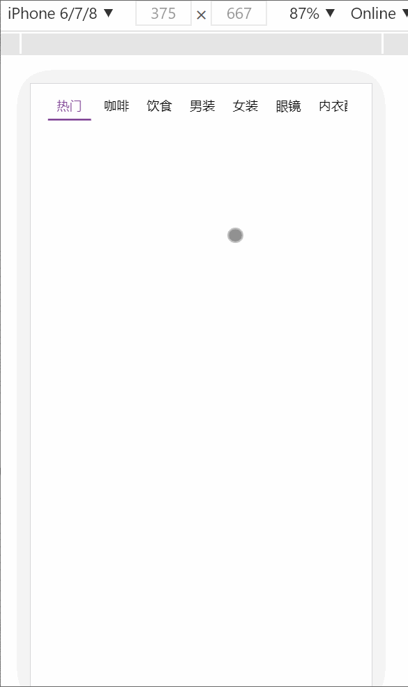

模板代码:

```html
<!DOCTYPE html>
<html lang="en">
<head>
  <meta charset="UTF-8">
  <meta http-equiv="X-UA-Compatible" content="IE=edge">
  <meta name="viewport" content="width=device-width, initial-scale=1.0">
  <title>Document</title>
  <script src="https://cdn.jsdelivr.net/npm/vue@2.7.14/dist/vue.js"></script>
  <style>
    .wrap {
      width: 100%;
      display: flex;
      margin: 0.2rem 0 0 0;
      position: relative;
    }
    
    /*左侧的导航样式*/
    .nav_left {
      width: 21.1875rem;
      overflow: scroll;
    }
    
    .nav_left::-webkit-scrollbar {
      display: none;
    }
    
    .nav_content {
      white-space: nowrap;
      padding: 0 0.7rem;
    }
    
    .nav_content span {
      display: inline-block;
      padding: 0.4rem 0.6rem;
      font-size: 0.875rem;
    }
    
    .nav_content .active {
      border-bottom: 2px solid #7f4395;
      color: #7f4395;
    }
    
    .nav_left,
    .down {
      float: left;
    }
    
    /*右侧导航部分*/
    .down {
      flex: 1;
      display: flex;
      align-items: center;
      justify-content: center;
    }
    
    .gray {
      color: gray;
      display: inline-block;
      vertical-align: middle;
    }
  </style>
</head>
<body>
  <div id="app">
    <div class="wrap">
      <div class="nav_left" id="navLeft">
        <div class="nav_content">
          <span class="active">导航名字</span>
        </div>
      </div>
      <div class="down">
        <i class="iconfont icon-xiajiantoubeifen gray"></i>
      </div>
    </div>
  </div>
  <script>
    const app = new Vue({
      el: '#app',
      data: {
        arr: [
          {
            first_id: "0",
            first_name: "热门"
          },
          {
            first_id: "621",
            first_name: "\u5496\u5561",
          },
          {
            first_id: "627",
            first_name: "\u996e\u98df",
          },
          {
            first_id: "279",
            first_name: "\u7537\u88c5",
          },
          {
            first_id: "294",
            first_name: "\u5973\u88c5",
          },
          {
            first_id: "122",
            first_name: "\u773c\u955c",
          },
          {
            first_id: "339",
            first_name: "\u5185\u8863\u914d\u9970",
          },
          {
            first_id: "391",
            first_name: "\u6bcd\u5a74",
          },
          {
            first_id: "35",
            first_name: "\u978b\u9774",
          },
          {
            first_id: "39",
            first_name: "\u8fd0\u52a8",
          },
          {
            first_id: "153",
            first_name: "\u7bb1\u5305",
          },
          {
            first_id: "119",
            first_name: "\u7f8e\u5986\u4e2a\u62a4",
          },
          {
            first_id: "355",
            first_name: "\u5bb6\u7eba",
          },
          {
            first_id: "51",
            first_name: "\u9910\u53a8",
          },
          {
            first_id: "334",
            first_name: "\u7535\u5668",
          },
          {
            first_id: "369",
            first_name: "\u5bb6\u88c5",
          },
          {
            first_id: "10",
            first_name: "\u5bb6\u5177",
          },
          {
            first_id: "223",
            first_name: "\u6570\u7801",
          },
          {
            first_id: "429",
            first_name: "\u6c7d\u914d",
          },
          {
            first_id: "546",
            first_name: "\u5065\u5eb7\u4fdd\u5065",
          },
          {
            first_id: "433",
            first_name: "\u5b9a\u5236",
          },
        ],
      }
    })
  </script>
</body>
</html>
```

正确代码:

```html
<!DOCTYPE html>
<html lang="en">
<head>
  <meta charset="UTF-8">
  <meta http-equiv="X-UA-Compatible" content="IE=edge">
  <meta name="viewport" content="width=device-width, initial-scale=1.0">
  <title>Document</title>
  <script src="https://cdn.jsdelivr.net/npm/vue@2.7.14/dist/vue.js"></script>
  <style>
    .wrap {
      width: 100%;
      display: flex;
      margin: 0.2rem 0 0 0;
      position: relative;
    }
    
    /*左侧的导航样式*/
    .nav_left {
      width: 21.1875rem;
      overflow: scroll;
    }
    
    .nav_left::-webkit-scrollbar {
      display: none;
    }
    
    .nav_content {
      white-space: nowrap;
      padding: 0 0.7rem;
    }
    
    .nav_content span {
      display: inline-block;
      padding: 0.4rem 0.6rem;
      font-size: 0.875rem;
    }
    
    .nav_content .active {
      border-bottom: 2px solid #7f4395;
      color: #7f4395;
    }
    
    .nav_left,
    .down {
      float: left;
    }
    
    /*右侧导航部分*/
    .down {
      flex: 1;
      display: flex;
      align-items: center;
      justify-content: center;
    }
    
    .gray {
      color: gray;
      display: inline-block;
      vertical-align: middle;
    }
  </style>
</head>
<body>
  <div id="app">
    <div class="wrap">
      <div class="nav_left" id="navLeft">
        <div class="nav_content">
          <span :class="{active: selIndex == index}" v-for="(item, index) in arr" :key="item.first_id" @click="change(index)">{{ item.first_name }}</span>
        </div>
      </div>
      <div class="down">
        <i class="iconfont icon-xiajiantoubeifen gray"></i>
      </div>
    </div>
  </div>
  <script>
    const app = new Vue({
      el: '#app',
      data: {
        selIndex: 0, // 记录当前应该哪个索引对应span高亮的 (默认第0个高亮)
        arr: [
          {
            first_id: "0",
            first_name: "热门"
          },
          {
            first_id: "621",
            first_name: "\u5496\u5561",
          },
          {
            first_id: "627",
            first_name: "\u996e\u98df",
          },
          {
            first_id: "279",
            first_name: "\u7537\u88c5",
          },
          {
            first_id: "294",
            first_name: "\u5973\u88c5",
          },
          {
            first_id: "122",
            first_name: "\u773c\u955c",
          },
          {
            first_id: "339",
            first_name: "\u5185\u8863\u914d\u9970",
          },
          {
            first_id: "391",
            first_name: "\u6bcd\u5a74",
          },
          {
            first_id: "35",
            first_name: "\u978b\u9774",
          },
          {
            first_id: "39",
            first_name: "\u8fd0\u52a8",
          },
          {
            first_id: "153",
            first_name: "\u7bb1\u5305",
          },
          {
            first_id: "119",
            first_name: "\u7f8e\u5986\u4e2a\u62a4",
          },
          {
            first_id: "355",
            first_name: "\u5bb6\u7eba",
          },
          {
            first_id: "51",
            first_name: "\u9910\u53a8",
          },
          {
            first_id: "334",
            first_name: "\u7535\u5668",
          },
          {
            first_id: "369",
            first_name: "\u5bb6\u88c5",
          },
          {
            first_id: "10",
            first_name: "\u5bb6\u5177",
          },
          {
            first_id: "223",
            first_name: "\u6570\u7801",
          },
          {
            first_id: "429",
            first_name: "\u6c7d\u914d",
          },
          {
            first_id: "546",
            first_name: "\u5065\u5eb7\u4fdd\u5065",
          },
          {
            first_id: "433",
            first_name: "\u5b9a\u5236",
          },
        ],
      },
      methods: {
        change(index){
          this.selIndex = index // 把isSelIindex的值赋予成应该高亮的span标签的索引, 保证上面动态class判断成功
        }
      }
    })
  </script>
</body>
</html>
```


### 学生信息管理

==如果1个按钮不会写, 用2个按钮写==

目标: 

* 需求1: 渲染页面, 准备初始的数据(自己手写数据结构) - 前面是数组索引+1 *作为序号
* 需求2: 当输入框没有值, 要给用户一个提示, 必须都有值才能增加新数据 (数据驱动页面哦)
* 需求3: 添加功能 - 想好数据结构统一对象的key
* 需求4: 点击编辑功能, 把值赋予到输入框上(不要操作dom, 数据驱动页面)
* 需求5: 用户修改后, 点击相同按钮 - 想想怎么判断怎么是添加还是修改的功能 (提示: 准备一个全局变量, 点过编辑按钮可以让它为true) - 实现编辑后更新页面效果
* 需求6: 点击删除, 删除这行数据


模板代码:

```html
<!DOCTYPE html>
<html lang="en">
<head>
  <meta charset="UTF-8">
  <meta http-equiv="X-UA-Compatible" content="IE=edge">
  <meta name="viewport" content="width=device-width, initial-scale=1.0">
  <title>Document</title>
  <script src="https://cdn.jsdelivr.net/npm/vue@2.7.14/dist/vue.js"></script>
  <style>
    .wrap {
      width: 100%;
      display: flex;
      margin: 0.2rem 0 0 0;
      position: relative;
    }
    
    /*左侧的导航样式*/
    .nav_left {
      width: 21.1875rem;
      overflow: scroll;
    }
    
    .nav_left::-webkit-scrollbar {
      display: none;
    }
    
    .nav_content {
      white-space: nowrap;
      padding: 0 0.7rem;
    }
    
    .nav_content span {
      display: inline-block;
      padding: 0.4rem 0.6rem;
      font-size: 0.875rem;
    }
    
    .nav_content .active {
      border-bottom: 2px solid #7f4395;
      color: #7f4395;
    }
    
    .nav_left,
    .down {
      float: left;
    }
    
    /*右侧导航部分*/
    .down {
      flex: 1;
      display: flex;
      align-items: center;
      justify-content: center;
    }
    
    .gray {
      color: gray;
      display: inline-block;
      vertical-align: middle;
    }
  </style>
</head>
<body>
  <div id="app">
    <div>
      <span>姓名:</span>
      <input type="text" />
    </div>
    <div>
      <span>年龄:</span>
      <input type="number" />
    </div>
    <div>
      <span>性别:</span>
      <select >
        <option value="男">男</option>
        <option value="女">女</option>
      </select>
    </div>
    <div>
      <button >添加/修改</button>
    </div>
    <div>
      <table
        border="1"
        cellpadding="10"
        cellspacing="0"
      >
        <tr>
          <th>序号</th>
          <th>姓名</th>
          <th>年龄</th>
          <th>性别</th>
          <th>操作</th>
        </tr>
        <tr >
          <td></td>
          <td></td>
          <td></td>
          <td></td>
          <td>
            <button >删除</button>
            <button >编辑</button>
          </td>
        </tr>
      </table>
    </div>
  </div>
  <script>
    const app = new Vue({
      el: '#app',
      data: {
      }
    })
  </script>
</body>
</html>
```


正确代码:

```html
<!DOCTYPE html>
<html lang="en">
<head>
  <meta charset="UTF-8">
  <meta http-equiv="X-UA-Compatible" content="IE=edge">
  <meta name="viewport" content="width=device-width, initial-scale=1.0">
  <title>Document</title>
  <script src="https://cdn.jsdelivr.net/npm/vue@2.7.14/dist/vue.js"></script>
  <style>
    .wrap {
      width: 100%;
      display: flex;
      margin: 0.2rem 0 0 0;
      position: relative;
    }
    
    /*左侧的导航样式*/
    .nav_left {
      width: 21.1875rem;
      overflow: scroll;
    }
    
    .nav_left::-webkit-scrollbar {
      display: none;
    }
    
    .nav_content {
      white-space: nowrap;
      padding: 0 0.7rem;
    }
    
    .nav_content span {
      display: inline-block;
      padding: 0.4rem 0.6rem;
      font-size: 0.875rem;
    }
    
    .nav_content .active {
      border-bottom: 2px solid #7f4395;
      color: #7f4395;
    }
    
    .nav_left,
    .down {
      float: left;
    }
    
    /*右侧导航部分*/
    .down {
      flex: 1;
      display: flex;
      align-items: center;
      justify-content: center;
    }
    
    .gray {
      color: gray;
      display: inline-block;
      vertical-align: middle;
    }
  </style>
</head>
<body>
  <div id="app">
    <div>
      <span>姓名:</span>
      <input type="text" v-model.trim="username" />
    </div>
    <div>
      <span>年龄:</span>
      <input type="number" v-model.number="userAge" />
    </div>
    <div>
      <span>性别:</span>
      <select v-model="gender">
        <option value="男">男</option>
        <option value="女">女</option>
      </select>
    </div>
    <div>
      <button @click="addOrEdit">添加/修改</button>
    </div>
    <div>
      <table
        border="1"
        cellpadding="10"
        cellspacing="0"
        v-show="dataArr.length > 0"
      >
        <tr>
          <th>序号</th>
          <th>姓名</th>
          <th>年龄</th>
          <th>性别</th>
          <th>操作</th>
        </tr>
        <tr v-for="(item, index) in dataArr" :key="item.name">
          <td>{{ index + 1 }}</td>
          <td>{{ item.name }}</td>
          <td>{{ item.age }}</td>
          <td>{{ item.sex }}</td>
          <td>
            <button @click="del(index)">删除</button>
            <button @click="edit(index)">编辑</button>
          </td>
        </tr>
      </table>
    </div>
  </div>
  <script>
    const app = new Vue({
      el: '#app',
      data: {
        username: "",
        userAge: 0,
        gender: "男",
        editIndex: null, // 保存正在编辑的对象的索引, 千万不能给0和0以上的值(默认上来就是编辑状态)
        dataArr: [
          {
            name: "Tom",
            age: 19,
            sex: "男",
          },
          {
            name: "Jone",
            age: 21,
            sex: "女",
          },
        ],
      },
      methods: {
        addOrEdit() {
          // 添加/修改-点击事件方法
          const newObj = {
            name: this.username,
            age: this.userAge,
            sex: this.gender,
          }
          if (this.editIndex !== null) { // 本次是要编辑更新
            this.dataArr.splice(this.editIndex, 1, newObj)
            // 千万注意
            this.editIndex = null // 更新后, 保证下次点击是新增
          } else { // 新增
            this.dataArr.push(newObj)
          }
        },
        del(index) {
          // 删除 点击事件方法
          this.dataArr.splice(index, 1)
        },
        edit(index) {
          // 编辑 点击事件方法 -index(正在编辑的数据对象的索引值)
          let editObj = this.dataArr[index] // 把要编辑的对象信息取出来
          this.username = editObj.name
          this.userAge = editObj.age
          this.gender = editObj.sex
          this.editIndex = index // 把正在编辑的索引值保存起来
        }
      }
    })
  </script>
</body>
</html>
```


## Day03

### todo案例

完整效果演示

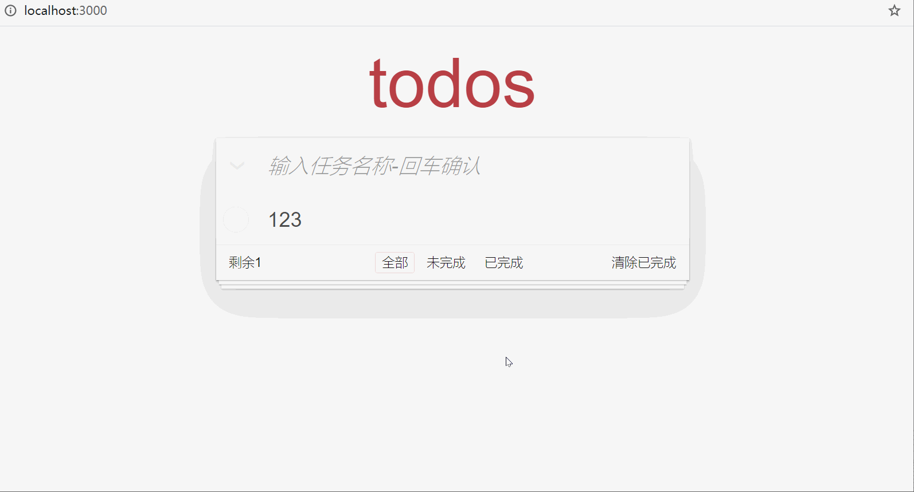

#### todo案例-创建工程和组件

> 目标: 新建工程, 准备好所需的一切

* 需求1: 创建新工程
* 需求2: 分组件创建 – 准备标签和样式(从.md笔记复制)

分析：

​	①：初始化todo工程

​	②：创建３个组件和里面代码(在预习资料.md复制)

​	③：把styles的样式文件准备好(从预习资料复制)

​	④:  App.vue引入注册使用, 最外层容器类名todoapp

预先准备: 把styles的样式文件准备好(从预习资料复制), 在App.vue引入使用

```js
// 1.0 样式引入
import "./styles/base.css"
import "./styles/index.css"
```

根据需求: 我们定义3个组件准备复用

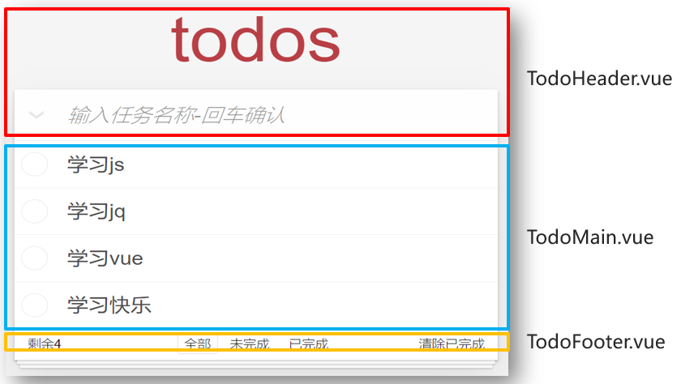

components/TodoHeader.vue - 复制标签和类名

```vue
<template>
  <header class="header">
    <h1>todos</h1>
    <input id="toggle-all" class="toggle-all" type="checkbox" >
    <label for="toggle-all"></label>
    <input
      class="new-todo"
      placeholder="输入任务名称-回车确认"
      autofocus
    />
  </header>
</template>

<script>
export default {
 
}
</script>
```

components/TodoMain.vue - 复制标签和类名

```vue
<template>
  <ul class="todo-list">
    <!-- completed: 完成的类名 -->
    <li class="completed" >
      <div class="view">
        <input class="toggle" type="checkbox" />
        <label>任务名</label>
        <button class="destroy"></button>
      </div>
    </li>
  </ul>
  
</template>

<script>
export default {
}
</script>
```

components/TodoFooter.vue - 复制标签和类名

```vue
<template>
  <footer class="footer">
    <span class="todo-count">剩余<strong>数量值</strong></span>
    <ul class="filters">
      <li>
        <a class="selected" href="javascript:;" >全部</a>
      </li>
      <li>
        <a href="javascript:;">未完成</a>
      </li>
      <li>
        <a href="javascript:;" >已完成</a>
      </li>
    </ul>
    <button class="clear-completed" >清除已完成</button>
  </footer>
</template>

<script>
export default {

}
</script>
```

App.vue中引入和使用

```vue
<template>
  <section class="todoapp">
    <!-- 除了驼峰, 还可以使用-转换链接 -->
    <TodoHeader></TodoHeader>
    <TodoMain></TodoMain>
    <TodoFooter></TodoFooter>
  </section>
</template>

<script>
// 1.0 样式引入
import "./styles/base.css"
import "./styles/index.css"
    
import TodoHeader from "./components/TodoHeader";
import TodoMain from "./components/TodoMain";
import TodoFooter from "./components/TodoFooter";


export default {
  components: {
    TodoHeader,
    TodoMain,
    TodoFooter,
  },
};
</script>
```

#### todo案例-渲染待办任务

> 目的: 把待办任务, 展示到页面TodoMain.vue组件上

* 需求1: 把待办任务, 展示到页面TodoMain.vue组件上
* 需求2: 关联选中状态, 设置相关样式

分析：

​	①: App.vue – 准备数组传入TodoMain.vue内

​	②: v-for循环展示数据

​	③: v-model绑定复选框选中状态

​	④: 根据选中状态, 设置完成划线样式

App.vue

```js
 <TodoMain :arr="showArr"></TodoMain>

export default {
  data() {
    return {
      list: [
        { id: 100, name: "吃饭", isDone: true },
        { id: 201, name: "睡觉", isDone: false },
        { id: 103, name: "打豆豆", isDone: true },
      ],
    };
  }
};
```

TodoMain.vue

```vue
<template>
  <ul class="todo-list">
    <!-- 2.2 循环任务-关联选中状态-渲染数据 -->
    <!-- completed: 完成的类名 -->
    <li :class="{completed: obj.isDone}" v-for="(obj, index) in arr" :key='obj.id'>
      <div class="view">
        <input class="toggle" type="checkbox" v-model="obj.isDone"/>
        <label>{{ obj.name }}</label>
        <!-- 4.0 注册点击事件 -->
        <button @click="delFn(index)" class="destroy"></button>
      </div>
    </li>
  </ul>
</template>

<script>
export default {
  props: ["list"]
};
</script>

<style>
</style>
```

#### todo案例-添加任务

> 目标: 在顶部输入框输入要完成的任务名, 敲击回车, 完成新增功能

* 需求: 输入任务敲击回车, 新增待办任务

分析：

​	①: TodoHeader.vue – 输入框 – 键盘事件 – 回车按键

​	②: 子传父, 把待办任务 – App.vue中 – 加入数组list里

​	③: 原数组改变, 所有用到的地方都会更新

​	④: 输入框为空, 提示用户必须输入内容

TodoHeader.vue

```vue
<template>
  <header class="header">
    <h1>todos</h1>
    <input id="toggle-all" class="toggle-all" type="checkbox" v-model="isAll">
    <label for="toggle-all"></label>
    <!-- 3.0 键盘事件-回车按键
         3.1 输入框 - v-model获取值
     -->
    <input
      class="new-todo"
      placeholder="输入任务名称-回车确认"
      autofocus
      @keydown.enter="downFn"
      v-model="task"
    />
  </header>
</template>

<script>
// 3. 目标 - 新增任务
export default {
  data(){
    return {
      task: ""
    }
  },
  methods: {
    downFn(){
      if (this.task.trim().length === 0) {
        alert("任务名不能为空");
        return;
      }
      // 3.2(重要) - 当前任务名字要加到list数组里
      // 子传父技术
      this.$emit("create", this.task)
      this.task = ""
    }
  }
}
</script>
```

App.vue

```js
<TodoHeader @create="createFn"></TodoHeader>

methods: {
   createFn(taskName){ // 添加任务
      // 3.3 push到数组里
      let id = this.list.length == 0 ? 100 : this.list[this.list.length - 1].id + 1
      this.list.push({
        id: id,
        name: taskName,
        isDone: false
      })
    },
}
```

#### todo案例-删除任务

> 目标: 实现点x, 删除任务功能

* 需求: 点击任务后的x, 删除当前这条任务

分析：

​	①: x标签 – 点击事件 – 传入id区分

​	②: 子传父, 把id传回– App.vue中 – 删除数组list里某个对应的对象

​	③: 原数组改变, 所有用到的地方都会更新

App.vue - 传入自定义事件等待接收要被删除的序号

```js
<TodoMain :arr="showArr" @del="deleteFn"></TodoMain>

methods: {
    deleteFn(theId){ // 删除任务
      let index = this.list.findIndex(obj => obj.id === theId)
      this.list.splice(index, 1)
    },
},
```

TodoMain.vue - 把id传回去实现删除(想好数据在哪里, 就在哪里删除)

```js
<!-- 4.0 注册点击事件 -->
<button class="destroy" @click="delFn(obj.id)"></button>

methods: {
     delFn(id){
      // 4.1 子传父
      this.$emit('del', id)
    }
}
```

#### todo案例-底部统计

> 目的: 显示现在任务的总数

* 需求: 统计当前任务的条数

分析：

​	①: App.vue中 – 数组list – 传给TodoFooter.vue

​	②: 直接在标签上显示 / 定义计算属性用于显示都可以

​	③: 原数组只要改变, 所有用到此数组的地方都会更新

TodoFooter.vue - 接收list统计直接显示

```vue
<template>
  <footer class="footer">
    <span class="todo-count">剩余<strong>{{ count }}</strong></span>
    <ul class="filters">
      <li>
        <a class="selected" href="javascript:;">全部</a>
      </li>
      <li>
        <a href="javascript:;">未完成</a>
      </li>
      <li>
        <a href="javascript:;">已完成</a>
      </li>
    </ul>
    <button class="clear-completed">清除已完成</button>
  </footer>
</template>

<script>
export default {
  // 5.0 props定义
  props: ['farr'],
  // 5.1 计算属性 - 任务数量
  computed: {
    count(){
      return this.farr.length
    }
  },
}
</script>

<style>

</style>
```

App.vue - 传入数据

```vue
<TodoFooter :farr="showArr"></TodoFooter>
```

#### todo案例-数据切换

> 目的: 点击底部切换数据

* 需求1: 点击底部切换 – 点谁谁有边框
* 需求2: 对应切换不同数据显示

分析：

​	①: TodoFooter.vue – 定义isSel – 值为all, yes, no其中一种

​	②: 多个class分别判断谁应该有类名selected

​	③: 点击修改isSel的值

​	④: 子传父, 把类型isSel传到App.vue

​	⑤: 定义计算属性showArr, 决定从list里显示哪些数据给TodoMain.vue和TodoFooter.vue

App.vue

```vue
<TodoFooter :farr="showArr" @changeType="typeFn"></TodoFooter>

<script>
    export default{
       data(){
            return {
              // ...其他省略
              getSel: "all" // 默认显示全部
            }
        },
        methods: {
            // ...其他省略
            typeFn(str){ // 'all' 'yes' 'no' // 修改类型
              this.getSel = str
            },
        },
        // 6.5 定义showArr数组 - 通过list配合条件筛选而来
          computed: {
            showArr(){
              if (this.getSel === 'yes') { // 显示已完成
                return this.list.filter(obj => obj.isDone === true)
              } else if (this.getSel === 'no') { // 显示未完成
                return this.list.filter(obj => obj.isDone === false)
              } else {
                return this.list // 全部显示
              }
            }
          },
    }
</script>
```

TodoFooter.vue

```vue
<template>
  <footer class="footer">
    <span class="todo-count">剩余<strong>{{ count }}</strong></span>
    <ul class="filters" @click="fn">
      <li>
        <!-- 6.1 判断谁应该有高亮样式: 动态class
            6.2 用户点击要切换isSel里保存的值
         -->
        <a :class="{selected: isSel === 'all'}" href="javascript:;" @click="isSel='all'">全部</a>
      </li>
      <li>
        <a :class="{selected: isSel === 'no'}" href="javascript:;" @click="isSel='no'">未完成</a>
      </li>
      <li>
        <a :class="{selected: isSel === 'yes'}" href="javascript:;" @click="isSel='yes'">已完成</a>
      </li>
    </ul>
    <!-- 7. 目标: 清除已完成 -->
    <!-- 7.0 点击事件 -->
    <button class="clear-completed" >清除已完成</button>
  </footer>
</template>

<script>
// 5. 目标: 数量统计
export default {
  // 5.0 props定义
  props: ['farr'],
  // 5.1 计算属性 - 任务数量
  computed: {
    count(){
      return this.farr.length
    }
  },
  // 6. 目标: 点谁谁亮
  // 6.0 变量isSel
  data(){
    return {
      isSel: 'all' // 全部:'all', 已完成'yes', 未完成'no'
    }
  },
  methods: {
    fn(){ // 切换筛选条件
      // 6.3 子 -> 父 把类型字符串传给App.vue 
      this.$emit("changeType", this.isSel)
    }
  }
}
</script>
```

#### todo案例-清空已完成

> 目的: 点击右下角按钮- 把已经完成的任务清空了

* 需求: 点击右下角链接标签, 清除已完成任务 

分析：

​	①: 清空标签 – 点击事件

​	②: 子传父 – App.vue – 一个清空方法

​	③: 过滤未完成的覆盖list数组 (不考虑恢复)

App.vue - 先传入一个自定义事件-因为得接收TodoFooter.vue里的点击事件

```vue
<TodoFooter :farr="showArr" @changeType="typeFn" @clear="clearFun"></TodoFooter>

<script>
    methods: {
        // ...省略其他
        clearFun(){ // 清除已完成
          this.list = this.list.filter(obj => obj.isDone == false)
        }
    }
</script>
```

TodoFooter.vue

```vue
<!-- 7. 目标: 清除已完成 -->
<!-- 7.0 点击事件 -->
<button class="clear-completed" @click="clearFn">清除已完成</button>

<script>
	methods: {
        clearFn(){ // 清空已完成任务
          // 7.1 触发App.vue里事件对应clearFun方法
          this.$emit('clear')
        }
    }
</script>
```

#### todo案例-数据缓存

> 目的: 新增/修改状态/删除 后, 马上把数据同步到浏览器本地存储

* 需求: 无论如何变化 – 都保证刷新后数据还在

分析：

​	①: App.vue – 侦听list数组改变 – 深度

​	②: 覆盖式存入到本地 – 注意本地只能存入JSON字符串

​	③: 刷新页面 – list应该默认从本地取值 – 要考虑无数据情况空数组

App.vue

```vue
<script>
    export default {
        data(){
            return {
                // 8.1 默认从本地取值
                list: JSON.parse(localStorage.getItem('todoList')) || [],
                // 6.4 先中转接收类型字符串
                getSel: "all" // 默认显示全部
            }
        },
        // 8. 目标: 数据缓存
        watch: {
            list: {
                deep: true,
                handler(){
                    // 8.0 只要list变化 - 覆盖式保存到localStorage里
                    localStorage.setItem('todoList', JSON.stringify(this.list))
                }
            }
        }
    };
</script>
```

#### todo案例-全选功能

> 目标: 点击左上角v号, 可以设置一键完成, 再点一次取消全选

* 需求1: 点击全选 – 小选框受到影响
* 需求2: 小选框都选中(手选) – 全选自动选中状态

分析：

​	①: TodoHeader.vue – 计算属性 - isAll

​	②: App.vue – 传入数组list – 在isAll的set里影响小选框

​	③: isAll的get里统计小选框最后状态, 影响isAll – 影响全选状态

​	④: 考虑无数据情况空数组 – 全选不应该勾选

提示: 就是遍历所有的对象, 修改他们的完成状态属性的值

TodoHeader.vue

```vue
<!-- 9. 目标: 全选状态
9.0 v-model关联全选状态
页面变化(勾选true, 未勾选false) -> v-model -> isAll变量
-->
<input id="toggle-all" class="toggle-all" type="checkbox" v-model="isAll">

<script>
    export default {
        // ...其他省略
        // 9.1 定义计算属性
        computed: {
            isAll: {
                set(checked){ // 只有true / false
                    // 9.3 影响数组里每个小选框绑定的isDone属性
                    this.arr.forEach(obj => obj.isDone = checked)
                },
                get(){
                    // 9.4 小选框统计状态 -> 全选框
                    // 9.5 如果没有数据, 直接返回false-不要让全选勾选状态
                    return this.arr.length !== 0 && this.arr.every(obj => obj.isDone === true)
                }
            }
        },
    }
</script>
```

App.vue

```vue
<TodoHeader :arr="list" @create="createFn"></TodoHeader>
```

### 喜欢小狗狗吗

> 目标: 封装Dog组件, 用来复用显示图片和标题的

效果:


----

正确答案(==先不要看==)

components/Dog1.vue

```html
<template>
  <div class="my_div">
    
    <p>这是一个孤独可怜的狗</p>
  </div>
</template>

<script>
export default {};
</script>

<style>
.my_div {
  width: 400px;
  border: 1px solid black;
  text-align: center;
  float: left;
}

.my_div img {
  width: 100%;
}
</style>
```

在App.vue中使用

```vue
<template>
  <div>
    <Dog></Dog>
    <Dog/>
  </div>
</template>

<script>
import Dog from './components/Dog1'
export default {
  components: {
    Dog
  }
}
</script>

<style>

</style>
```

> 总结: 重复部分封装成组件, 然后注册使用

### 点击文字变色

> 目标: 修改Dog组件, 实现组件内点击变色

提示: 文字在组件内, 所以事件和方法都该在组件内-独立

图示:


正确代码(==先不要看==)

components/Dog2.vue

```html
<template>
  <div class="my_div">
    
    <p :style="{backgroundColor: colorStr}" @click="btn">这是一个孤独可怜的狗</p>
  </div>
</template>

<script>
export default {
  data(){
    return {
      colorStr: ""
    }
  },
  methods: {
    btn(){
      this.colorStr = `rgb(${Math.floor(Math.random() * 256)}, ${Math.floor(Math.random() * 256)}, ${Math.floor(Math.random() * 256)})`
    }
  }
};
</script>

<style>
.my_div {
  width: 400px;
  border: 1px solid black;
  text-align: center;
  float: left;
}

.my_div img {
  width: 100%;
}
</style>
```

### 卖狗啦

> 目标: 把数据循环用组件显示渲染

数据:

```js
[
    {
        dogImgUrl:
        "http://nwzimg.wezhan.cn/contents/sitefiles2029/10146688/images/21129958.jpg",
        dogName: "博美",
    },
    {
        dogImgUrl:
        "https://ss2.bdstatic.com/70cFvnSh_Q1YnxGkpoWK1HF6hhy/it/u=1224576619,1307855467&fm=26&gp=0.jpg",
        dogName: "泰迪",
    },
    {
        dogImgUrl:
        "https://ss2.bdstatic.com/70cFvnSh_Q1YnxGkpoWK1HF6hhy/it/u=2967740259,1518632757&fm=26&gp=0.jpg",
        dogName: "金毛",
    },
    {
        dogImgUrl:
        "https://pic1.zhimg.com/80/v2-7ba4342e6fedb9c5f3726eb0888867da_1440w.jpg?source=1940ef5c",
        dogName: "哈士奇",
    },
    {
        dogImgUrl:
        "https://timgsa.baidu.com/timg?image&quality=80&size=b9999_10000&sec=1563813435580&di=946902d419c3643e33a0c9113fc8d780&imgtype=0&src=http%3A%2F%2Fvpic.video.qq.com%2F3388556%2Fd0522aynh3x_ori_3.jpg",
        dogName: "阿拉斯加",
    },
    {
        dogImgUrl:
        "https://timgsa.baidu.com/timg?image&quality=80&size=b9999_10000&sec=1563813454815&di=ecdd2ebf479568453d704dffacdfa12c&imgtype=0&src=http%3A%2F%2Fwww.officedoyen.com%2Fuploads%2Fallimg%2F150408%2F1-15040Q10J5B0.jpg",
        dogName: "萨摩耶",
    },
]
```

图示:


正确代码(==不可复制==)

components/Dog3.vue

```vue
<template>
  <div class="my_div">
    
    <p :style="{backgroundColor: colorStr}" @click="btn">{{ dogname }}</p>
  </div>
</template>

<script>
export default {
  props: ['imgurl', 'dogname'],
  // ...其他代码省略
};
</script>
```

App.vue引入使用把数据循环传给组件显示

```vue
<template>
  <div>
    <Dog v-for="(obj, index) in arr"
    :key="index"
    :imgurl="obj.dogImgUrl"
    :dogname="obj.dogName"
    ></Dog>
  </div>
</template>

<script>
import Dog from './components/Dog3'
export default {
  data() {
    return {
      // 1. 准备数据
      arr: [
        {
          dogImgUrl:
            "https://img-pre.ivsky.com/img/tupian/pre/201605/30/pomeranian-001.jpg",
          dogName: "博美",
        },
        {
          dogImgUrl:
            "https://ss2.bdstatic.com/70cFvnSh_Q1YnxGkpoWK1HF6hhy/it/u=1224576619,1307855467&fm=26&gp=0.jpg",
          dogName: "泰迪",
        },
        {
          dogImgUrl:
            "https://ss2.bdstatic.com/70cFvnSh_Q1YnxGkpoWK1HF6hhy/it/u=2967740259,1518632757&fm=26&gp=0.jpg",
          dogName: "金毛",
        },
        {
          dogImgUrl:
            "https://gimg2.baidu.com/image_search/src=http%3A%2F%2Fs9.rr.itc.cn%2Fr%2FwapChange%2F20165_6_11%2Fa0teml39607703025596.png&refer=http%3A%2F%2Fs9.rr.itc.cn&app=2002&size=f9999,10000&q=a80&n=0&g=0n&fmt=jpeg?sec=1616048681&t=228c337babe1aed1e95a3e689693130f",
          dogName: "哈士奇",
        },
        {
          dogImgUrl:
            "https://timgsa.baidu.com/timg?image&quality=80&size=b9999_10000&sec=1563813435580&di=946902d419c3643e33a0c9113fc8d780&imgtype=0&src=http%3A%2F%2Fvpic.video.qq.com%2F3388556%2Fd0522aynh3x_ori_3.jpg",
          dogName: "阿拉斯加",
        },
        {
          dogImgUrl:
            "https://timgsa.baidu.com/timg?image&quality=80&size=b9999_10000&sec=1563813454815&di=ecdd2ebf479568453d704dffacdfa12c&imgtype=0&src=http%3A%2F%2Fwww.officedoyen.com%2Fuploads%2Fallimg%2F150408%2F1-15040Q10J5B0.jpg",
          dogName: "萨摩耶",
        },
      ],
    };
  },
  components: {
    Dog
  }
};
</script>
```

### 选择喜欢的狗

> 目标: 用户点击狗狗的名字, 在右侧列表显示一次名字

效果:

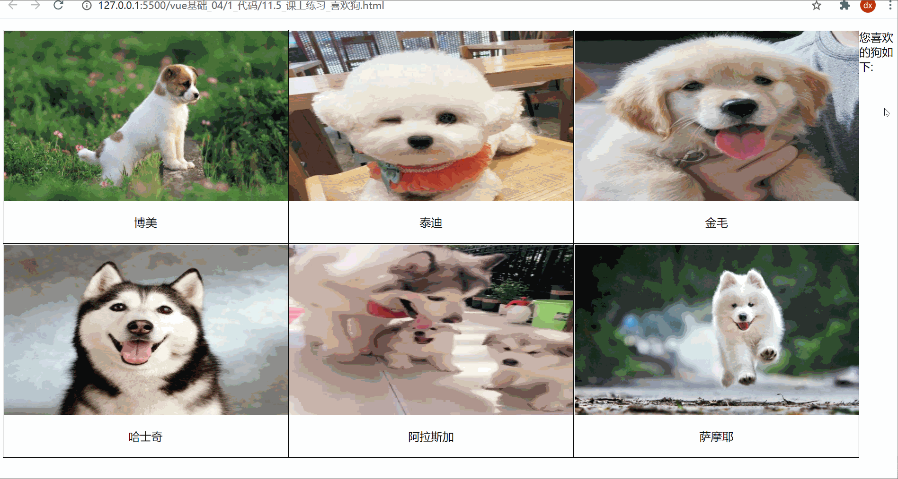

正确代码(==不可复制==)

components/Dog4.vue

```js
this.$emit("love", this.dogname);
```

App.vue

```vue
<template>
  <div>
    <Dog
      v-for="(obj, index) in arr"
      :key="index"
      :imgurl="obj.dogImgUrl"
      :dogname="obj.dogName"
      @love="fn"
    ></Dog>

    <hr />
    <p>显示喜欢的狗:</p>
    <ul>
      <li v-for="(item, index) in loveArr" :key="index">{{ item }}</li>
    </ul>
  </div>
</template>

<script>
import Dog from "./components/Dog4";
export default {
  data() {
    return {
        loveArr: []
    }
  },
  // ...中间省略代码
  methods: {
    fn(dogName) {
      this.loveArr.push(dogName)
    },
  },
};
</script>
```

附加练习_5.卖完了

> 目标: 完成图示的卖完了效果

需求: 

* 如果为0了后面显示卖光了!!!
* 如果库存有值, 后面就不显示卖光了!!!
* 如果库存有值, 累计商品总数量

要求: 一行是一个组件进行复用, 这里要求必须用table>tr (也就是封装tr组件)

组件使用注意: html正常解析, table>tr或者select>option, 虽然vue渲染页面可以自定义, 但是还需要遵循浏览器的标签关系

* table>tr中不能直接使用组件, 需要在tr的is属性指定组件名
* select>option 也不能封装options组件, 需要在option的is属性指定组件名

效果演示:

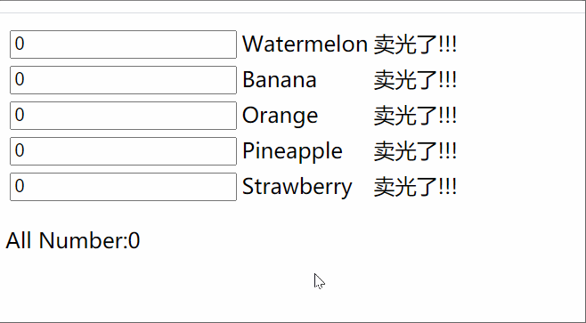

vue实例data里的数组如下

```js
goodsArr: [
    {
        count: 0,
        goodsName: "Watermelon"
    }, {
        count: 0,
        goodsName: "Banana"
    }, {
        count: 0,
        goodsName: "Orange"
    }, {
        count: 0,
        goodsName: "Pineapple"
    }, {
        count: 0,
        goodsName: "Strawberry"
    }
]
```

正确代码

components/MyTr.vue

```html
<template>
  <tr>
    <td>
      <input type="number" v-model.number="obj['count']"/>
    </td>
    <td>
      <span>{{ obj["goodsName"] }}</span>
    </td>
    <td>
      <span v-show="obj['count'] == 0">卖光了!!!</span>
    </td>
  </tr>
</template>

<script>
export default {
    // 传入对象有风险, 但是如果是一对一关系可以传入对象-直接修改对象里的值影响外部效果
    props: ["obj"]
};
</script>

<style>
</style>
```

App.vue使用

```vue
<template>
  <div>
    <table>
      <!-- 2. 使用tr组件, 传入需要的数据 -->
      <tr
        is="myTr"
        v-for="(item, index) in goodsArr"
        :key="index"
        :obj="item"
        :index="index"
      ></tr>
    </table>
    <p>All Number:{{ sumNumber }}</p>
  </div>
</template>

<script>
import MyTr from './components/MyTr'
export default {
  data() {
    return {
      goodsArr: [
        {
          count: 0,
          goodsName: "Watermelon",
        },
        {
          count: 0,
          goodsName: "Banana",
        },
        {
          count: 0,
          goodsName: "Orange",
        },
        {
          count: 0,
          goodsName: "Pineapple",
        },
        {
          count: 0,
          goodsName: "Strawberry",
        },
      ],
    };
  },
  components: {
    MyTr
  },
  computed: {
    sumNumber(){
      return this.goodsArr.reduce((sum, obj) => sum + obj.count * 1, 0)
    }
  }
};
</script>
```

### 买点好吃的

> 目标: 商品列表显示一下, 然后封装组件实现增加减少功能并在最后统计总价

要求: 商品名, 增加 数量, 减少这一条封装成组件使用

效果演示:


数据:

```js
[
    {
        "shopName": "可比克薯片",
        "price": 5.5,
        "count": 0
    },
    {
        "shopName": "草莓酱",
        "price": 3.5,
        "count": 0
    },
    {
        "shopName": "红烧肉",
        "price": 55,
        "count": 0
    },
    {
        "shopName": "方便面",
        "price": 12,
        "count": 0
    }
]
```

正确代码(==不可复制==)

components/Food.vue

```html
<template>
  <div>
    <span>{{ goodsname }}</span>
    <button @click="add(ind)">+</button>
    <span> {{ count }} </span>
    <button @click="sec(ind)">-</button>
  </div>
</template>

<script>
export default {
    props: ['goodsname', 'ind', 'count'], // 商品名,索引,数量
    methods: {
        add(ind){
            this.$emit('addE', ind)
        },
        sec(ind){
            this.$emit("secE", ind)
        }
    }
};
</script>
```

App.vue

```vue
<template>
  <div>
    <p>商品清单如下:</p>
    <div v-for="(obj, index) in shopData" :key="index">
      {{ obj.shopName }} -- {{ obj.price }}元/份
    </div>
    <p>请选择购买数量:</p>
    <Food
      v-for="(obj, index) in shopData"
      :key="index"
      :goodsname="obj.shopName"
      :ind="index"
      :count="obj.count"
      @addE="addFn"
      @secE="secFn"
    >
    </Food>
    <p>总价为: {{ allPrice }}</p>
  </div>
</template>

<script>
import Food from "./components/Food";
export default {
  data() {
    return {
      // 商品数据
      shopData: [
        {
          shopName: "可比克薯片",
          price: 5.5,
          count: 0,
        },
        {
          shopName: "草莓酱",
          price: 3.5,
          count: 0,
        },
        {
          shopName: "红烧肉",
          price: 55,
          count: 0,
        },
        {
          shopName: "方便面",
          price: 12,
          count: 0,
        },
      ],
    };
  },
  components: {
    Food,
  },
  methods: {
    addFn(ind){
      this.shopData[ind].count++
    },
    secFn(ind){
      this.shopData[ind].count > 0 && this.shopData[ind].count--
    }
  },
  computed: {
    allPrice(){
      return this.shopData.reduce((sum, obj) => sum + obj.count * obj.price, 0)
    }
  }
};
</script>
```


### 购物车

目的: 把一行tr封装成一个组件, 然后v-for循环复用传值

> 提示: 对象类型传入到子组件, 内部修改也会相应外部这个对象 (对象是引用关系哦)

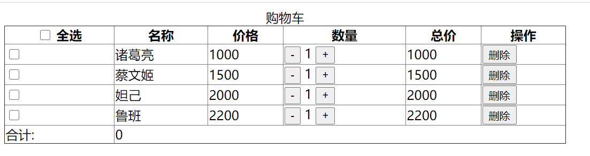

不带vue代码的标签结构

```vue
<template>
  <div>
    <table
      border="1"
      width="700"
      style="border-collapse: collapse"
    >
      <caption>
        购物车
      </caption>
      <thead>
        <tr>
          <th>
            <input type="checkbox" /> <span>全选</span>
          </th>
          <th>名称</th>
          <th>价格</th>
          <th>数量</th>
          <th>总价</th>
          <th>操作</th>
        </tr>
      </thead>
      <tbody>
        
      </tbody>
      <tfoot>
        <tr>
          <td>合计:</td>
          <td colspan="5">
            
          </td>
        </tr>
      </tfoot>
    </table>
  </div>
</template>

<script>
export default {
  data() {
    return {
      goodList: [
        {
          name: "诸葛亮",
          price: 1000,
          num: 1,
          checked: false,
        },
        {
          name: "蔡文姬",
          price: 1500,
          num: 1,
          checked: false,
        },
        {
          name: "妲己",
          price: 2000,
          num: 1,
          checked: false,
        },
        {
          name: "鲁班",
          price: 2200,
          num: 1,
          checked: false,
        },
      ],
    };
  },
};
</script>

<style>
</style>
```

### 做数学题

目的: 随机产生数学题, 输入答案提交后, 在下面对应序号显示结果

> 数字输入框按钮是一个组件, 下面每个序号和提示是一个组件

图示:

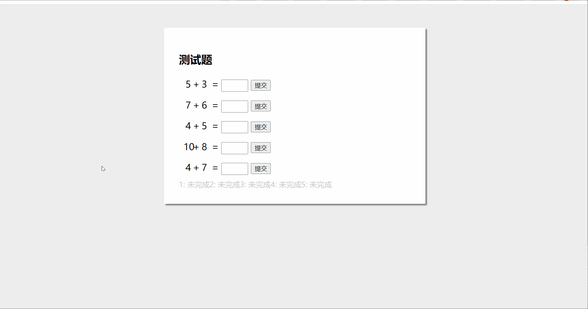

Subject.vue - 题目一行组件 (样式和标签)

```vue
<template>
  <div class="subject">
    <span></span>
    <span>+</span>
    <span></span>
    <span>=</span>
    <input type="number" />
    <button>提交</button>
  </div>
</template>

<script>
export default {

};
</script>

<style scoped>
.subject {
  margin: 5px;
  padding: 5px;
  font-size: 20px;
}
.subject span {
  display: inline-block;
  text-align: center;
  width: 20px;
}
.subject input {
  width: 50px;
  height: 20px;
}
</style>
```

Flag.vue - 下面结果一条的组件 (复制标签和样式)

```vue
<template>
  <span >1: 未完成</span>
</template>

<script>
export default {

};
</script>

<style scoped>
.right {
  color: green;
}
.error {
  color: red;
}
.undo {
  color: #ccc;
}
</style>
```

App.vue - 复制标签和样式

无vue代码的标签

```html
<template>
  <div id="app">
    <h2>测试题</h2>
    <subject ></subject>
    <div>
      <flag></flag>
    </div>
  </div>
</template>

<script>

export default {
  
};
</script>

<style>
body {
  background-color: #eee;
}

#app {
  background-color: #fff;
  width: 500px;
  margin: 50px auto;
  box-shadow: 3px 3px 3px rgba(0, 0, 0, 0.5);
  padding: 2em;
}
</style>
```

## Day04

### 购物车案例


### 购物车案例-项目初始化

> 目标: 初始化新项目, 清空不要的东西, 下载bootstrap库, 下载less模块

```bash
vue create shopcar
npm i bootstrap
npm i less less-loader@5.0.0 -D
```

图示:


1. 按照需求, 把项目页面拆分成几个组件, 在components下创建

* MyHeader组件

* MyFooter组件
* MyGoods组件 - 商品
* MyCount组件

2. 然后引入到App.vue上注册

3. 在main.js中引入bootStrap库

```js
import "bootstrap/dist/css/bootstrap.css" // 引入第三方包里的某个css文件
```

MyHeader.vue

```vue
<template>
  <div class="my-header">购物车案例</div>
</template>

<script>
export default {

}
</script>

<style lang="less" scoped>
  .my-header {
    height: 45px;
    line-height: 45px;
    text-align: center;
    background-color: #1d7bff;
    color: #fff;
    position: fixed;
    top: 0;
    left: 0;
    width: 100%;
    z-index: 2;
  }
</style>
```

MyGoods.vue

```vue
<template>
  <div class="my-goods-item">
    <div class="left">
      <div class="custom-control custom-checkbox">
        <input type="checkbox" class="custom-control-input" id="input"
        >
        <label class="custom-control-label" for="input">
          
        </label>
      </div>
    </div>
    <div class="right">
      <div class="top">商品名字</div>
      <div class="bottom">
        <span class="price">¥ 100</span>
        <span>
            数量组件
        </span>
      </div>
    </div>
  </div>
</template>

<script>
export default {

}
</script>

<style lang="less" scoped>
.my-goods-item {
  display: flex;
  padding: 10px;
  border-bottom: 1px solid #ccc;
  .left {
    img {
      width: 120px;
      height: 120px;
      margin-right: 8px;
      border-radius: 10px;
    }
    .custom-control-label::before,
    .custom-control-label::after {
      top: 50px;
    }
  }
  .right {
    flex: 1;
    display: flex;
    flex-direction: column;
    justify-content: space-between;
    .top{
        font-size: 14px;
        font-weight: 700;
    }
    .bottom {
      display: flex;
      justify-content: space-between;
      padding: 5px 0;
      align-items: center;
      .price {
        color: red;
        font-weight: bold;
      }
    }
  }
}

</style>
```

> 目标: 完成商品组件右下角商品组件的开发


components/MyCount.vue

```vue
<template>
  <div class="my-counter">
    <button type="button" class="btn btn-light" >-</button>
    <input type="number" class="form-control inp" >
    <button type="button" class="btn btn-light">+</button>
  </div>
</template>

<script>
export default {
}
</script>

<style lang="less" scoped>
.my-counter {
  display: flex;
  .inp {
    width: 45px;
    text-align: center;
    margin: 0 10px;
  }
  .btn, .inp{
    transform: scale(0.9);
  }
}
</style>
```

components/MyFooter.vue

```vue
<template>
  <!-- 底部 -->
  <div class="my-footer">
    <!-- 全选 -->
    <div class="custom-control custom-checkbox">
      <input type="checkbox" class="custom-control-input" id="footerCheck">
      <label class="custom-control-label" for="footerCheck">全选</label>
    </div>
    <!-- 合计 -->
    <div>
      <span>合计:</span>
      <span class="price">¥ 0</span>
    </div>
    <!-- 按钮 -->
    <button type="button" class="footer-btn btn btn-primary">结算 ( 0 )</button>
  </div>
</template>

<script>
export default {
  
}
</script>

<style lang="less" scoped>
.my-footer {
  position: fixed;
  z-index: 2;
  bottom: 0;
  width: 100%;
  height: 50px;
  border-top: 1px solid #ccc;
  display: flex;
  justify-content: space-between;
  align-items: center;
  padding: 0 10px;
  background: #fff;

  .price {
    color: red;
    font-weight: bold;
    font-size: 15px;
  }
  .footer-btn {
    min-width: 80px;
    height: 30px;
    line-height: 30px;
    border-radius: 25px;
    padding: 0;
  }
}
</style>
```

### 购物车案例-头部自定义

> 目的: 头部的标题, 颜色, 背景色可以随便修改, props类型的校验

思路

1. 在MyHeader.vue中准备props里变量, 然后使用
2. 在使用MyHeader.vue组件时, 传入相应的值 (color和backgroundColor)

MyHeader.vue

```vue
<template>
  <div class="my-header" :style="{backgroundColor: background, color}">{{ title }}</div>
</template>

<script>
// 目标: 让Header组件支持不同的项目 - 自定义
// 1. 分析哪些可以自定义 (背景色, 文字颜色, 文字内容)
// 2. (新) 可以对props的变量的值 进行校验
// 3. 内部使用props变量的值
// 4. 外部使用时, 遵守变量名作为属性名, 值的类型遵守
export default {
    props: {
        background: String, // 外部插入此变量的值, 必须是字符串类型, 否则报错
        color: {
            type: String, // 约束color值的类型
            default: "#fff" // color变量默认值(外部不给 我color传值, 使用默认值)
        },
        title: {
            type: String,
            required: true // 必须传入此变量的值
        }
    }
}
</script>

<style lang="less" scoped>
  .my-header {
    height: 45px;
    line-height: 45px;
    text-align: center;
    background-color: #1d7bff;
    color: #fff;
    position: fixed;
    top: 0;
    left: 0;
    width: 100%;
    z-index: 2;
  }
</style>
```

App.vue传入相应自定义的值

```vue
<MyHeader title="购物车案例"></MyHeader>
```

> 总结:  
>
> props: [] - 只能声明变量和接收, 不能类型校验
>
> props: {} - 声明变量和校验类型规则 - 外部传入值不对则报错

### 购物车案例-请求数据

> 目标: 使用axios把数据请求回来

数据地址: https://applet-base-api-t.itheima.net/api/cart  (get方式)

1. 下载axios

```vue
npm i axios
```

2. main.js - 原型上挂载

```js
// 目标: 请求数据 - 打印
// 1. 下载axios库, main.js - 全局绑定属性 (确保任意.vue文件可以都访问到这个axios方法)
import axios from 'axios'
// 2. 基础地址
axios.defaults.baseURL = 'https://applet-base-api-t.itheima.net'
// 3. axios方法添加到Vue的原型上
Vue.prototype.$axios = axios

new Vue({
    render: h => h(App),
}).$mount('#app')

```

3. App.vue请求使用

```vue
<script>
export default {
  data(){
    return {
      list: [] // 商品所有数据
    }
  },
  created(){
    // 不必在自己引入axios变量, 而是直接使用全局属性$axios
    this.$axios({
      url: "/api/cart"
    }).then(res => {
      console.log(res);
      this.list = res.data.list
    })
  }
}
</script>
```

> 总结: 利用axios, 调用接口, 把数据请求回来

### 购物车案例-数据渲染

> 目标: 把上面请求的数据, 渲染到页面上

App.vue

```vue
<MyGoods v-for="item in list" 
         :key="item.goods_id"
         :gObj="item"
></MyGoods>
```

MyGoods.vue

```vue
<template>
  <div class="my-goods-item">
    <div class="left">
      <div class="custom-control custom-checkbox">
        <!-- *重要:
          每个对象和组件都是独立的
          对象里的goods_state关联自己对应商品的复选框
         -->
         <!-- bug:
          循环的所有label的for都是input, id也都是input - 默认只有第一个生效
          解决: 每次对象里的id值(1, 2), 分别给id和for使用即可区分
          -->
        <input type="checkbox" class="custom-control-input" :id="gObj.goods_id"
        v-model="gObj.goods_state"
        >
        <label class="custom-control-label" :for="gObj.goods_id">
          
        </label>
      </div>
    </div>
    <div class="right">
      <div class="top">{{ gObj.goods_name }}</div>
      <div class="bottom">
        <span class="price">¥ {{ gObj.goods_price }}</span>
        <span>
            <MyCount :obj="gObj"></MyCount>
        </span>
      </div>
    </div>
  </div>
</template>

<script>
import MyCount from './MyCount'
export default {
    props: {
      gObj: Object
    },
    components: {
        MyCount
    }
}
</script>
```

MyCount.vue

```vue
<template>
  <div class="my-counter">
    <button type="button" class="btn btn-light" >-</button>
    <input type="number" class="form-control inp" v-model.number="obj.goods_count">
    <button type="button" class="btn btn-light" >+</button>
  </div>
</template>

<script>
export default {
  props: {
    obj: Object // 商品对象
  }
}
</script>

```

> 总结: 把各个组件关联起来, 把数据都渲染到页面上

### 购物车案例-商品选中

> 问题: 点击发现总是第一个被选中

原来id和for都是"input"

但是id是唯一的啊, 所以用数据的id来作为标签的id, 分别独立, 为了兼容label点击图片也能选中的效果

```vue
<input type="checkbox" class="custom-control-input" :id="gObj.goods_id"
       v-model="gObj.goods_state"
       >
<label class="custom-control-label" :for="gObj.goods_id">
    
</label>
```

> 总结: lable的for值对应input的id, 点击label就能让对应input处于激活

### 购物车案例-数量控制

> 目标: 点击+和-或者直接修改输入框的值影响商品购买的数量

```vue
<template>
  <div class="my-counter">
    <button type="button" class="btn btn-light" :disabled="obj.goods_count === 1" @click="obj.goods_count > 1 && obj.goods_count--">-</button>
    <input type="number" class="form-control inp" v-model.number="obj.goods_count">
    <button type="button" class="btn btn-light" @click="obj.goods_count++">+</button>
  </div>
</template>

<script>
// 目标: 商品数量 - 控制
// 1. 外部传入数据对象
// 2. v-model关联对象的goods_count属性和输入框 (双向绑定)
// 3. 商品按钮 +和-, 商品数量最少1件
// 4. 侦听数量改变, 小于1, 直接强制覆盖1
export default {
  props: {
    obj: Object // 商品对象
  },
  // 因为数量控制要通过对象"互相引用的关系"来影响外面对象里的数量值, 所以最好传 对象进来
  watch: {
    obj: {
      deep: true,
      handler(){ // 拿到商品数量, 判断小于1, 强制修改成1
        if (this.obj.goods_count < 1) {
          this.obj.goods_count = 1
        }
      }
    }
  }
}
</script>
```


### 购物车案例-全选功能

> 目标: 在底部组件上, 完成全选功能


思路: 

1. 点击获取它的选中状态
2. 同步给上面每个小选框 - 而小选框的选中状态又在数组里
3. 把数组传给MyFooter, 然后更新即可 - 因为对象都是引用关系的

MyFooter.vue

```vue
<template>
  <!-- 底部 -->
  <div class="my-footer">
    <!-- 全选 -->
    <div class="custom-control custom-checkbox">
      <input type="checkbox" class="custom-control-input" id="footerCheck" v-model="isAll">
      <label class="custom-control-label" for="footerCheck">全选</label>
    </div>
    <!-- 合计 -->
    <div>
      <span>合计:</span>
      <span class="price">¥ {{ allPrice }}</span>
    </div>
    <!-- 按钮 -->
    <button type="button" class="footer-btn btn btn-primary">结算 ( {{ allCount }} )</button>
  </div>
</template>

<script>
// 目标: 全选
// 1. v-model关联全选-复选框(v-model后变量计算属性)
// 2. 页面(视频层)v(true) -> 数据层(变量-) 计算属性(完整写法)
// 3. 把全选 true/false同步给所有小选框选中状态上

// 小选  -> 全选
// App.vue里list数组 -> MyFooter.vue
// isAll的get方法里, 统计状态影响全选框

// 目标: 总数量统计
// 1. allCount计算属性用 数组reduce+判断统计数量并返回

// 目标: 总价
// allPrice计算属性, 数组reduce+单价*数量, 判断选中, 才累加后返回

export default {
  props: {
    arr: Array
  },
  computed: {
    isAll: {
      set(val){ // val就是关联表单的值(true/false)
        this.$emit('changeAll', val)
      },
      get(){
        // 查找小选框关联的属性有没有不符合勾选的条件
        // 直接原地false
        return this.arr.every(obj => obj.goods_state === true)
      }
    },
    
    
  }
}
</script>
```

App.vue

```vue
<MyFooter @changeAll="allFn" :arr="list"></MyFooter>

<script>
methods: {
    allFn(bool){
      this.list.forEach(obj => obj.goods_state = bool)
      // 把MyFooter内的全选状态true/false同步给所有小选框的关联属性上
    }
  }
</script>
```

> 总结: 全选的v-model的值, 使用计算属性完整写法

### 购物车案例-总数量

> 目标: 完成底部组件, 显示选中的商品的总数量

MyFooter.vue

```js
allCount(){
    return this.arr.reduce((sum, obj) => {
        if (obj.goods_state) { // 选中商品才累加数量
            sum + obj.goods_count;
        }
        return sum;
    }, 0)
},
```

> 总结: 对象之间是引用关系, 对象值改变, 所有用到的地方都跟着改变

### 购物车案例-总价

> 目标: 完成选中商品计算价格

components/MyFooter.vue

```js
allPrice(){
      return this.arr.reduce((sum, obj) => {
        if (obj.goods_state){
          sum + obj.goods_count * obj.goods_price
        }
        return sum;
      }, 0)
    }
```

> 总结: 把数组传给了MyFooter组件, 统计总价


## Day05

### tabbar 案例

> 完成如下案例和各步功能


知识点:

- 组件封装
- 动态组件
- keep-alive
- 作用域插槽
- 自定义指令

### tabbar 案例-初始化项目

> 目标: 创建项目文件夹, 引入字体图标, 下载bootstrap, less, less-loader@5.0.0 axios, 在App.vue注册组件

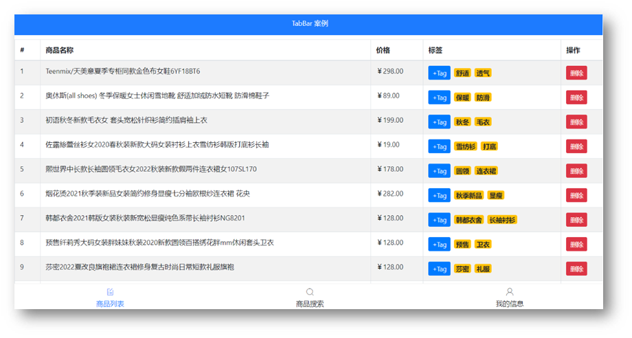

* 需求: 从0新建项目, 拆分组件, 创建使用

组件分析:

* 组件拆分:
  * MyHeader.vue – ==复用之前的==
  * MyTabBar.vue – 底部导航
  * MyTable.vue – 封装表格

* 三个页面
  * MyGoodsList.vue – 商品页
  * MyGoodsSearch.vue – 搜索页
  * -MyUserInfo.vue – 用户信息页

思路分析：

​	①: vue create tabbar-demo

​	②: npm i less less-loader@5.0.0 -D

​	③: npm i bootstrap axios 并在main.js 引入和全局属性

​	④: 根据需求-创建需要的页面组件

​	⑤: 把昨天购物车案例-封装的MyHeader.vue文件复制过来复用

​	⑥: 从App.vue – 引入组织相关标签

新建工程:

```bash
vue create tabbar-demo
npm i less less-loader@5.0.0 -D
npm i bootstrap axios
```

在main.js中引入bootStrap.css和字体图标样式

```js
import "bootstrap/dist/css/bootstrap.css"
import "./assets/fonts/iconfont.css"
```

创建/复制如下文件

从昨天案例中-直接复制过来components/MyHeader.vue

components/MyTabBar.vue


views/MyGoodsList.vue

views/MyGoodsSearch.vue

views/MyUserInfo.vue


components/MyTable.vue

### tabbar 案例-底部封装

> 目标: 实现MyTabBar.vue组件


* 需求: 把底部导航也灵活封装起来

分析：

​	①: 基本标签+样式(md里复制)

​	②: 为tabbar组件指定数据源

​	③: 数据源最少2个, 最多5个(validator)

​	④: 从App.vue给MyTabBar.vue传入底部导航的数据

​	⑤: MyTabBar.vue中循环展示

App.vue-数组准备

```js
tabList: [
    {
        iconText: "icon-shangpinliebiao",
        text: "商品列表",
        componentName: "MyGoodsList"
    },
    {
        iconText: "icon-sousuo",
        text: "商品搜索",
        componentName: "MyGoodsSearch"
    },
    {
        iconText: "icon-user",
        text: "我的信息",
        componentName: "MyUserInfo"
    }
]
```

MyTabBar.vue - 标签模板

```vue
<template>
  <div class="my-tab-bar">
  	<div class="tab-item">
      <!-- 图标 -->
      <span class="iconfont"></span>
      <!-- 文字 -->
      <span></span>
    </div>
  </div>
</template>

<script>
export default {
  
}
</script>

<style lang="less" scoped>
.my-tab-bar {
  position: fixed;
  left: 0;
  bottom: 0;
  width: 100%;
  height: 50px;
  border-top: 1px solid #ccc;
  display: flex;
  justify-content: space-around;
  align-items: center;
  background-color: white;
  .tab-item {
    display: flex;
    flex-direction: column;
    align-items: center;
  }
}
    
.current {
  color: #1d7bff;
}
</style>
```

MyTabBar.vue正确代码(==不可复制==)

```vue
<template>
  <div class="my-tab-bar">
    <div
      class="tab-item"
      v-for="(obj, index) in arr"
      :key="index"
    >
      <!-- 图标 -->
      <span class="iconfont" :class="obj.iconText"></span>
      <!-- 文字 -->
      <span>{{ obj.text }}</span>
    </div>
  </div>
</template>

<script>
export default {
  props: {
    arr: {
      type: Array,
      required: true,
      // 自定义校验规则
      validator(value) {
        // value就是接到数组
        if (value.length >= 2 && value.length <= 5) {
          return true; // 符合条件就return true
        } else {
          console.error("数据源必须在2-5项");
          return false;
        }
      },
    },
  }
};
</script>
```

不要忘了把tabList数组从App.vue -> MyTabBar.vue

### tabbar 案例-底部高亮

> 目标: 点击底部导航实现高亮效果

* 需求: 点击底部实现高亮效果

分析：

​	①: 绑定点击事件, 获取点击的索引

​	②: 循环的标签设置动态class, 遍历的索引, 和点击保存的索引比较, 相同则高亮

效果演示:


MyTabBar.vue(==正确代码==)

```vue
<template>
  <div class="my-tab-bar">
    <div class="tab-item" 
    v-for="(obj, index) in arr" 
    :key="index"
    :class="{current: activeIndex === index}"
    @click="activeIndex = index">
      <!-- 图标 -->
      <span class="iconfont" :class="obj.iconText"></span>
      <!-- 文字 -->
      <span>{{ obj.text }}</span>
    </div>
  </div>
</template>

<script>
export default {
  data(){
    return {
      activeIndex: 0 // 高亮元素下标
    }
  },
  // ....其他代码
};
</script>
```

### tabbar 案例-组件切换

> 目的: 点击底部导航, 切换页面组件显示

需求: 点击底部切换组件

分析：

​	①: 使用路由切换组件 (不要参考下面的代码)

效果演示:

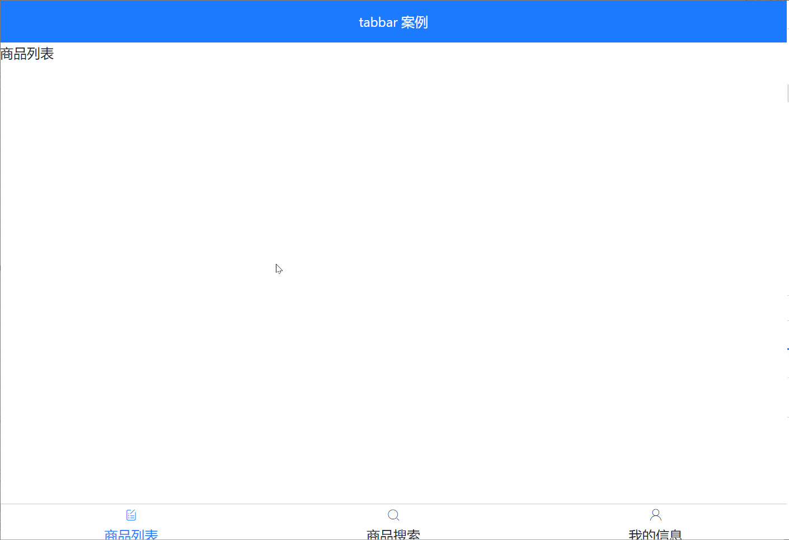

补充: 给内容div.app- 设置上下内边距

App.vue - 引入并注册

```vue
<template>
  <div>
    <MyHeader
      :background="'blue'"
      :fontColor="'white'"
      title="TabBar案例"
    ></MyHeader>
    <div class="main">
      <component :is="comName"></component>
    </div>
    <MyTabBar :arr="tabList"
    @changeCom="changeComFn"
    ></MyTabBar>
  </div>
</template>

<script>
import MyHeader from "./components/MyHeader";
// 目标: 完成底部封装
// 1. MyTabBar.vue 组件标签+样式 准备
// 2. 字体图标引入
// 3. 准备底部数据
// 4. 使用MyTabBar组件, 传入数据(父->子), 循环产生底部导航
// 5. 子组件内props自定义检验规则(2-5项)
// 6. 子组件内循环产生底部导航
import MyTabBar from './components/MyTabBar'

// 目标: 切换组件显示
// 1. 创建组件 - 编写内容
// 2. 引入App.vue注册
// 3. 挂载点设置is
// 4. 切换comName的值(重要)
// 5. 底部导航点击- MyTabBar.vue里
// 子 -> 父技术 (传要切换的组件名出来)

import MyGoodsList from './views/MyGoodsList'
import MyGoodsSearch from './views/MyGoodsSearch'
import MyUserInfo from './views/MyUserInfo'
export default {
  data() {
    return {
      comName: "MyGoodsList", // 默认显示的组件
      tabList: [ // 底部导航的数据
        {
          iconText: "icon-shangpinliebiao",
          text: "商品列表",
          componentName: "MyGoodsList",
        },
        {
          iconText: "icon-sousuo",
          text: "商品搜索",
          componentName: "MyGoodsSearch",
        },
        {
          iconText: "icon-user",
          text: "我的信息",
          componentName: "MyUserInfo",
        },
      ],
    };
  },
  components: {
    MyHeader,
    MyTabBar,
    MyGoodsList,
    MyGoodsSearch,
    MyUserInfo
  },
  methods: {
    changeComFn(cName){
      
      this.comName = cName; // MyTabBar里选出来的组件名赋予给is属性的comName
      // 导致组件的切换
    }
  }
};
</script>

<style scoped>
.main{
  padding-top: 45px;
  padding-bottom: 51px;
}
</style>
```

MyTabBar.vue - 点击传递过来组件名

```js
methods: {
    btn(index, theObj) {
      this.selIndex = index; // 点谁, 就把谁的索引值保存起来
      this.$emit("changeCom", theObj.componentName); // 要切换的组件名传App.vue
    },
  },
```

### tabbar 案例-商品列表

> 目标: 为MyGoodsList页面, 准备表格组件MyTable.vue-渲染展示数据 

* 需求: 商品列表渲染页面

分析：

​	①: 封装MyTable.vue – 准备标签和样式

​	②: axios在MyGoodsList.vue请求数据回来

​	③: 请求地址: https://www.escook.cn/api/goods

​	④: 传入MyTable.vue中循环数据显示

​	⑤: 给删除按钮添加bootstrap的样式: btn btn-danger btn-sm

效果演示:


MyTable.vue - 准备table整个表格标签和样式(可复制)

```vue
<template>
  <table class="table table-bordered table-stripped">
    <!-- 表格标题区域 -->
    <thead>
      <tr>
        <th>#</th>
        <th>商品名称</th>
        <th>价格</th>
        <th>标签</th>
        <th>操作</th>
      </tr>
    </thead>
    <!-- 表格主体区域 -->
    <tbody>
      <tr >
        <td>1</td>
        <td>商品</td>
        <td>998</td>
        <td>xxx</td>
        <td>xxx</td>
      </tr>
    </tbody>
  </table>
</template>

<script>
export default {
  name: 'MyTable'
}
</script>


<style scoped lang="less">
.my-goods-list {
  .badge {
    margin-right: 5px;
  }
}
</style>
```

> 使用axios请求数据, 把表格页面渲染出来

main.js - 注册axios配置默认地址

```js
import axios from "axios";
axios.defaults.baseURL = "https://www.escook.cn";
```

MyGoodsList.vue - 使用axios请求数据, 把数据传入给MyTable.vue里循环渲染

```vue
<template>
  <div>
    <MyTable :arr="list">
    </MyTable>
  </div>
</template>

<script>
import MyTable from "../components/MyTable";
import axios from "axios";
axios.defaults.baseURL = "https://www.escook.cn";
// 目标: 循环商品列表表格
// 1. 封装MyTable.vue 整体表格组件-一套标签和样式
// 2. axios请求数据
// 3. 传入MyTable组件里循环tr显示数据

// 目标: 展示tags标签
// 1. tags数组 - 某个td循环span使用文字
// 2. span设置bs的样式

// 目标: 删除数据
// 1. 删除按钮 - 点击事件
// 2. 作用域插槽把索引值关联出来了
// scope身上就有row和index
// 3. 删除中使用scope.index的索引值
// 4. 删除事件里删除数组里对应索引值的数据
export default {
  components: {
    MyTable,
  },
  data() {
    return {
      list: [] // 所有数据
    };
  },
  created() {
    axios({
      url: "/api/goods",
    }).then((res) => {
      console.log(res);
      this.list = res.data.data;
    });
  }
};
</script>
```

MyTable.vue里正确代码(==不可复制==)

```vue
<template>
  <table class="table table-bordered table-stripped">
    <!-- 表格标题区域 -->
    <thead>
      <tr>
        <th>#</th>
        <th>商品名称</th>
        <th>价格</th>
        <th>标签</th>
        <th>操作</th>
      </tr>
    </thead>
    <!-- 表格主体区域 -->
    <tbody>
      <tr v-for="(obj, index) in arr"
      :key="obj.id"
      >
        <td>{{ obj.id }}</td>
        <td>{{ obj.goods_name }}</td>
        <td>{{ obj.goods_price }}</td>
        <td>{{ obj.tags }}</td>
        <td>
            <button class="btn btn-danger btn-sm">删除</button>
        </td>
      </tr>
    </tbody>
  </table>
</template>

<script>
export default {
  name: 'MyTable',
  props: {
      arr: Array
  }
}
</script>


<style scoped lang="less">
.my-goods-list {
  .badge {
    margin-right: 5px;
  }
}
</style>
```

### tabbar 案例-商品表格-插槽

> 目标: 使用插槽技术, 和作用域插槽技术, 给MyTable.vue组件, 自定义列标题, 自定义表格内容

* 需求: 允许用户自定义表格头和表格单元格内容

分析：

​	①: 把MyTable.vue里准备slot

​	②: 使用MyTable组件时传入具体标签

步骤:

1. 提高组件==复用性和灵活性==, 把表格列标题thead部分预留<slot>标签, 设置name属性
2. 使用MyTable.vue时, 传入列标题标签
3. 表格内容td部分也可以让组件使用者自定义, 也给tbody下tr内留好<slot>标签和name属性名
4. 使用插槽需要用到插槽内的obj对象上的数据, 使用作用域插槽技术

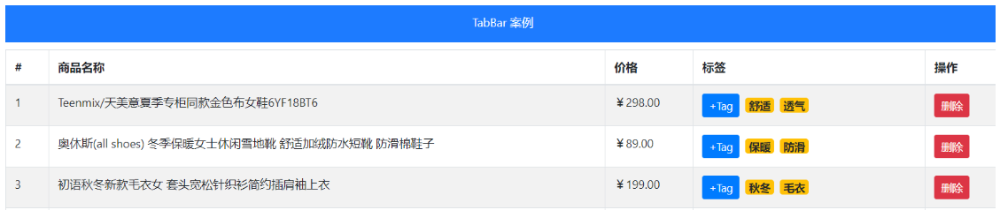

MyTable.vue - 留好具名插槽

```vue
<template>
  <table class="table table-bordered table-stripped">
    <!-- 表格标题区域 -->
    <thead>
      <tr>
        <!-- <th>#</th>
        <th>商品名称</th>
        <th>价格</th>
        <th>标签</th>
        <th>操作</th> -->
        <slot name="header"></slot>
      </tr>
    </thead>
    <!-- 表格主体区域 -->
    <tbody>
      <tr v-for="(obj, index) in arr"
      :key="obj.id"
      >
        <!-- <td>{{ obj.id }}</td>
        <td>{{ obj.goods_name }}</td>
        <td>{{ obj.goods_price }}</td>
        <td>{{ obj.tags }}</td>
        <td>
            <button class="btn btn-danger btn-sm">删除</button>
        </td> -->
        <slot name="body" :row="obj" :index="index"></slot>
      </tr>
    </tbody>
  </table>
</template>

<script>
export default {
  name: 'MyTable',
  props: {
      arr: Array
  }
}
</script>
```

MyGoodsList.vue 使用

```vue
<template>
  <div>
    <MyTable :arr="list">
      <template #header>
        <th>#</th>
        <th>商品名称</th>
        <th>价格</th>
        <th>标签</th>
        <th>操作</th>
      </template>
      <!-- scope的值: {row: obj, index: 索引值} -->
      <template #body="scope">
        <td>{{ scope.row.id }}</td>
        <td>{{ scope.row.goods_name }}</td>
        <td>{{ scope.row.goods_price }}</td>
        <td>
            {{ scope.row.tags }}
        </td>
        <td>
          <button class="btn btn-danger btn-sm"
          >删除</button>
        </td>
      </template>
    </MyTable>
  </div>
</template>

<script>
import MyTable from "../components/MyTable";
import axios from "axios";
axios.defaults.baseURL = "https://www.escook.cn";
// 目标: 循环商品列表表格
// 1. 封装MyTable.vue 整体表格组件-一套标签和样式
// 2. axios请求数据
// 3. 传入MyTable组件里循环tr显示数据

// 目标: 展示tags标签
// 1. tags数组 - 某个td循环span使用文字
// 2. span设置bs的样式

// 目标: 删除数据
// 1. 删除按钮 - 点击事件
// 2. 作用域插槽把索引值关联出来了
// scope身上就有row和index
// 3. 删除中使用scope.index的索引值
// 4. 删除事件里删除数组里对应索引值的数据
export default {
  components: {
    MyTable,
  },
  data() {
    return {
      list: [] // 所有数据
    };
  },
  created() {
    axios({
      url: "/api/goods",
    }).then((res) => {
      console.log(res);
      this.list = res.data.data;
    });
  }
};
</script>

<style>
</style>
```

### tabbar 案例-商品表格-tags微标

> 目标: 把单元格里的标签, tags徽章渲染下

* 需求: 标签列自定义显示

分析：

​	①: 插槽里传入的td单元格

​	②: 自定义span标签的循环展示-给予样式

效果演示:


bootstrap徽章: https://v4.bootcss.com/docs/components/badge/

MyGoodsList.vue - 插槽

```vue
<span v-for="(str, ind) in scope.row.tags" :key="ind"
      class="badge badge-warning"
      >
    {{ str }}
</span>
```

下面额外添加样式

```vue
<style lang="less" scoped>
.my-goods-list {
  .badge {
    margin-right: 5px;
  }
}
</style>
```

### tabbar 案例-商品表格-删除功能

> 目标: 点击删除对应这条数据

* 需求: 点击删除按钮删除数据

分析：

​	①: 删除按钮绑定点击事件

​	②: 作用域插槽绑定id值出来

​	③: 传给删除方法, 删除MyGoodsList.vue里数组里数据

效果演示

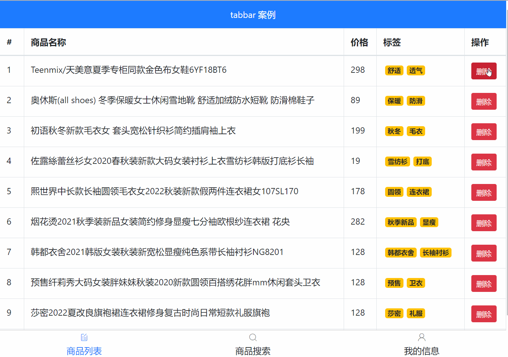

提示: id在MyTable.vue里, 但是MyGoodsList.vue里要使用, 而且在插槽位置, 使用作用域插槽已经把整个obj对象(包含id)带出来了

MyTable.vue

```vue
<slot name="body" :row="obj"></slot>
```

1. MyGoodsList.vue - 注册点击事件

```jsx
<button class="btn btn-danger btn-sm"
    @click="removeBtn(scope.row.id)"
    >删除</button>
```

​	2. `my-goods-list.vue` 根据 id 删除

```jsx
removeBtn(id){
    let index = this.list.findIndex(obj => obj.id === id)
    this.list.splice(index, 1)
},
```

### tabbar 案例-添加tab

> 目标: 实现点击tab按钮, 出现输入框自动获取焦点, 失去焦点关闭input, 回车新增tag, esc清空内容

* 需求1: 点击Tab, 按钮消失, 输入框出现
* 需求2: 输入框自动聚焦
* 需求3: 失去焦点, 输入框消失, 按钮出
* 需求4: 监测input回车, 无数据拦截
* 需求5: 监测input取消, 清空数据
* 需求6: 监测input回车, 有数据添加

效果目标: 

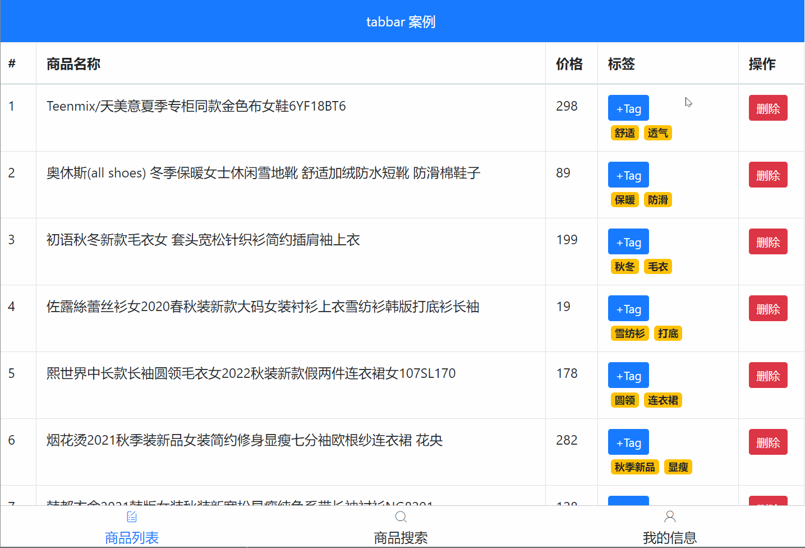

#### 点击按钮消失, 输入框出现

MyGoodsList.vue - 标签位置添加

注意: 每个tab按钮和input都是独立变量控制, 那么直接在row身上的属性控制即可

```vue
<input
          class="tag-input form-control"
          style="width: 100px;"
          type="text"
          v-if="scope.row.inputVisible"
          />
          <button 
          v-else 
          style="display: block;" 
          class="btn btn-primary btn-sm add-tag"
          @click="scope.row.inputVisible = true"
          >+Tag</button>

```

#### input自动获取焦点

main.js - 定义全局自定义指令

```js
// 全局指令
Vue.directive("focus", {
  inserted(el){
    el.focus()
  }
})
```

MyGoodsList.vue - 使用 v-focus指令

#### input失去焦点关闭input

监听input失去焦点事件, 让input消失

```js
@blur="scope.row.inputVisible = false"
```

#### input回车新增tag

监听input的回车事件, 如果无数据拦截代码

```js
@keydown.enter="enterFn(scope.row)"
```

事件处理函数

```js
enterFn(obj){ // 回车
    // console.log(obj.inputValue);
    if (obj.inputValue.trim().length === 0) {
        alert('请输入数据')
        return
    }

    obj.tags.push(obj.inputValue) // 表单里的字符串状态tags数组
    obj.inputValue = ""
}
```

#### input框esc清空内容

```js
@keydown.esc="scope.row.inputValue = ''"
```


## Day06

### 切换页面

> 目的: 点击导航a标签, 实现下面页面内容的切换

建议: 新初始化一个空白的项目来写, 避免新手放到一起, 看的乱

要求: 网页打开默认显示 - 首页部分

规范: 

* views/4个页面.vue文件
* router/index.js - 路由配置
* App.vue显示, main.js 注册路由

效果:


### 二级路由嵌套

> 目标: 完成git演示的路由切换效果

建议: 再新建一个工程来写

图示:

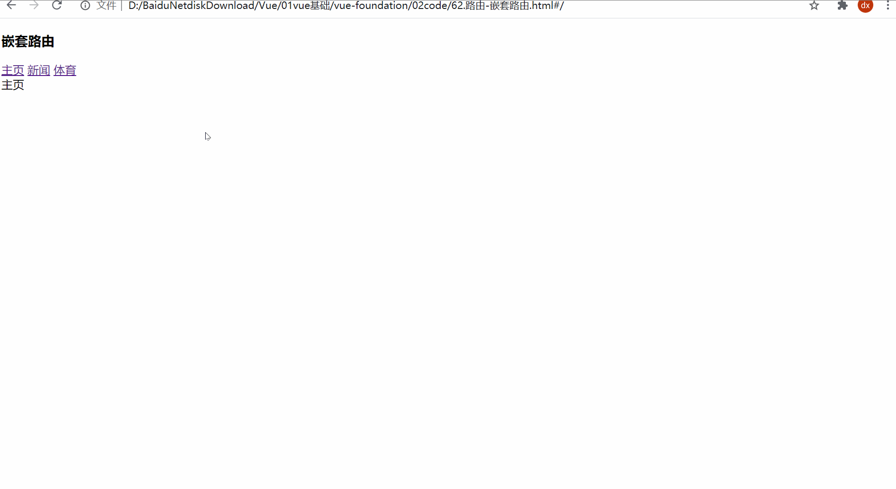


### 三级路由嵌套

要求:

* 默认显示第一个UI_Router路由(一级路由) 3个组件
* 第二个组件需要嵌入导航和二级路由 展示区域
* Bob下才需要第三个路由嵌入

提示:

> 点击按钮使用编程式导航, 可以在2级路由导航路径(带2个/的) 先写成一个数组, 随机取1个然后跳转即可

问题:

可能会爆出警告, 编程式导航如果当前已经在这页, 还想跳转当前路由就会出个警告, 无需关心不影响功能

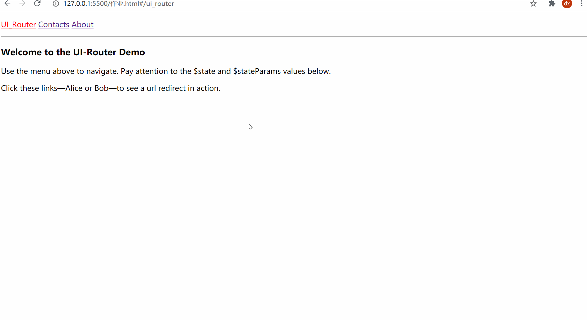


标签内容(有的短自己手写吧)

```html
<div>
    <h3>Welcome to the UI-Router Demo</h3>
    <p>Use the menu above to navigate. Pay attention to the $state and $stateParams values below.</p>
    <p>Click these links—Alice or Bob—to see a url redirect in action.</p>
</div>


<div>
    <h3>UI-Router Resources</h3>
    <ul>
        <li>Source for this Sample</li>
        <li>GitHub Main Page</li>
        <li>Quick Start</li>
        <li>In-Depth Guide</li>
        <li>API Reference</li>
    </ul>
</div>
```

### 调色板

效果演示:

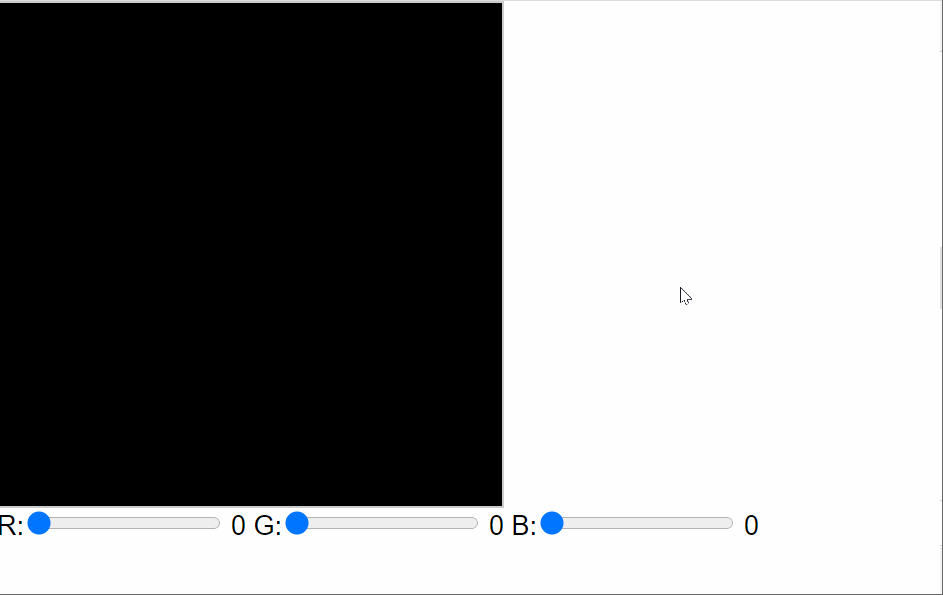

模板代码:(==可复制==)

```vue
<template>
  <div>
    <div class="colorBox" ></div>
    <div>
      R:<input type="range"  max="250" /> 
      G:<input type="range"  max="250" />
      B:<input type="range"  max="250" /> 
    </div>
  </div>
</template>
<script>
export default {

}
</script>
<style scoped>
.colorBox {
  width: 200px;
  height: 200px;
  border: 1px solid #ccc;
}
</style>

```


正确代码:(==不可复制==)

```vue
<template>
  <div>
    <div class="colorBox" :style="`backgroundColor:rgb(${r},${g},${b})`"></div>
    <div>
      R:<input type="range" v-model="r" max="250" /> {{ r }}
      G:<input type="range" v-model="g" max="250" /> {{ g }}
      B:<input type="range" v-model="b" max="250" /> {{ b }}
    </div>
  </div>
</template>
<script>
export default {
  data () {
    return {
      r: 0,
      g: 0,
      b: 0
    }
  }
}
</script>
<style scoped>
.colorBox {
  width: 200px;
  height: 200px;
  border: 1px solid #ccc;
}
</style>

```


