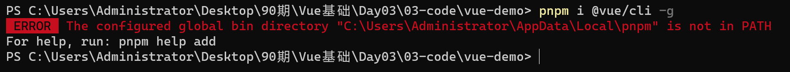
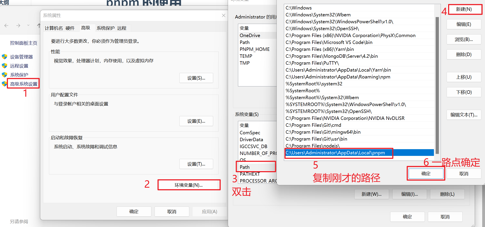

# pnpm 的使用

## 安装

```bash
npm i pnpm@6 -g
```


**如果只是安装项目包运行, 到此即可结束, 全局包使用 npm 来安装**

以下命令都没问题:

```bash
pnpm i xxx
pnpm i
```


## 配置全局包的 PATH 环境变量

pnpm 安装全局包会出现以下错误:

- 意思是全局包的路径没有配置到 PATH 环境变量中




1. 右键点击计算机 => 属性 => 高级系统设置 

2. Win 键 => 搜索 => 高级系统设置

​			环境变量 => PATH => 新建 => 复制上图的路径 => 一路点击确定保存




从此以后可以使用 pnpm 安装全局包啦!


## 装包错误解决

>  ERR_PNPM_UNEXPECTED_STORE  Unexpected store location

分析原因: 超出预期的 pnpm 存储位置, 它不知道该把包装在哪里

解决方案:

```bash
pnpm i
```

