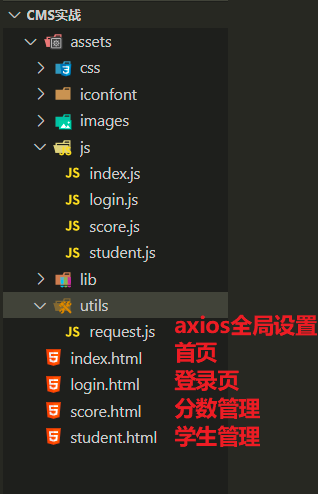
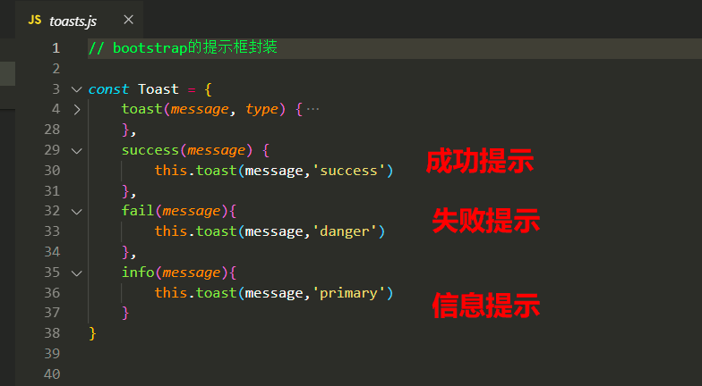
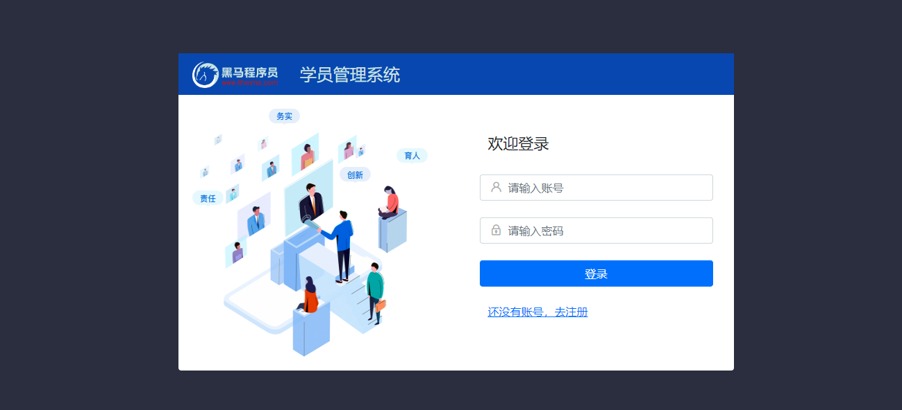
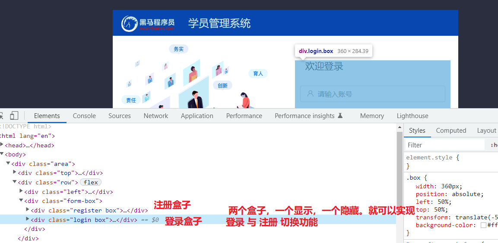
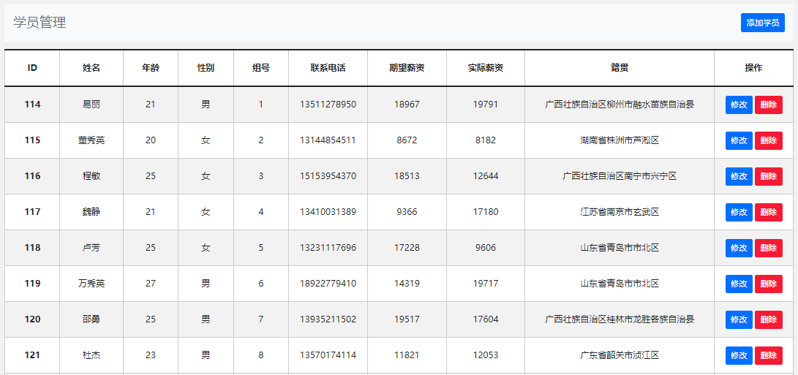
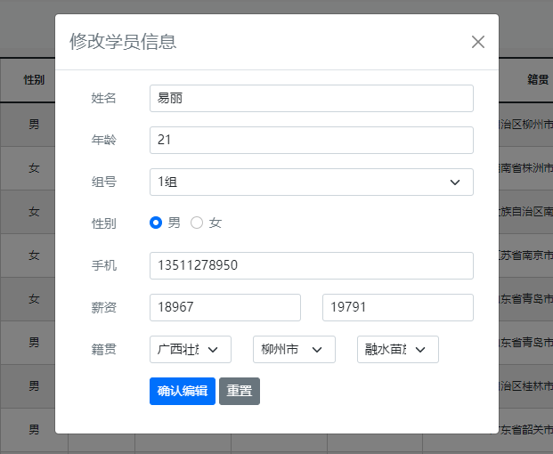
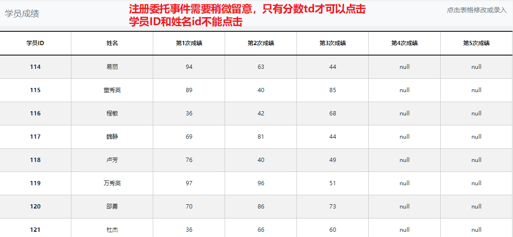
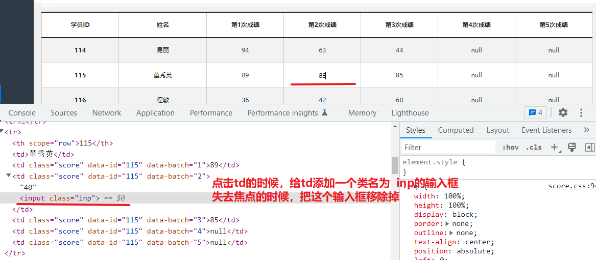

## 01-项目实战介绍

* **接口文档地址**：https://docs.apipost.cn/preview/ebfa24f6d27e4f89/cf3af015f5ca6674

* **接口根路径**：http://www.itcbc.com:8000

  >* 把接口文档里面的http://localhost:8000替换成http://www.itcbc.com:8000。 例如
  >* 登录接口：http://www.itcbc.com:8000/api/login
  >* 注册接口：http://www.itcbc.com:8000/api/register

* **线上演示地址**：http://heimazxk.gitee.io/ajax-cms/


* 项目代码模板说明







>提示框用法
>
>Toast.success('提示信息')
>
>Toast.fail('错误信息')
>
>Toast.info('提示信息')


## 02-完成登录注册功能(20分)





> 核心思路介绍
>
> (1)收集表单数据
>
> (2)校验表单数据（非空+正则）
>
> (3)发送ajax请求（根据接口文档）
>
> (4)服务器响应（保存token,跳转首页）


> 细节注意点：
>
> 登录页 和 注册页其实是同一个页面，只是两个盒子不一样。
>
> 登录状态：  显示登录盒子， 隐藏注册盒子
>
> 注册状态： 显示注册盒子，隐藏登录盒子





## 03-完成axios拦截器(10分)


> 核心思路介绍
>
> （1）登录成功之后保存token
>
> （2）配置axios拦截器
>
> 请求拦截器：发送token
>
> 响应拦截器：拦截401，如果token过期就跳转登录页


* 参考代码（能不参考，尽量不要参考。出现bug先自己找，找了半小时还是解决不了。可以参考下面代码）


```javascript
// 全局的axios配置

//1. 配置基地址
axios.defaults.baseURL = 'http://www.itcbc.com:8000'

//2. 添加拦截器

//2.1 添加请求拦截器 
axios.interceptors.request.use(
  // config：请求报文信息
  function(config) {
    // 在发送请求之前做些什么
    let token = localStorage.getItem('mytoken')
    //如果有token则通过请求头的方式传递,没有token就不发
    if (token) {
      // config.headers请求报文头
      config.headers.Authorization = token
    }
    return config
  },
  function(error) {
    // 对请求错误做些什么
    return Promise.reject(error)
  }
)

//2.2 添加响应拦截器
axios.interceptors.response.use(
  function(response) {
    // 对响应数据做点什么
    return response
  },
  function(error) {
    // 响应错误了，出错了
    // 如果是状态码401,说明token认证失败( 没有token 或者 token过期导致错误都会出现401)
    if (error.response.status == 401) {
      if( window.location.href.indexOf('login') == -1){
        alert('请重新登录')
      }
      window.parent.location.href = './login.html'
    }

    // 对响应错误做点什么
    return Promise.reject(error)
  }
)

```


## 04-首页-初始化数据设置


> 默认情况下，刚注册的新账号是没有任何数据的。需要调用一次初始化数据设置之后。 你的账号才会有数据。
>
> 一个新账号，这个接口只需要调用一次。 调用之后，把页面刷新。 其他的接口就会返回你数据了


```javascript
/* 3.初始化数据 : 
(1)点击按钮发送ajax请求 
(2)响应成功之后刷新页面
*/
document.querySelector('.init').addEventListener('click',function(){
    axios({
        url: '/init/data',
        method:'get'
      }).then(res => {
        if (res.data.code == 0) {
			// 成功提示
			Toast.success('恭喜您，初始化数据成功！')
			// 刷新页面
			location.reload()
		}else{
            Toast.info(res.data.message)
        }
      })
})
```


## 05-学生管理页面（40分）


> 1.默认加载学员信息列表 
>
> 2.添加学员 ：bootstrap模态框(跟课堂模态框有一点点区别)
>
> ​      显示模态框语法：  $('#addModal').modal('show')
>
> ​      隐藏模态框语法：   $('#addModal').modal('hide')
>
> 3.省市县三级联动
>
> 4.确认添加 : 发送ajax请求
>
> 5.重置添加弹窗
>
> 6.删除学员信息
>
> 7.修改学员信息
>
> 
>
> 本页面三个难点
>
> 难点1 ： 省市县三级联动 逻辑复杂
>
> 难点2 ： 表单较多，如何获取表单参数
>
> 难点3 ： 新增和编辑复用一个模态框， 一个按钮实现两种业务
>
> ​    新增 ： (1)获取表单数据 (2)发送新增ajax请求
>
> ​    编辑 ： (1)将点击的当前数据渲染到表单上 (2)获取表单数据 (3)发送编辑ajax请求








## 06-分数列表展示（20）


> 1.页面一加载,发送ajax请求学员成绩列表
>
> 2.点击分数td,给当前td动态添加一个input输入框
>
> ​    * (1)td标签是动态新增的元素,需要注册委托事件
>
> ​    * (2)学员id和姓名不能修改，只有分数才可以修改
>
> ​    * (3)输入框默认显示当前点击的td的文本
>
> 3.输入框按enter键 : (1)获取输入框文本 (2)发送ajax请求  (3)移除输入框





## 07-分数编辑功能（10）


> 点击td的时候，给td添加一个类名为inp的输入框
>
> 输入框焦点事件：移除输入框
>
> 输入框enter事件： 获取分数 ，  发送ajax ,  移除输入框 ，  刷新列表

