# day02-注册登录\-axios拦截器\-远程仓库

## 自己注册

来到https://gitee.com/这个网站, 注册账号并登录

为今天学的远程仓库做准备


## 学习目标

* 掌握注册和登录的逻辑
* 掌握 axios 拦截器的使用和场景
* 掌握 token 的作用, 权限拦截
* 掌握远程仓库的使用


## 项目接口文档

[黑马前端-接口总集合](https://www.apifox.cn/apidoc/shared-fa9274ac-362e-4905-806b-6135df6aa90e/doc-842135)


## 01.git仓库准备

### 目标

* 掌握**新项目**的git仓库创建


### 讲解

1. 新建项目文件夹`hm_data`, 然后初始化git仓库, 得到.git文件夹

   ```bash
   git init
   ```

   

2. 新建.gitignore文件, 配置好需要过滤掉的文件

   ```.gitignore
   .DS_Store
   node_modules/
   dist/
   
   npm-debug.log*
   yarn-debug.log*
   yarn-error.log*
   package-lock.json
   yarn.lock
   mock
   
   # Editor directories and files
   .idea
   .vscode
   *.suo
   *.ntvs*
   *.njsproj
   *.sln
   
   ```

   

3. 先准备公共的库文件, 把`2_素材`里的几个文件夹, 复制到`hm_data`工程目录下

   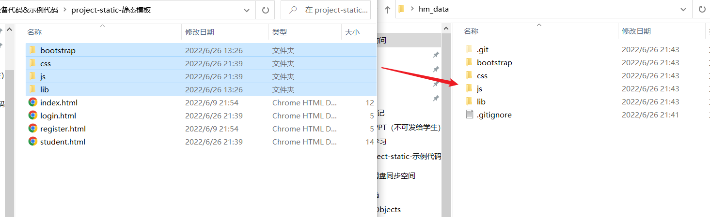


4. 进行第一次提交, 完成了git仓库环境的和过滤文件准备

   ```bash
   git add .
   git commit -m '项目初始化_过滤文件准备'
   ```

   

5. 分支管理

   * master -> 主分支  (放置正式使用代码)

   * develop -> 开发分支 (所有开发后代码合并到这里, 为测试做准备)

     

6. 先在基础模板下, 直接创建develop分支

```bash
git branch develop
git checkout develop
```


### 小结

1. 一个新的项目开始前, 我们需要做一些什么?

   <details>
   <summary>答案</summary>
   <ul>
   <li>创建git仓库和过滤文件, 在此基础上, 先创建开发分支</li>
   </ul>
   </details>


## 02.注册-页面准备

### 目标

* 梳理注册页面需求, 并完成标签样式布局并提交

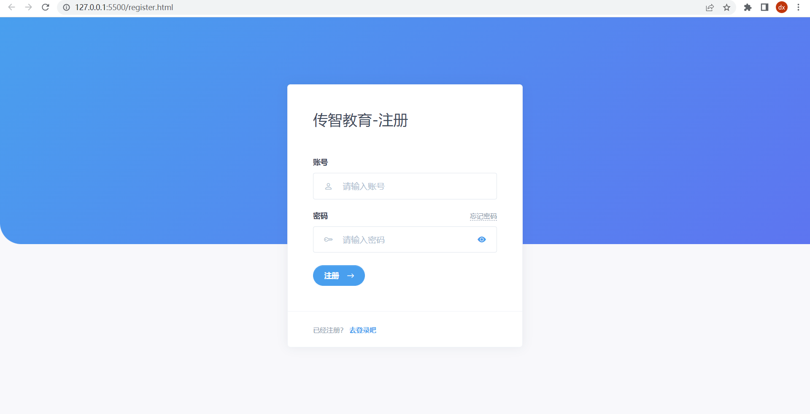


### 讲解

1. 创建 reg 分支

   ```bash
   git branch reg
   git checkout reg
   ```

2. 从`03_素材_包含准备代码和示例代码`里找到静态模板, 先准备注册页面

   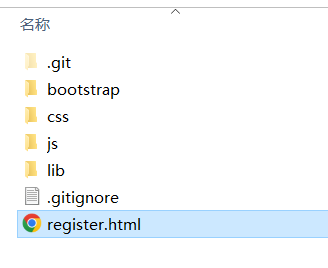


2. 运行注册页面, 并核对标签和页面的对应关系

3. 暂存提交一次记录

   ```bash
   git add .
   git commit -m '注册页面_标签和样式'
   ```

   


### 小结

1. 完成一个功能, 我们git如何管理?

   <details>
   <summary>答案</summary>
   <ul>
   <li>确认所在分支后, 暂存, 提交产生一次提交记录</li>
   </ul>
   </details>


## 03.注册-功能实现

### 目标

* 实现注册的功能


### 讲解

1. 给注册按钮绑定点击事件

2. 收集表单数据

3. 表单校验

4. 发请求注册

5. 根据请求结果设置提示内容

6. 使用 Toast 提示用户

   ```js
   // 创建 Toast 弹框
   const toast = new bootstrap.Toast('#myToast')
   const toastBody = document.querySelector('.toast-body')
   const form = document.querySelector('form')
   // 1. 给注册按钮绑定点击事件
   document.querySelector('#btn-register').addEventListener('click', async () => {
     // 2. 收集表单数据
     const data = serialize(form, { hash: true, empty: true })
     // 3. 表单校验
     const { username, password } = data
     if (username.length < 2 || username.length > 30) {
       toastBody.innerHTML = '账号必须是 2 ~ 30 个字符'
       toast.show()
       return
     }
     if (password.length < 6 || password.length > 30) {
       toastBody.innerHTML = '密码必须是 6 ~ 30 个字符'
       toast.show()
       return  
     }
     try {
       // 4. 发请求注册
       const res = await axios({
         url: 'http://ajax-api.itheima.net/register',
         method: 'post',
         data
       })
       // 5. 根据请求结果设置提示内容
       toastBody.innerHTML = res.data.message
     } catch(e) {
       toastBody.innerHTML = e.response.data.message
     }
     // 6. 提示用户
     toast.show()
   })
   ```

   

7. 把本次代码提交一次在注册的分支下

   ```bash
   git add .
   git commit -m '注册页面_JS功能完成'
   ```

8. 将 reg 分支合并到 develop 分支

   ```bash
   git checkout develop
   git merge reg
   ```

   

### 小结

1. 注册功能实现后需要使用 git 做什么?

   <details>
   <summary>答案</summary>
   <ul>
   <li>切换到 develop 分支将 reg 分支合并进来</li>
   </ul>
   </details>


## 04.登录-页面准备

### 目标

* 完成登录页面标签和样式的阅读


### 讲解

1. 先切换到登录的分支login下

   ```bash
   git checkout -b login
   ```

2. 把素材里的 login.html 复制到 hm_data 项目下, 阅读标签和样式与页面对应关系

3. 准备好以后, 再暂存和提交一次, 产生记录

   ```bash
   git add .
   git commit -m '登录页面_标签和样式'
   ```

   

## 05.登录-功能实现

### 目标

* 登录功能实现


### 讲解

1. 给登录按钮绑定点击事件

2. 收集表单数据

3. 表单校验

4. 发请求登录

5. 根据请求结果设置提示内容

6. 使用 Toast 提示用户

   ```js
   // 创建 Toast 弹框
   const toast = new bootstrap.Toast('#myToast')
   const toastBody = document.querySelector('.toast-body')
   const form = document.querySelector('form')
   // 1. 给登录按钮绑定点击事件
   document.querySelector('#btn-login').addEventListener('click', async () => {
     // 2. 收集表单数据
     const data = serialize(form, { hash: true, empty: true })
     // 3. 表单校验
     const { username, password } = data
     if (username.length < 2 || username.length > 30) {
       toastBody.innerHTML = '账号必须是 2 ~ 30 个字符'
       toast.show()
       return
     }
     if (password.length < 6 || password.length > 30) {
       toastBody.innerHTML = '密码必须是 6 ~ 30 个字符'
       toast.show()
       return  
     }
     try {
       // 4. 发请求登录
       const { data: res } = await axios({
         url: 'http://ajax-api.itheima.net/login',
         method: 'post',
         data
       })
       // 5. 根据请求结果设置提示内容
       toastBody.innerHTML = res.data.message
     } catch(e) {
       toastBody.innerHTML = e.response.data.message
     }
     // 6. 提示用户
     toast.show()
   })
   ```


2. 完成功能, 再次暂存和提交

   ```bash
   git add .
   git commit -m '登录页面_JS功能实现'
   ```

3. 切换回 develop 分支并合并 login 分支

   ```bash
   git checkout develop
   git merge login
   ```

   


## 06.首页-页面准备

### 目标

* 准备首页的标签和样式并核对


### 讲解

1. 新建首页分支并切换过去

   ```bash
   git checkout -b home
   ```
   
2. 从素材中, 拿到 index.html, 复制到 hm_data 项目文件夹下

3. 阅读标签和页面的对应关系

4. 暂存提交一次产生记录

   ```bash
   git add .
   git commit -m '首页_标签和样式准备'
   ```

   

### 小结

1. 如果统计所有分支, 现在有几个分支了?

   <details>
   <summary>答案</summary>
   <ul>
   	<li>master</li>
       <li>develop</li>
       <li>reg</li>
       <li>login</li>
       <li>home</li>
   </ul>
   </details>


## 07.首页-权限控制

### 目标

* 掌握访问控制权限


### 讲解

1. 我们是一个内部项目, 现在谁都能看首页(包含未登录的和游客身份) 这样不好, 会让数据泄露

2. 这里我们要基于一个叫 token 的字符串 (在前后端的分离模式中, 也叫jwt, 全称JSON WEB Token) 它是一个后端加密并转换生成的一个字符串, 里面存储着本次登录的用户相关信息 (需要登录, 输入正确的账号和密码 换取)

3. 看下token字符串流程

   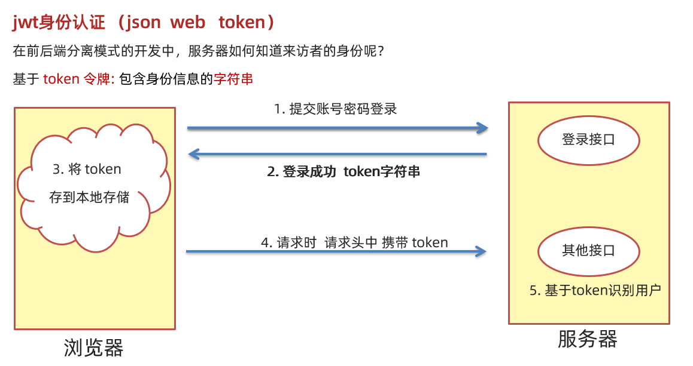

4. 登录成功后, 将 token 字符串存入浏览器本地, 跳转到首页

   ```js
   // 保存token字符串
   localStorage.setItem('token', res.data.data.token)
   location.href = './index.html'
   ```

5. 在首页 index.html 中, 需要判断是否有 token, 也就是浏览器本地是否有 token, 如果没有则强制切换回到登录页面

   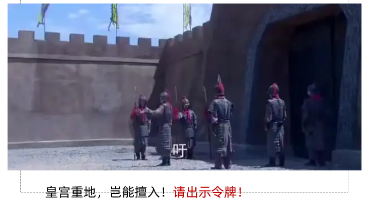

6. 具体流程如下

   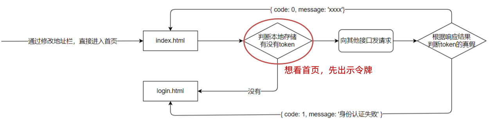

7. 在 index.html 的 script 里判断本地是否有 token

   ```js
   // 判断是否有token, 如果无则强制回到登录页面
   if (!localStorage.getItem('token')) {
       location.href = './login.html'
   }
   ```

   

8. 前端只能判断有没有token, 而token字符串有效期, 需要在请求时携带给后端判断, 如果过期会返回401

9. 提交一次

   ```bash
   git add .
   git commit -m '访问控制_登录后保存token字符串在本地_首页拦截'
   ```


### 小结

1. 登录成功后, 我们需要做什么?

   <details>
   <summary>答案</summary>
   <ul>
   <li>把后台返回的token存入到本地</li>
   </ul>
   </details>

2. token 字符串有什么用?

   <details>
   <summary>答案</summary>
   <ul>
   <li>在以后的请求中, 可以携带给后端, 用来表明自己的身份, 而且后端有判断, 你不带token来请求它是返给你返回401状态码, 而不会给你数据和服务</li>
   </ul>
   </details>

3. 前端是否能判断 token 有效期?

   <details>
   <summary>答案</summary>
   <ul>
   <li>不能, 前端只能判断有无token, 有就认为已经登录了, 但是过不过期, 得携带给后端, 根据后端返回结果再后面去讲判断</li>
   </ul>
   </details>


## 08.首页-用户名和退出

### 目标

* 实现显示用户名
* 实现退出登录功能


### 讲解

1. 先在登录成功位置, 把用户名保存到本地

   > 因为 login.html 的值想要给 index.html, 跨页面传数据用 localStorage, login 存, index 取

   ```js
   // 保存用户名
   localStorage.setItem('username', res.data.data.username)
   // 跳转到主页
   location.href = './index.html'
   ```

   

2. 在 index.html 取出并渲染

   ```js
   // 设置用户名
   let userNameSpan = document.querySelector('.navbar-nav .font-weight-bold')
   userNameSpan.innerHTML = localStorage.getItem('username')
   ```

   

3. 实现退出功能

   > 所谓的退出, 就是清除本地所有缓存, 然后强制切换到登录页面

   ```js
   // 退出登录功能
   document.querySelector('#logout').addEventListener('click', e => {
       localStorage.clear()
       location.href = './login.html'
   })
   ```

   

4. 提交一次

   ```bash
   git add .
   git commit -m '主页_显示用户名和退出功能'
   ```


### 小结

1. 退出登录是做什么?

   <details>
   <summary>答案</summary>
   <ul>
   <li>就是把本地存储清空, 然后切换回到登录页面</li>
   </ul>
   </details>


## 09.首页-获取统计数据

### 目标

* 掌握请求头携带技术


### 讲解

1. 在 index.html 中请求获取首页统计数据

   ```js
   document.addEventListener('DOMContentLoaded', async () => {
     const res = await axios({ url: 'http://ajax-api.itheima.net/dashboard' })
     console.log(res)
   })
   ```

2. 不出意外, 在 network 里看到报错提示 401, 没有携带token

3. 所以我们axios有个固定名字配置项叫headers, 可以携带请求头和值带给后端

   ```js
   const res = await axios({
       url: 'http://ajax-api.itheima.net/dashboard',
       headers: {
           Authorization: localStorage.getItem('token')
       }
   })
   ```

   

4. 流程图示:

   


### 小结

1. 我们除了注册和登录, 其他的接口请求时需要做什么?

   <details>
   <summary>答案</summary>
   <ul>
   <li>在请求头上携带Authorization和token值, 表明自己身份, 才能拿到对应的数据</li>
   </ul>
   </details>


## 10.axios-请求拦截器

### 目标

* 掌握 axios 请求拦截器语法和使用场景


### 讲解

1. 我们每次请求都要自己写headers, 岂不是很麻烦

2. 那好在我们用的统一都是axios, 而axios自带一个叫请求拦截器的函数

3. 流程如图所示

   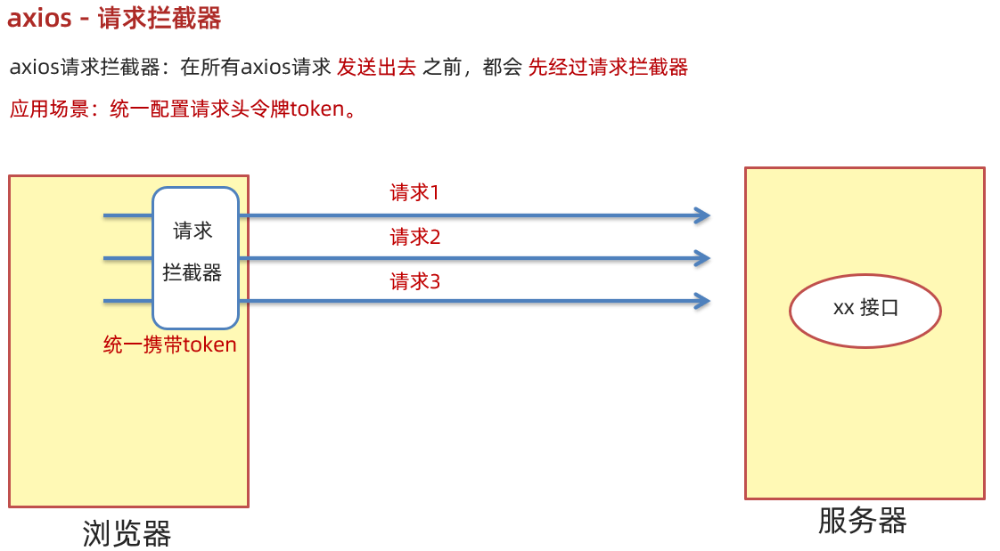


4. 语法:

   > 因为index和后面的student页面都要用, 所以我们可以写在common.js中

   ```js
   // 设置请求基地址, 以后就不需要每次都写前面一截请求地址啦
   axios.defaults.baseURL = 'http://ajax-api.itheima.net/'
   
   axios.interceptors.request.use(config => {
       config.headers.Authorization = localStorage.getItem('token')
       return config
     },
     e => Promise.reject(e)
   )
   ```

   

5. 然后把 index.html 中的 axios 携带请求头的代码删除, 看看是否可以用请求拦截器把请求头携带给后台, 在network里查看, 答案是可以的!


### 小结

1. 请求拦截器的场景是什么?

   <details>
   <summary>答案</summary>
   <ul>
   <li>主要统一携带请求头和token给后端, 标明身份的</li>
   </ul>
   </details>

2. 设置 axios 请求基地址的属性是什么?

   <details>
   <summary>答案</summary>
   <ul>
   <li>axios.defaults.baseURL</li>
   </ul>
   </details>


## 11.axios-响应拦截器

### 目标

* 处理响应 401 的情况 (token过期-默认2小时)
* 处理 axios 请求结果每次都要取一下 data


### 讲解

1. 在common.js加入响应拦截器, 处理这2个事情

   ```js
   axios.interceptors.response.use(
     // 直接拿到数据
     res => res.data, // http响应状态码为 2xx 和 3xx 进入第一个函数
     e => { // http 响应状态码为 4xx 和5xx, 进入第二个函数
       if (e.response.status === 401) {
         localStorage.clear()
         location.href = './login.html'
       }
       return Promise.reject(e)
     }
   )
   ```

   

2. 回到登录页面和注册页面, 把请求后的响应结果, 少取一次 data, 因为响应拦截器返回的就是 res.data 属性的值(就是后台返回的数据对象) 直接返回到 axios发起的地方了


### 小结

1. 响应拦截器有什么作用?

   <details>
   <summary>答案</summary>
   <ul>
       <li>对 axios 结果对象进行处理, 把后端返回的真正数据返回到axios调用处使用</li>
       <li>对响应的错误进行统一处理</li>
   </ul>
   </details>


## 12.远程仓库-介绍

### 目标

* 了解远程仓库的概念和好处


### 讲解

1. 远程仓库是另外一台服务器上, 可以存储我们版本库的所有记录和存档记录

2. 如图介绍所示

   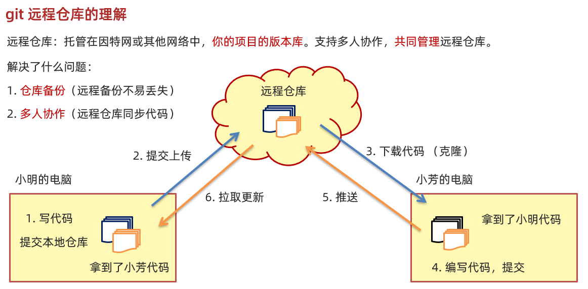


3. 这样当我们电脑坏了, 我们也可以从远程仓库上, 克隆下来一份之前提交的代码到本地继续开发


### 小结

1. 远程仓库好处是什么?

   <details>
   <summary>答案</summary>
   <ul>
   <li>可以托管我们的代码</li>
   </ul>
   </details>


## 13.远程仓库-gitee

### 目标

* 掌握gitee码云网站的使用
* github / gitlab


### 讲解

1. 登录gitee.com网站以后, 可以选择创建一个远程仓库的项目 (可以多个)

   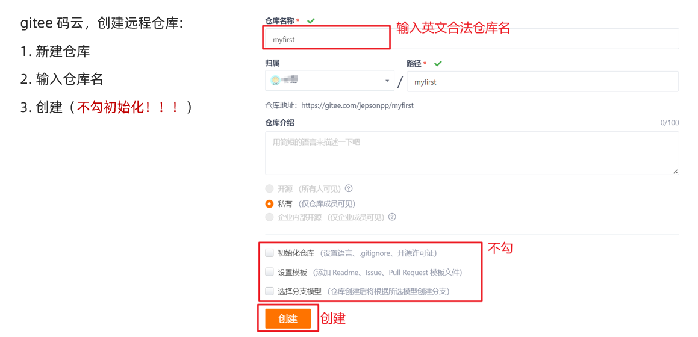


2. 创建后, 会得到一个远程仓库的地址链接, 一般是以.git结尾的地址

3. 地址分为两种

   最常用的两种传输协议：

   https 协议：需要输入用户名和密码            https://gitee.com/leetc/test.git

   ssh 协议：  需要配置秘钥，可免密码登录      git@gitee.com:leetc/test.git


### 讲解

1. 远程仓库如何创建?

   <details>
   <summary>答案</summary>
   <ul>
   <li>一般对应的平台有可视化的网页, 根据提示操作即可</li>
   </ul>
   </details>


## 14.远程仓库-SSH配置

### 目标

* 我们可以在本机一次性配置SSH以后免密登录


### 讲解

1. ssh秘钥组成和作用

   ```js
   ssh key 的作用：实现本地仓库和 gitee平台 之间免登录的加密数据传输。
   ssh key 由两部分组成，分别是：
   id_rsa（私钥文件，存放于客户端的电脑中即可）
   id_rsa.pub（公钥文件，需要配置到 gitee平台 中）
   私钥加密的信息，只能通过公钥解密。公钥加密的信息，只能通过私钥解密。安全性高。
   
   ```

   

2. 先在本机生成一个秘钥 (以后也可以重新生成, 重新配置)

   ```js
   步骤：
   1. 打开 Git Bash
   2. 粘贴如下的命令   ssh-keygen -t rsa -C "你注册账号的邮箱"
   3. 连续敲击 3 次回车，即可在 C:\Users\用户名文件夹\.ssh 目录中生成 id_rsa 和 id_rsa.pub 两个文件
   4. 使用 vscode 打开 id_rsa.pub 文件，复制里面的文本内容
   5. 粘贴配置到 码云 ->  设置  ->  ssh 公钥  中即可
   
   
   Tips: mac获取公钥 https://juejin.cn/post/6844904169191522317
   
   ```

   

## 15.远程仓库-本机已有项目推送

### 目标

* 如果本地已经有项目了, 想要推送到远程仓库里


### 讲解

1. 先给本地仓库配置个远程仓库的地址, 建立仓库之间的链接

   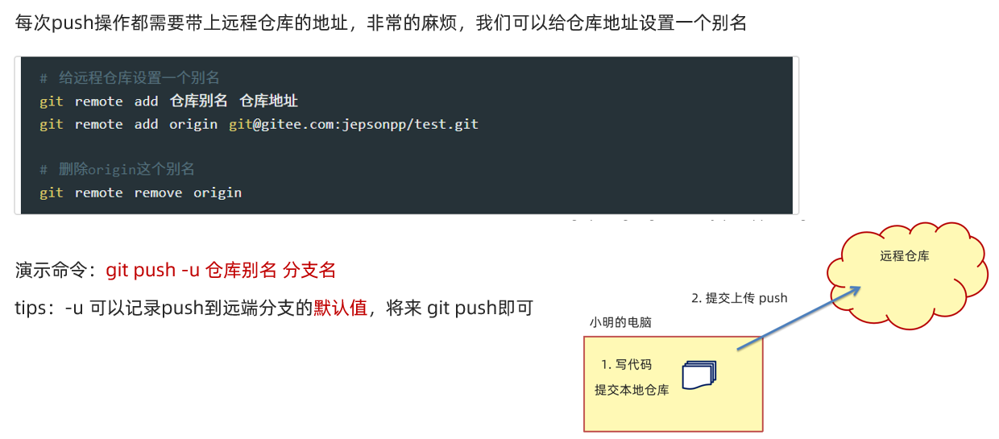


2. 注意这个remote 配置只需要链接好即可

3. 以后本地有变化, 暂存, 提交 在本地产生一次版本记录(可以立刻推送 / 下班之前推送 n次的提交记录都可以)

   > 本地仓库的和远程仓库的提交记录 一般是相等的


## 16.远程仓库-新入职

### 目标

* 万一我本地没有项目呢?


### 讲解

1. 其实记住本地有没有代码即可, 有了就用上面16 

2. 如果你本地没有, 而且如果你是要拿到别人仓库里的代码, 看如下命令即可

   ```js
   git clone 目标远程仓库的git地址
   git clone 远程仓库的git地址 -b 分支名
   ```

3. 图示如下

   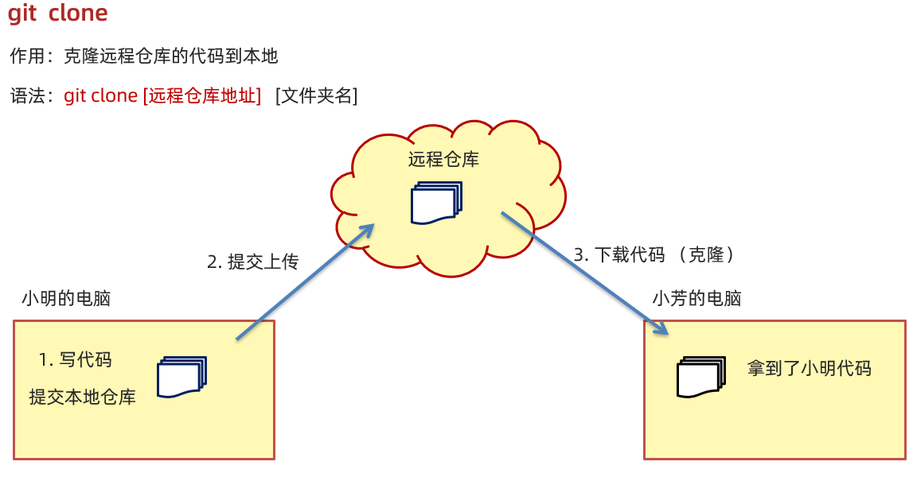


### 小结

1. 本地没有远程仓库的代码怎么办?

   <details>
   <summary>答案</summary>
   <ul>
   <li>使用git clone命令, 只有第一次需要用这句</li>
   </ul>
   </details>


## 17.远程仓库-日常使用

### 目标

* 多人协同开发的日常流程


### 讲解

1. 这里我再本地新建2个文件夹, 来模拟2个前端攻城狮
2. A编写代码, 暂存, 提交, 然后推送到远程服务器
3. B编写代码, 暂存, 提交, 可以先拉取对方刚提交的记录到本地合并, 然后合并后无误再推送到远程
4. A可以git pull拉取远程最新的代码版本到本地合并使用

> 这里的A和B谁先都可以, 继续 拉取更新的 用git  pull命令即可


### 小结

1. 想要把自己本地写完的交上去用什么命令?

   <details>
   <summary>答案</summary>
   <ul>
   <li>用git push</li>
   </ul>
   </details>


2. 想要在本地拿到别人在远程仓库上的更新 ,用什么命令?

   <details>
   <summary>答案</summary>
   <ul>
   <li>使用git pull</li>
   </ul>
   </details>


