# day03-ECharts 图表使用

## 学习目标

* 掌握 ECharts 的使用
* 完成项目中图表的使用


## 01-概念-数据可视化

### 目标

* 了解什么是数据可视化


### 讲解

1. 看下图数据, 请回答出谁的智商最高?

   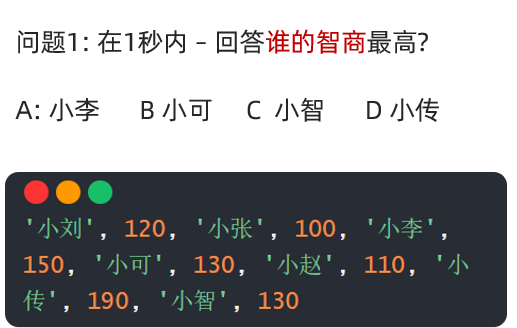


2. 是不是查找起来需要一点时间? 不够直观呀? 所以我们需要用一些图形来展示数据, 再看下面, 请回答谁的智商最高?

   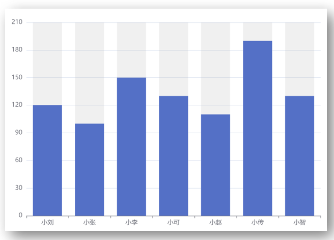


3. 所以, 数据可视化的概念:

   > 数据可视化: 
   >
   > 1.借助图形手段, 清晰传达信息的表现方式
   >
   > 2.把枯燥的数字数据, 转换成图形, 数据特点更突出

   

4. 大家觉得这些数据我们要一笔一划的自己画出来吗?

   > 答案: 肯定不是的
   >
   > 1. 自己绘制, 需要学习使用 canvas 标签 / svg 标签 的使用, 而且需要大量的坐标点计算
   > 2. 很浪费宝贵的开发时间, 所以有人已经封装好了一些可以复用的图表供我们使用


5. 所以, 今天有请我们的主人公, ECharts登场!

   > 中文官网链接地址: https://echarts.apache.org/zh/index.html

   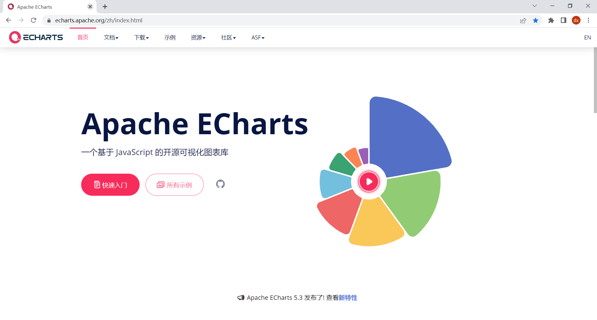


6. 今天我们会学习如何使用ECharts来绘制一些图表在我们自己的网页中

7. 而且在我们的项目中, 我们会使用到如下几种图表

   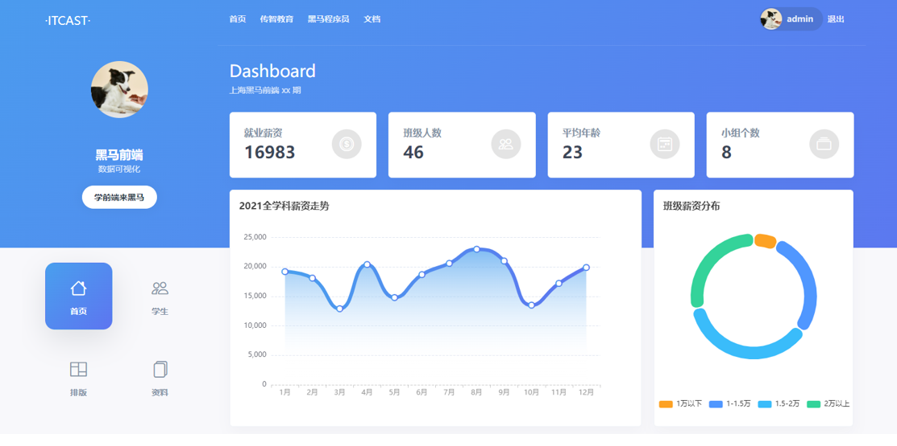

   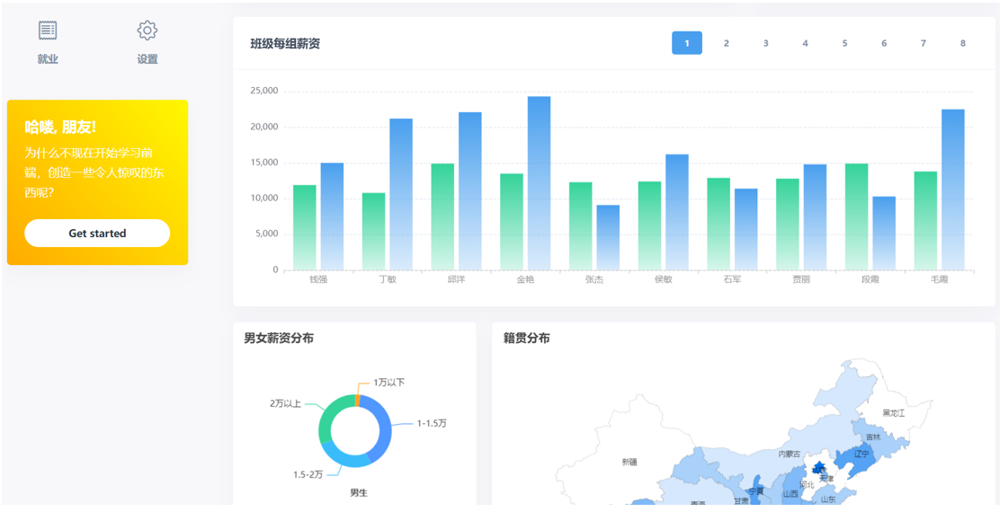


### 小结

1. 什么是数据可视化?

   <details>
   <summary>答案</summary>
   <ul>
   <li>把数据用图形, 图表的形式直观的表现出来</li>
   </ul>
   </details>


2. 在前端项目中, 我们如何实现这些图表?

   <details>
   <summary>答案</summary>
   <ul>
   <li>可以借助一些可视化的图表库</li>
   </ul>
   </details>


## 02-ECharts-基础学习

### 目标

* 掌握ECharts文档的入门使用


### 讲解

1. 百度找到ECharts的官网文档
2. ECharts是一个基于JS的可视化图表库
3. 特点：
   * 性能好，流畅运行于 PC 和 移动端
   * 兼容主流浏览器
   * 提供非常多的常用图表，且支持定制

4. 快速入门文档: https://echarts.apache.org/handbook/zh/get-started/

   1. 新建`01-02.ECharts_基础学习.html`, 根据文档的指示, 引入ECharts的js文件

      > https://cdn.jsdelivr.net/npm/echarts@5.3.3/dist/echarts.min.js

   2. 准备一个<font color="red">具备宽高</font>的DOM容器

      ```html
      <div id="main" style="width: 600px; height: 400px"></div>
      ```

   3. 初始化Echarts实例

      ```js
      let myEchart = echarts.init(document.querySelector('#main'))
      ```

   4. 准备配置项

      ```js
      let option = {
          title: {
              text: 'ECharts 入门示例'
          },
          tooltip: {},
          legend: {
              data: ['销量']
          },
          xAxis: {
              data: ['衬衫', '羊毛衫', '雪纺衫', '裤子', '高跟鞋', '袜子']
          },
          yAxis: {},
          series: [
              {
                  name: '销量',
                  type: 'bar',
                  data: [5, 20, 36, 10, 10, 20]
              }
          ]
      }
      ```

   5. 给echarts实例配置进入, 即可得到一个相关的柱形图表

      ```js
      myEchart.setOption(option)
      ```

      

### 小结

1. ECharts如何使用, 可以得到一个图表?

   <details>
   <summary>答案</summary>
   <ul>
   <li>引入js文件, 准备具备宽高的容器, 然后实例化ECharts实例, 关键准备好它的配置项, 并设置即可</li>
   </ul>
   </details>


## 03-ECharts-配置项讲解

### 目标

* 理解配置项的作用


### 讲解

1. ECharts内部的代码都是写好的, 我们只需要使用不同的配置项组合(和一些规定好的值), 即可组合出不同的图表使用

2. 上个案例中, 各个配置项的解释

3. 把刚才代码复制, 然后重命名为`02.ECharts_配置项讲解.html`, 挨个和文档对比查找他们的含义

   > 配置项文档: https://echarts.apache.org/zh/option.html#title

4. 含义如图所示

   

   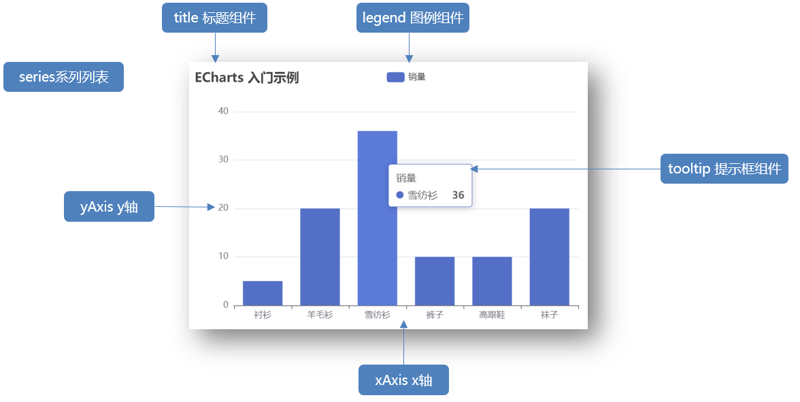

   ```js
   let option = {
       title: { // 标题组件
           text: 'ECharts 入门示例' // 主标题
       },
       tooltip: {}, // 提示框组件
       legend: { // 图例组件
           data: ['销量'] // 图例数组数据(必须和series的name一致)
       },
       xAxis: { // 直角坐标系的x轴
           data: ["衬衫", "羊毛衫", "雪纺衫", "裤子", "高跟鞋", "袜子"] // x轴数据
       },
       yAxis: {}, // 直角坐标系的y轴
       series: [{ // 系列列表, 一个对象一套数据
           name: '销量',
           type: 'bar', // 图表类型 - 柱状图
           data: [5, 20, 36, 10, 10, 20] // 纵轴数据
       }]
   }
   ```

   

### 小结

1. 什么叫做配置项?

   <details>
   <summary>答案</summary>
   <ul>
   <li>配置项就是传入的对象里的属性, 此对象传入到插件的源码内, 它需要调用这些名字的选项, 拿到我们传入的值, 再根据不同的值渲染不同的结果, 而且有的值内部也有要求!! 所以管这些固定传入的对象属性就叫配置项</li>
    <li>当然了最专业的其实还是对象的属性/键/key, 而配置项或者选项都是大家自己好理解的叫法</li>
   </ul>
   </details>


## 04-项目-数据概览区域

### 目标

* 完成如下需求

  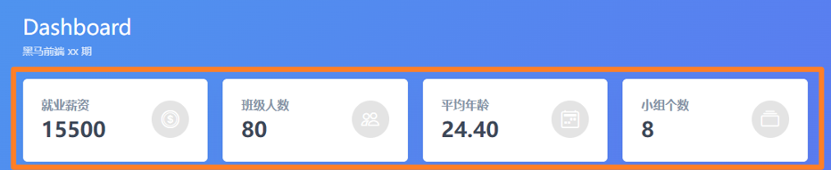


### 讲解

1. 再次打开我们之前写完一半的项目hm_data

2. 确认标签和数据在哪里以及关系

3. 开始循环铺设数据到标签里

   ```js
   // 渲染概览数据
   // 1. 确认标签和数据的映射关系
   // res.data.overview里是概览数据
   // 发现数据对象属性和标签 name 属性值一致, 于是我有了一个大胆的想法
   // 用数据对象属性名去获取标签
   // 2. 循环数据并设置给标签内容
   function setOverview(data) {
     Object.keys(data).forEach(k => document.querySelector(`[name=${k}]`).innerHTML = data[k])
   }
   // 获取数据后调用 setOverview() 函数即可
   const res = await axios({ url: '/dashboard' })
   setOverview(res.data.overview)
   ```
   
   

### 小结

1. 铺设概览如何获取标签的?

   <details>
   <summary>答案</summary>
   <ul>
   <li>发现数据对象的属性和标签的name属性名对应(其实也可以自己给标签class名/name名提前和数据属性名对上), 这样可以循环对象属性就对应获取标签了, 然后把值赋予进去 (一个可以复用的经验) </li>
   </ul>
   </details>


## 05-项目-薪资走势

### 目标

* 完成折线图的需求效果

  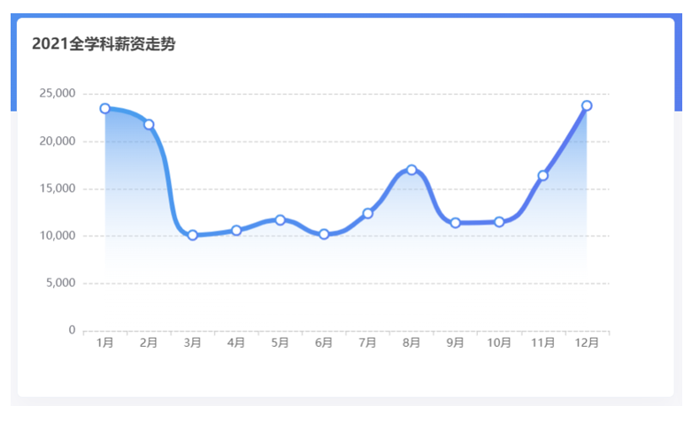

### 讲解

1. 先去ECharts示例中, 找到[类似的](https://echarts.apache.org/examples/zh/editor.html?c=line-smooth)

   ```js
   const initYearChartFn = () => {
       const myEchart = echarts.init(document.querySelector('#line'))
       myEchart.setOption({
           xAxis: {
               type: 'category',
               data: ['Mon', 'Tue', 'Wed', 'Thu', 'Fri', 'Sat', 'Sun']
           },
           yAxis: {
               type: 'value'
           },
           series: [
               {
                   data: [820, 932, 901, 934, 1290, 1330, 1320],
                   type: 'line',
                   smooth: true // 是否平滑曲线显示
               }
           ]
       })
   }
   ```

   

2. 在这个基础上修改, 先修改x轴和y轴的数据

   ```js
   // 2. 设置x轴和y轴的数据
   let xData = yearArr.map(obj => obj.month) // ['1月', '2月', ...]
   let yData = yearArr.map(obj => obj.salary) // [19300, 22300, ...]
   const myEchart = echarts.init(document.querySelector('#line'))
   myEchart.setOption({
       xAxis: {
           type: 'category',
           // data: ['Mon', 'Tue', 'Wed', 'Thu', 'Fri', 'Sat', 'Sun']
           data: xData // x轴数据
       },
       yAxis: {
           type: 'value'
       },
       series: [
           {
               // data: [820, 932, 901, 934, 1290, 1330, 1320],
               data: yData, // 系列数据(影响y轴)
               type: 'line',
               smooth: true // 是否平滑曲线显示
           }
       ]
   })
   ```

   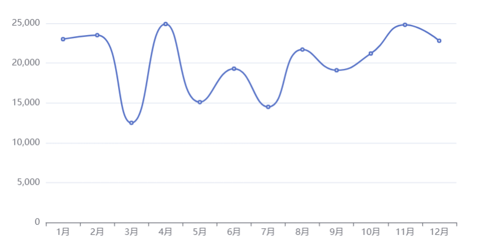


3. 从上到下, 添加title标题区域, 查找文档

   > 字体大小: 16px;
   >
   > 距离上: 15px;
   >
   > 距离左: 10px

   ```js
   title: { // 新增标题
               text: '2021全学科薪资走势',
               top: 15,
               left: 10,
               textStyle: {
                 fontSize: 16
               }
   }
   ```

   

   

4. 设置标记大小为10, 先去[示例](https://echarts.apache.org/examples/zh/editor.html?c=line-pen)中找到需要的, 然后查看多出来哪些配置项, 可以在线上尝试后, 移动到自己的项目中

   ```js
   series: [
       {
           data: yData,
           type: 'line',
           smooth: true,
           symbolSize: 10 // 标记的大小
       }
   ]
   ```

   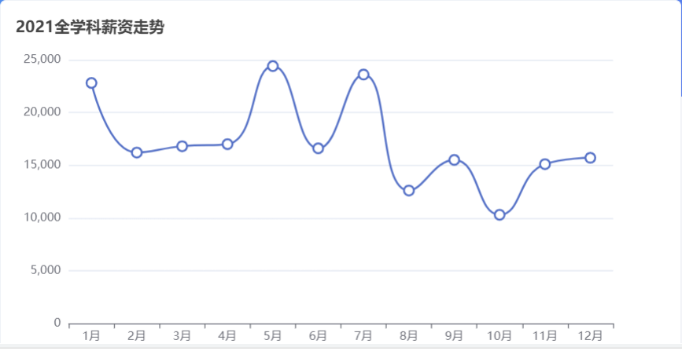


5. 设置折线图带阴影效果, 还是先去找到类似的[示例](https://echarts.apache.org/examples/zh/editor.html?c=area-time-axis), 找到关键的配置项

   > 颜色为: \#499FEE
   >
   > 中间80%为: rgba(255, 255, 255, 0.2)
   >
   > 最后100%为: rgba(255, 255, 255, 0)

   > 如果xy和x2和y2讲不懂: https://echarts.apache.org/examples/zh/editor.html?c=area-basic
   >
   > 在这个图上设置左上角为x和y起始点(因为web中左上角为原点0, 0, 然后右下角为x2和y2, 来讲解

   ```js
   series: [
             {
               // data: [820, 932, 901, 934, 1290, 1330, 1320],
               data: yData, // 系列数据(影响y轴)
               type: 'line',
               smooth: true,
               symbolSize: 10, // 标记的大小
               areaStyle: {
                 color: {
                   // 前四个参数分别是 x0, y0, x2, y2, 范围从 0 - 1，相当于在图形包围盒中的百分比
                   type: 'linear', // 线性渐变
                   x: 0,
                   y: 0,
                   x2: 0,
                   y2: 1,
                   colorStops: [{
                     offset: 0, color: 'red' // 0% 处的颜色
                   }, {
                     offset: 0.8, color: 'rgba(255, 255, 255, 0.2)' // 80% 处的颜色
                   }, {
                     offset: 1, color: 'rgba(255, 255, 255, 0)' // 100% 处的颜色
                   }],
                   global: false // 缺省为 false(为ture, x, y值就是坐标点, 否则为百分比, 建议百分比)
                 }
               }
             }
           ]
   ```

   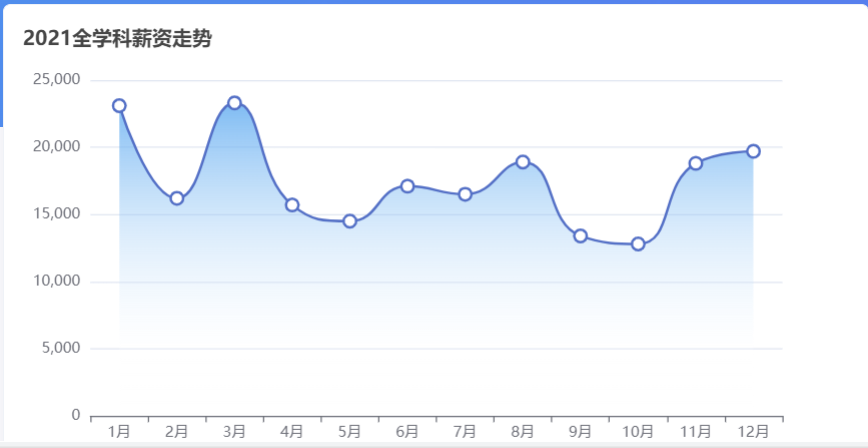


6. 修改线条的样式, 这个没有示例, 就得靠经验分析了, 区域在series里找找发现有修改lineStyle试试即可

   > 宽度为6
   >
   > 颜色为渐变色#499FEE到#5D75F0

   ```js
   series: [
             {
               // data: [820, 932, 901, 934, 1290, 1330, 1320],
               data: yData, // 系列数据(影响y轴)
               type: 'line',
               smooth: true,
               symbolSize: 10, // 标记的大小
               lineStyle: { // 线条宽度和颜色
                 width: 6,
                 color: {
                   type: 'linear',
                   x: 0,
                   y: 0,
                   x2: 1,
                   y2: 0,
                   colorStops: [
                     {
                       offset: 0,
                       color: '#499FEE', // 0% 处的颜色
                     },
                     {
                       offset: 1,
                       color: '#5D75F0', // 100% 处的颜色
                     },
                   ],
                 }
               },
               areaStyle: {
                 color: {
                   // 前四个参数分别是 x0, y0, x2, y2, 范围从 0 - 1，相当于在图形包围盒中的百分比
                   type: 'linear', // 线性渐变
                   x: 0,
                   y: 0,
                   x2: 0,
                   y2: 1,
                   colorStops: [{
                     offset: 0, color: '#499FEE' // 0% 处的颜色
                   }, {
                     offset: 0.8, color: 'rgba(255, 255, 255, 0.2)' // 80% 处的颜色
                   }, {
                     offset: 1, color: 'rgba(255, 255, 255, 0)' // 100% 处的颜色
                   }],
                   global: false // 缺省为 false(为ture, x, y值就是坐标点, 否则为百分比, 建议百分比)
                 }
               }
             }
           ]
   ```

   

7. 设置绘图网格区域, 距离上面title 20%

   ```js
   grid: { // 绘图网格距离上面组件距离(高度百分比)
       top: '20%',
   }
   ```


8. 设置鼠标悬停, 有提示框

   > 注意: 只要在坐标轴就触发, 而不是非得移动到折线上

   ```js
   tooltip: { // 提示组件
       trigger: 'axis',
   }
   ```

   

9. 网格里y轴线(也叫分割线)为虚线, 发现又没有实例, 那就只能看再哪个部分, 找到哪个配置项, 再不行就百度

   ```js
   yAxis: {
             type: 'value',
             splitLine: { // 分割线样式
               lineStyle: {
                 type: 'dashed',
               }
             }
   }
   ```


10. x坐标轴, 轴线颜色和样式, 以及刻度线颜色

    > 轴线颜色: #ccc
    >
    > 虚线
    >
    > 刻度颜色: #999
    
    ```js
    axisLine: {
      lineStyle: {
        color: '#ccc',
        type: 'dashed'
      }
    },
    axisLabel: {
      color: '#999'
    }
    ```
    
    


### 小结

1. ECharts如何做成自己想要的?

   <details>
   <summary>答案</summary>
   <ul>
   <li>先明确目标, 然后找类似的示例, 如果没有根据区域找到对应配置项再试, 或者最后不行就百度找找</li>
   </ul>
   </details>


## 06-项目-薪资分布

### 目标

* 完成薪资分布饼状图的显示

  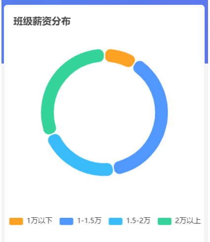


### 讲解

1. 还是先找到[类似的图表](https://echarts.apache.org/examples/zh/editor.html?c=pie-borderRadius), 然后再去调整相关样式, 但是第一次使用, 先读懂每个配置项的作用

   ```js
   myEchart.setOption({
       tooltip: { // 提示框组件
           trigger: 'item' // 放到某项触发提示框
       },
       legend: { // 图例组件(表示每种颜色的概念)
           top: '5%', // 具体容器顶部5%距离(容器高度换算)
           left: 'center' // 图例组件居中显示
       },
       series: [ // 系列数据(重要)
           {
               name: 'Access From', // 系列名称，用于tooltip的显示
               type: 'pie', // 图形类型'pie'固定代表饼状图
               radius: ['40%', '70%'], // 饼图的半径(内圈, 外圈) 表示外半径为可视区尺寸（容器高宽中较小一项）的 20%
               avoidLabelOverlap: true, // 是否启用防止标签重叠策略，默认开启，在标签拥挤重叠的情况下会挪动各个标签的位置，防止标签间的重叠。
               itemStyle: { // 图形样式
                   borderRadius: 10, // 表示内圆角半径和外圆角半径
                   borderColor: '#fff', // 图形的描边颜色
                   borderWidth: 2 // 描边线宽(为0无描边)
               },
               label: { // 饼图图形上的文本标签(默认上来显示的, 鼠标移入是另外配置)
                   show: false, // 隐藏
                   position: 'center' // 让他们出现在中心
               },
               emphasis: { // 高亮状态的扇区和标签样式
                   label: { // 文本标签控制
                       show: true, // 显示
                       fontSize: '40', // 字体大小
                       fontWeight: 'bold' // 字体粗度
                   }
               },
               labelLine: { // 标签的视觉引导线配置(就是解释每块图形的文本标签连线)
                   show: false
               },
               data: [ // 系列数据
                   { value: 1048, name: 'Search Engine' },
                   { value: 735, name: 'Direct' },
                   { value: 580, name: 'Email' },
                   { value: 484, name: 'Union Ads' },
                   { value: 300, name: 'Video Ads' },
               ]
           }
       ]
   })
   ```

   

2. 根据需求, 删除多余的配置项

   > avoidLabelOverlap
   >
   > emphasis

   ```js
   myEchart.setOption({
       tooltip: { // 提示框组件
           trigger: 'item' // 放到某项触发提示框
       },
       legend: { // 图例组件(表示每种颜色的概念)
           top: '5%', // 具体容器顶部5%距离(容器高度换算)
           left: 'center' // 图例组件居中显示
       },
       series: [ // 系列数据(重要)
           {
               name: 'Access From', // 系列名称，用于tooltip的显示
               type: 'pie', // 图形类型'pie'固定代表饼状图
               radius: ['40%', '70%'], // 饼图的半径(内圈, 外圈) 表示外半径为可视区尺寸（容器高宽中较小一项）的 20%
   
               itemStyle: { // 图形样式
                   borderRadius: 10, // 表示内圆角半径和外圆角半径
                   borderColor: '#fff', // 图形的描边颜色
                   borderWidth: 2 // 描边线宽(为0无描边)
               },
               label: { // 饼图图形上的文本标签(默认上来显示的, 鼠标移入是另外配置)
                   show: false, // 隐藏
                   position: 'center' // 让他们出现在中心
               },
   
               labelLine: { // 标签的视觉引导线配置(就是解释每块图形的文本标签连线)
                   show: false
               },
               data: [ // 系列数据
                   { value: 1048, name: 'Search Engine' },
                   { value: 735, name: 'Direct' },
                   { value: 580, name: 'Email' },
                   { value: 484, name: 'Union Ads' },
                   { value: 300, name: 'Video Ads' },
               ]
           }
       ]
   })
   ```

   


3. 改组件, 图例位置, 修改标题, 图形大小, 图形颜色(可以用color属性来设置几个, 图例默认会按照顺序使用)

   > 图例位置在距离底部6%位置
   >
   > 标题距上15, 距离左10, 字体大小16
   >
   > 圆形半径: 50%, 64%
   >
   > 圆心位置: 50%, 45%
   >
   > 图形颜色: ['#FDA224', '#5097FF', '#3ABCFA', '#34D39A']

   ```js
   myEchart.setOption({
           tooltip: { // 提示框组件
             trigger: 'item' // 放到某项触发提示框
           },
           legend: { // 图例组件(表示每种颜色的概念)
             bottom: '6%', 
             left: 'center' // 图例组件居中显示
           },
           title: {
             text: '班级薪资分布',
             top: 15,
             left: 10,
             textStyle: {
               fontSize: 16
             }
           },
           color: ['#FDA224', '#5097FF', '#3ABCFA', '#34D39A'],
           series: [ // 系列数据(重要)
             {
               name: '班级薪资分布', // 系列名称，用于tooltip的显示
               type: 'pie', // 图形类型'pie'固定代表饼状图
               radius: ['50%', '64%'], // 饼图的半径(内圈, 外圈) 表示外半径为可视区尺寸（容器高宽中较小一项）的 20%
               center: ['50%', '45%'],
               
               itemStyle: { // 图形样式
                 borderRadius: 10, // 表示内圆角半径和外圆角半径
                 borderColor: '#fff', // 图形的描边颜色
                 borderWidth: 2 // 描边线宽(为0无描边)
               },
               label: { // 饼图图形上的文本标签(默认上来显示的, 鼠标移入是另外配置)
                 show: false, // 隐藏
                 position: 'center' // 让他们出现在中心
               },
               
               labelLine: { // 标签的视觉引导线配置(就是解释每块图形的文本标签连线)
                 show: false
               },
               data: [ // 系列数据
                 { value: 1048, name: 'Search Engine' },
                 { value: 735, name: 'Direct' },
                 { value: 580, name: 'Email' },
                 { value: 484, name: 'Union Ads' },
                 { value: 300, name: 'Video Ads' },
               ]
             }
           ]
         })
   ```

   

4. 修改数据即可, 看好人家要的数据结构和对象属性的名字, 按要求转换此数据格式传入

   ```js
   data: salaryList.map(obj => {
       return {
           value: obj.g_count + obj.b_count,
           name: obj.label
       }
   })
   ```

   


### 小结

1. ECharts等组件使用万能套路?

   <details>
   <summary>答案</summary>
   <ul>
   <li>明确目标, 找组件, 用组件, 读组件, 删组件, 增/改组件的配置项</li>
   </ul>
   </details>


## 07-项目-每组薪资

### 目标

* 完成每组薪资的2个柱状条的图形设置

  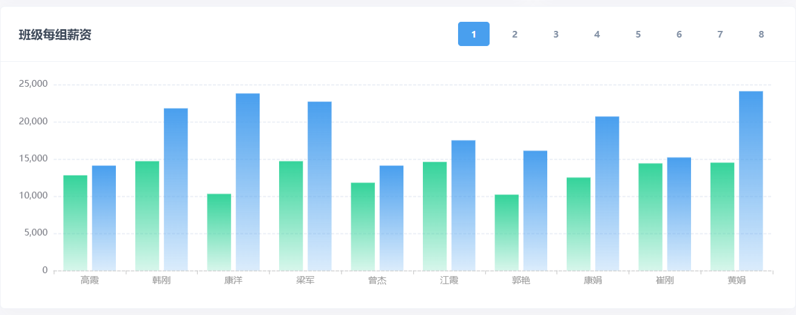


### 讲解

1. 先找到[类似图表](https://echarts.apache.org/examples/zh/editor.html?c=bar-simple), 可能不太像, 但是我们可以自己添加一组数据, 当然了有别的也可以使用, 使用到项目中, 并在容器基础上生成

   ```js
   myEchart.setOption({
       xAxis: {
           type: 'category',
           data: ['Mon', 'Tue', 'Wed', 'Thu', 'Fri', 'Sat', 'Sun']
       },
       yAxis: {
           type: 'value'
       },
       series: [
           {
               data: [120, 200, 150, 80, 70, 110, 130],
               type: 'bar'
           },
           {
               data: [120, 200, 150, 80, 70, 110, 130],
               type: 'bar'
           }
       ]
   })
   ```

   

2. 从上到下, 从大到小, 修改如下这几个选项

   > 绘图网格区域, left: 70, top: 30, right: 30, bottom: 50
   >
   > x坐标轴和上面折线图一样, 坐标轴线和刻度线
   >
   > y轴分割线和上面折线图一样, 直接复制
   >
   > 在每个柱状图上悬浮出现提示框
   >
   > 第一列是期望薪资提示, 第二列是就业薪资
   >
   > color颜色直接复制如下代码

   ```js
   color: [
       {
           type: 'linear',
           x: 0,
           y: 0,
           x2: 0,
           y2: 1,
           colorStops: [
               {
                   offset: 0,
                   color: '#34D39A', // 0% 处的颜色
               },
               {
                   offset: 1,
                   color: 'rgba(52,211,154,0.2)', // 100% 处的颜色
               },
           ],
       },
       {
           type: 'linear',
           x: 0,
           y: 0,
           x2: 0,
           y2: 1,
           colorStops: [
               {
                   offset: 0,
                   color: '#499FEE', // 0% 处的颜色
               },
               {
                   offset: 1,
                   color: 'rgba(73,159,238,0.2)', // 100% 处的颜色
               },
           ],
       },
   ]
   ```

   

3. 最后图表相关样式, 落地代码如下

   ```js
   myEchart.setOption({
       grid: {
           left: 70,
           top: 30,
           right: 30,
           bottom: 50,
       },
       tooltip: {
           trigger: 'item',
       },
       xAxis: {
           type: 'category',
           data: ['Mon', 'Tue', 'Wed', 'Thu', 'Fri', 'Sat', 'Sun'],
           axisLine: {
               lineStyle: {
                   color: '#ccc',
                   type: 'dashed'
               }
           },
           axisLabel: {
               color: '#999'
           }
       },
       yAxis: {
           type: 'value',
           splitLine: {
               lineStyle: {
                   type: 'dashed'
               }
           }
       },
       series: [
           {
               data: [120, 200, 150, 80, 70, 110, 130],
               type: 'bar',
               name: '期望薪资'
           },
           {
               data: [120, 200, 150, 80, 70, 110, 130],
               type: 'bar',
               name: '就业薪资'
           }
       ],
       color: [
           {
               type: 'linear',
               x: 0,
               y: 0,
               x2: 0,
               y2: 1,
               colorStops: [
                   {
                       offset: 0,
                       color: '#34D39A', // 0% 处的颜色
                   },
                   {
                       offset: 1,
                       color: 'rgba(52,211,154,0.2)', // 100% 处的颜色
                   },
               ],
           },
           {
               type: 'linear',
               x: 0,
               y: 0,
               x2: 0,
               y2: 1,
               colorStops: [
                   {
                       offset: 0,
                       color: '#499FEE', // 0% 处的颜色
                   },
                   {
                       offset: 1,
                       color: 'rgba(73,159,238,0.2)', // 100% 处的颜色
                   },
               ],
           },
       ],
   })
   ```

   

4. 然后设置相关数据即可

   ```js
   // 默认显示第1组的数据
   let firstArr = groupObj[1] // 注意groupObj是个对象, 后台返回此对象key从1开始(不是数组下标)
   
   
   // 准备配置项
   myEchart.setOption({
       grid: {
           left: 70,
           top: 30,
           right: 30,
           bottom: 50,
       },
       tooltip: {
           trigger: 'item',
       },
       xAxis: {
           type: 'category',
           data: firstArr.map(obj => obj.name),
           axisLine: {
               lineStyle: {
                   color: '#ccc',
                   type: 'dashed'
               }
           },
           axisLabel: {
               color: '#999'
           }
       },
       yAxis: {
           type: 'value',
           splitLine: {
               lineStyle: {
                   type: 'dashed'
               }
           }
       },
       series: [
           {
               data: firstArr.map(obj => obj.hope_salary),
               type: 'bar',
               name: '期望薪资'
           },
           {
               data: firstArr.map(obj => obj.salary),
               type: 'bar',
               name: '就业薪资'
           }
       ],
       color: [
           {
               type: 'linear',
               x: 0,
               y: 0,
               x2: 0,
               y2: 1,
               colorStops: [
                   {
                       offset: 0,
                       color: '#34D39A', // 0% 处的颜色
                   },
                   {
                       offset: 1,
                       color: 'rgba(52,211,154,0.2)', // 100% 处的颜色
                   },
               ],
           },
           {
               type: 'linear',
               x: 0,
               y: 0,
               x2: 0,
               y2: 1,
               colorStops: [
                   {
                       offset: 0,
                       color: '#499FEE', // 0% 处的颜色
                   },
                   {
                       offset: 1,
                       color: 'rgba(73,159,238,0.2)', // 100% 处的颜色
                   },
               ],
           },
       ],
   })
   ```

   


### 小结

1. 对象里的可以可不可以用数字字符串?

   <details>
   <summary>答案</summary>
   <ul>
   <li>可以使用</li>
   </ul>
   </details>


## 08-项目-每组薪资\_切换

### 目标

* 点击组号, 把数据进行切换


### 讲解

1. 思路: 需要改了数据还得让setOption重新执行一次, 所以先把配置对象单独定义出来

   ```js
   // 事件委托
   const btns = document.querySelector('#btns')
   btns.addEventListener('click', (e) => {
       if (e.target.tagName === 'BUTTON') {
           // 先做点击高亮
           btns.querySelector('.btn-blue').classList.remove('btn-blue')
           e.target.classList.add('btn-blue')
   
           // 获取内容(1-8数字字符串)
           const group = e.target.innerText
           // 切换数据
           options.xAxis.data = groupObj[group].map((item) => item.name);
           options.series[0].data = groupObj[group].map((item) => item.hope_salary);
           options.series[1].data = groupObj[group].map((item) => item.salary);
           myEchart.setOption(options)
       }
   })
   ```

   

### 小结

1. JS原生如何做的点击事件高亮?

   <details>
   <summary>答案</summary>
   <ul>
   <li>先获取有高亮激活效果的类名的标签, 把它的相关类名删除掉, 然后给当前点击的标签设置上高亮激活的类名即可</li>
   </ul>
   </details>


## 09-项目-男女薪资分布

### 目标

* 完成图示效果

  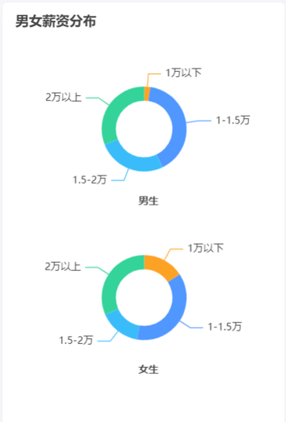


### 讲解

1. 还是先找到类似的[图表](https://echarts.apache.org/examples/zh/editor.html?c=pie-simple), 在此基础上改, 2个圆形其实可以一个图表, 2个系列数据设置圆心位置

2. 在代码中先使用

   ```js
   myEchart.setOption({
       title: [
           {
               text: '男女薪资分布',
               left: 10,
               top: 10,
               textStyle: {
                   fontSize: 16,
               },
           },
           {
               text: '男生',
               left: '50%',
               top: '45%',
               textAlign: 'center',
               textStyle: {
                   fontSize: 12,
               },
           },
           {
               text: '女生',
               left: '50%',
               top: '85%',
               textAlign: 'center',
               textStyle: {
                   fontSize: 12,
               },
           },
       ],
       tooltip: {
           trigger: 'item'
       },
       color: ['#FDA224', '#5097FF', '#3ABCFA', '#34D39A'],
       series: [
           {
               type: 'pie',
               radius: 50,
               radius: ['20%', '30%'],
               center: ['50%', '30%'],
               datasetIndex: 1,
               data: [{name:'1万以下',value: 4}]
               
           },
           {
               type: 'pie',
               radius: 50,
               radius: ['20%', '30%'],
               center: ['50%', '70%'],
               datasetIndex: 2,
               data: [{name:'1万以下',value: 4}]
           }
       ]
   })
   ```

   


### 小结

1. 一个图例中可以有多个图形吗?

   <details>
   <summary>答案</summary>
   <ul>
   <li>可以有, series里设置多个对象数据</li>
   </ul>
   </details>


## 10-项目-籍贯分布

### 目标

* 了解完成图上设置和社区的使用

  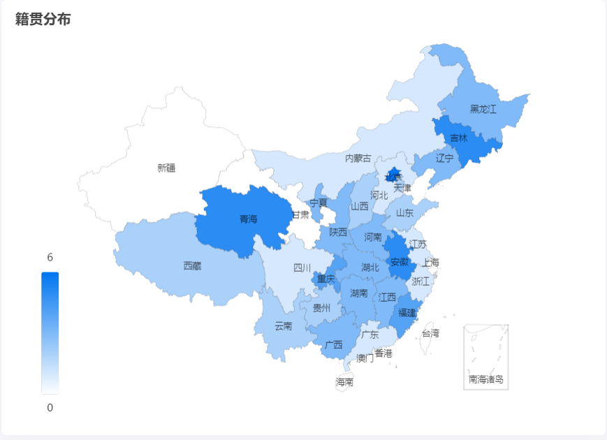


### 讲解

1. 官方案例没有这样的地图, 可以去社区的看下

   > 社区地址: https://www.makeapie.cn/echarts_category/series-map

2. 然后找到类似的, 再进行修改, 直接从这里复制, 不复制文档上的

   ```js
   const setMap = (data) => {
         const myEchart = echarts.init(document.querySelector('#map'))
         
         const dataList = [
           { name: '南海诸岛', value: 0 },
           { name: '北京', value: 0 },
           { name: '天津', value: 0 },
           { name: '上海', value: 0 },
           { name: '重庆', value: 0 },
           { name: '河北', value: 0 },
           { name: '河南', value: 0 },
           { name: '云南', value: 0 },
           { name: '辽宁', value: 0 },
           { name: '黑龙江', value: 0 },
           { name: '湖南', value: 0 },
           { name: '安徽', value: 0 },
           { name: '山东', value: 0 },
           { name: '新疆', value: 0 },
           { name: '江苏', value: 0 },
           { name: '浙江', value: 0 },
           { name: '江西', value: 0 },
           { name: '湖北', value: 0 },
           { name: '广西', value: 0 },
           { name: '甘肃', value: 0 },
           { name: '山西', value: 0 },
           { name: '内蒙古', value: 0 },
           { name: '陕西', value: 0 },
           { name: '吉林', value: 0 },
           { name: '福建', value: 0 },
           { name: '贵州', value: 0 },
           { name: '广东', value: 0 },
           { name: '青海', value: 0 },
           { name: '西藏', value: 0 },
           { name: '四川', value: 0 },
           { name: '宁夏', value: 0 },
           { name: '海南', value: 0 },
           { name: '台湾', value: 0 },
           { name: '香港', value: 0 },
           { name: '澳门', value: 0 },
         ]
   
         const option = {
           title: {
             text: '籍贯分布',
             top: 10,
             left: 10,
             textStyle: {
               fontSize: 16,
             },
           },
           tooltip: {
             trigger: 'item',
             formatter: '{b}: {c} 位学员',
             borderColor: 'transparent',
             backgroundColor: 'rgba(0,0,0,0.5)',
             textStyle: {
               color: '#fff',
             },
           },
           visualMap: {
             min: 0,
             max: 6,
             left: 'left',
             bottom: '20',
             text: ['6', '0'],
             inRange: {
               color: ['#ffffff', '#0075F0'],
             },
             show: true,
             left: 40,
           },
           geo: { // 地理坐标系组件
             map: 'china',
             roam: false,
             zoom: 1.0,
             label: {
               normal: {
                 show: true,
                 fontSize: '10',
                 color: 'rgba(0,0,0,0.7)',
               },
             },
             itemStyle: {
               normal: {
                 borderColor: 'rgba(0, 0, 0, 0.2)',
                 color: '#e0ffff',
               },
               emphasis: {
                 areaColor: '#34D39A',
                 shadowOffsetX: 0,
                 shadowOffsetY: 0,
                 shadowBlur: 20,
                 borderWidth: 0,
                 shadowColor: 'rgba(0, 0, 0, 0.5)',
               },
             },
           },
           series: [
             {
               name: '籍贯分布',
               type: 'map',
               geoIndex: 0,
               data: dataList,
             },
           ],
         }
         myEchart.setOption(option)
       }
   ```

   

3. 把数据渲染进入使用

   ```js
   // 目标: 将 dataList 的数据进行修改
   // data: [{ name: '北京', value: 8}, { name: '湖北省', value: 4 }]
   // dataList: [{ name: '湖北', value: 0 }]
   data.forEach(item => {
     // console.log(item.name, item.value)
     const result = dataList.find(obj => obj.name === item.name.replace(/省|回族自治区|维吾尔自治区|壮族自治区|特别行政区|自治区/g, ''))
     // console.log(result)
     // 会: 找到的 result 是一个对象, 引用以前的地址值, 修改属性后, 原数组中的对象属性也会修改
     result.value = item.value
   })
   ```
   
   

### 小结

1. 如果官网没有需要的示例, 怎么办?

   <details>
   <summary>答案</summary>
   <ul>
   <li>去社区看看即可!</li>
   </ul>
   </details>


## 今日重点(必须会)

1. 掌握ECharts的查找和配置项使用
2. 掌握JS数组数据的装换


## 今日作业(必完成)

### 作业1-整理笔记

1. 把今天知识点梳理一遍, 记好笔记

### 作业2-案例

1. 课上案例至少再写一遍

### 作业3-答题+每日反馈

1. 10道选择题(祝你得100分): 
2. 关注微信群里的, 每日反馈


## 自我扩展

1. 饼状图-avoidLabelOverlap属性解释:

   > 设置为false, 不开启就这样

   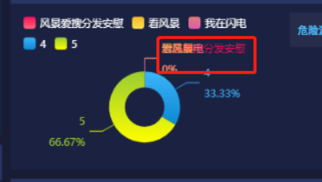

   > 开启为true, 就自动位移

   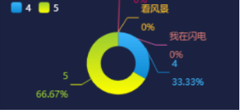
